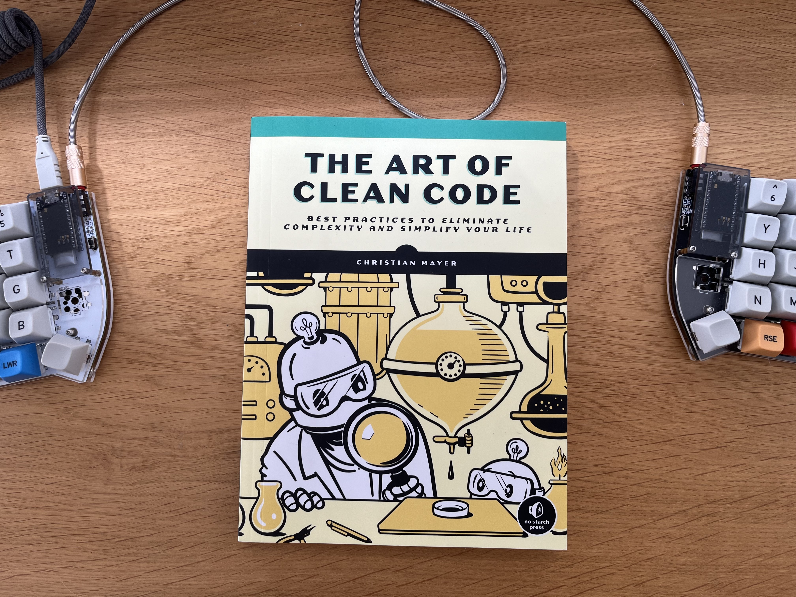
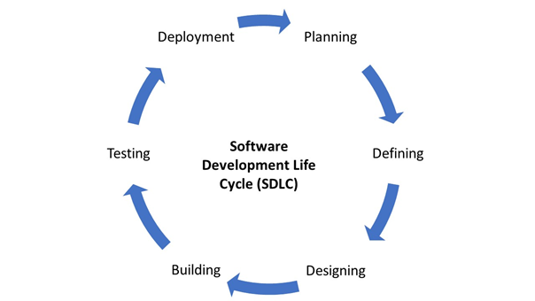
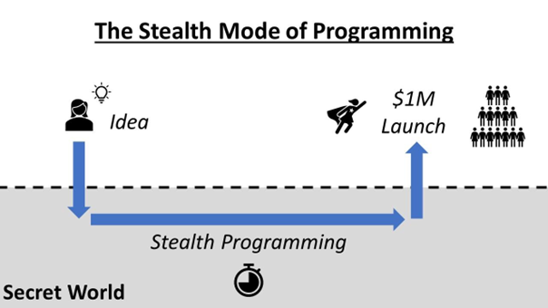
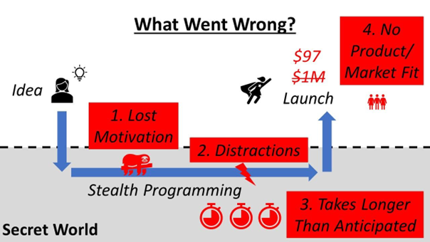
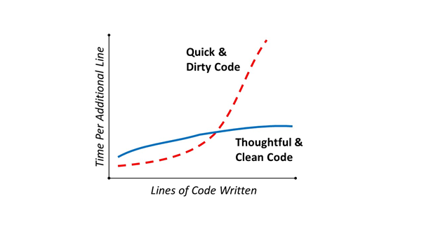
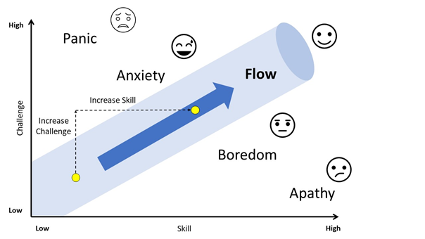

+++
title = "The Art of Clean Code, by Christian Mayer"
description = "Cal Newport's Deep Work but focused on coding and building tech products."
date = "2024-05-01"
[taxonomies]
tags = ["books", "clean code"]
[extra]
comment = true
+++

The book is a mix between how to write clean code (75%) and how to be a productive coder (25%). More than rules set in stone, it encourages applying minimalism to coding.



It reminded me of Cal Newport's work focused on coding and building tech products. Gladly, it is not as technical (or controversial) as Clean Code by Robert Cecil Martin or enter the category of self-help books with random productivity tips.

This is definitely one of the best books I've read on coding.


## 1. Reduce complexity using Software Development Life Cycle (SDLC)

Complexity describes a property of a whole system or entity with parts that makes the system difficult to explain, understand, or analyze.

This causes struggle, overwhelm, and confusion.

The answer to complexity is simplicity. Seek simplicity and focus in every stage of the coding cycle. Take a radically minimalistic position in every area you encounter .

Complexity in organizations appears when they accumulate too many processes, and complexity starts to clog the system. Innovation finds fewer vehicles for change because it’s unable to break through the complexity.

The goal of Software Development Life Cycle (SDLC) is to reduce this complexity by compartmentalize the abstraction of creating software into defined steps.



**Planning**

The purpose of this phase is to determine how the product will look. A successful planning phase leads to a strictly defined set of required features to deliver to the end user.

Factors:

- The cost of building a feature.
- The risk of not being able to successfully implement the feature.
- The expected value for the end user.
- Marketing and sales implications.
- Maintainability.
- Scalability.
- Legal restrictions…

This phase is crucial because it can save you from wasting massive amounts of energy later.

**Defining**

Translating the results from the planning phase into properly specified software requirements.

**Designing**

Draft the architecture of the system. Create a crystal-clear picture of how the final software product will look and how it’s built.

**Building**

Where the transformation from the architectural draft to the software product happens.Your ideas transform into tangible results.

**Testing**

You must test the behavior of your software product for different users' inputs and usage patterns.

If all your unit tests successfully pass, you haven’t yet completed the testing phase. You must test the correct interaction of the units as they’re building a greater whole. You must design real-world tests.

## 2. Getting the right minset for a tech-career

### The 80/20 Principle

The 80/20 or Pareto Principle refers to the idea that a majority of effects come from a minority of causes.

Not all the code is created equal. **A minority of code has a dominating impact on the user experience, while much of the code has little impact.**

We define the term success metrics as measurements of the behaviors that lead to more success in your field. The 80/20 approach allows you to identify the activities on which you must focus. **Be lazy with all activities but one**, your success metric exercise (e.g. write more words).

Pareto distribution disproportionately rewards focus on one specialized skill. In programming, the results tend to be much more heavily skewed toward the top than in most other fields. Instead of 80/20, the distribution often looks more like 90/10. For example, a great programmer can solve some problems that the average programmer simply cannot solve, and that pays off.

**One of the vital few activities to focus is to write more lines of code**. The more lines you write, the better coder you’ll become. Here’s an 80/20 activity you can follow every day: **track the number of lines you code every** day and optimize it. Make it a game to at least match your average every day.

### Figure out your success metrics

**Define your industry first. Identify what the most successful professionals in your industry are doing exceptionally well** and what tasks you can do every day to push you closer toward the top 20 percent. If you’re a coder, your success metric may be the number of lines of code written.

### Smile.

Smiling is a highly leveraged activity with massive impact and little cost.

### Don’t do things that reduce value.

Eating badly, not exercising, playing excessively video games.

### Figure out your big goals in life

White them down.

{{ note(header="Sidenote", body="This is not in the book but its the same idea") }}


Multiple sources (e.g. Andrew Huberman) points out that for a change in habit to be persistent it has to be internalized and come from within. Humans intrinsically operate in a cost-efficient way, meaning that **if the goal is not tangible you will not incur in the cost and pain that goes into coding.**

Coding is basically solving problems with code. ChatGPT can help you with the code part, but **it takes a lot of effort to identify and engineer solutions.**

You have to visualize yourself once you already have the goal achieved (e.g. the job, business, skill.) - what it entitled, what lifestyle change or benefits it brought to your life, etc. Otherwise, your brain will push it away as it inputs calories/resources to learn and produce no output.

That’s why kids want to play Minecraft for 3 hours and don’t want to study Math for 3 hours. The reward of the former is instant and of the latter takes +20 years to start collect the reward. Adults are not that different, we also have brains that optimize resources.

The mental goal has to happen before the physical one to anticipate the reward. **Without a clear goal it is difficult to move forward in anything tech-related**, as there are thousands of different frameworks and tools that you can possibly learn that pull you in different directions.

As an example, full stack development is completely different from machine learning engeneering and uses very different tools and libraries. Both take you probably thousands of hours to learn non-superficial specific knowledge, **you cannot focus on multiple objectives and collect Pareto rewards from multiple specific skills**. Even if you are very skilful, people that specialize only in one subfield will learn and apply the knowledge at a pace that you cannot follow, simply because we all humans have the same amount of hours in a day and there are also other very skilful people besides you.

**Choose a path and clear goals instead of digging into the new trendy shiny tech of the moment and being pulled into new directions every day.**

- Look for ways to achieve the same things with fewer resources.
- Reflect on your own successes.

What did you do that led to great results? How can you do more of those things?

- Reflect on your failures.
- Read more books in your industry.
- Spend much of your time improving and tweaking existing products.

If you create new products all the time without improving and optimizing the old ones, you’ll always have subaverage products.

## 3. Build a minimum viable product

An MVP is a version of your product stripped of all except the most necessary features.

The idea behind building an MVP is to combat problems that arise when you program in stealth mode. **Stealth mode is when you work on a project to completion without seeking any feedback from potential users.**



**Developing MVP products fights:**

- **The loss of motivation**

The longer you work on your project, the bigger your doubts grow. Loss of motivation can kill your project entirely. On the other hand, if you release an early version of the tool, encouraging words from an early adopter could keep you motivated enough to persevere.

- **Focus**

Creating an environment of more immediate feedback helps refocus your attention to the things that add value.

- **Faulty planning**

By stripping all unnecessary features your planning mistakes will be fewer, and your progress will be more predictable. Fewer things will go wrong.

- **Lack of response**

**The most likely outcome of any software project is silence.** If you don’t get any feedback from the real world during development, you start to drift away from reality, working on features nobody will use.

- **Wrong Assumptions**

You start a project with a bunch of assumptions, such as who the users will be. These assumptions are often wrong, and without external testing you blindly creating products your actual audience does not want.

- **Unnecessary Complexity**

You can be introducing features no only do not add value but harm the project adding complexity. If you introduce a set of features bundled without feedback, you don’t know whether the market would’ve accepted, or even preferred, any subset of features instead of the pack



### How to build MVPs

**Formulate an explicit hypothesis** and create a product that validates only this hypothesis. That it’s the core feature.

**Decide the simplest way to validate this hypothesis and gain some insight quickly**. For example, build a user interface without any sophisticated backend functionality, set up a website with an input field for the functionality and drive some traffic to it by sharing your idea in social media or by spending a small amount on ads.

- Does it solve a need in the real world?

- Does it have any traction (e.g. get organic users without promo or ads days after deployed) ?

**After some traction or signs of market fit, build a second MVP that adds to the next most important feature.**

If the first MVP did not generate any traction, you failed quickly. This is great because you did it without spending hours and hours improving the front and back-end for an idea that has no demand.

**Add new features one at a time and test them.** Only if a feature can prove that it improves key user metrics does it remain the product.

The term to describe this strategy of searching for the right product via a series of MVPs is called **rapid prototyping**. By this strategy you release early and often in order to find product-market fit.

The final step of the MVP software creation process is **split testing**. Rather than releasing the iterations with new features to your entire user base, you launch the new product to a fraction of users and observe the implicit and explicit response. This is also called data-driven software development.

### How to know if an MVP is ready to launch

An MVP comes from rigorous focus on one core functionality rather than from lazy product creation. **An MVP is not a half-ass product**

- **Functionality**. The product provides a clearly formulated function to the user, and it does it well.
- **Design**. The product is well designed and focused, and its design supports the value that your product offers to your target niche.
- **Reliability**. The product must be robust. Otherwise, your learnings from the MVP will be corrupted by the negative user feedback based on its unreliability.
- **Usability**. The MVP must be easy to use, attention is scarce.

## 4. Write Clean and Simple Code

{{ note(header="Sidenote", body="This chapter have 17 principles in the book, here are condensed") }}


**Coders spend the vast majority of their time reading old code in order to write new code.** If the old code is easy to real, this will speed the process considerable.

Dirty code is less time-consuming in the short term and for small code projects - if there were no benefits to writing dirty code, nobody would do it.

However, the more you work on a team and work on serious software the more positive impact has writing clean code.

Code is still written mainly by humans, and likely must pass many levels of human judgement before it is deployed. **Assume that others will read your code.**



### 1. Think about the big picture

- Do you need all the separate files and modules?

- Can you divide large and complicated files into simpler ones?

- Can your generalize code and turn it into a library?

- Can you use existing libraries to get rid of many lines of code?

- Can you use catching to avoid recomputing the same results over and over again?

- Can you use more straightforward and suitable algorithms?

- Can you remove premature optimizations?

- Can you use another programming language that would be more suitable for the problem?

### 2. Use the standard format and descriptive names

Use meaningful variable names, indentation, whitespace, comments, and line lengths.

Overusing indentation can decrease the readability of your code, stick to the standard for the language.

**You don’t want your untradictional naming conventions to distract those reading your code.**

Choose descriptive, unambiguous, and **pronounceable** names.

For example, the variable name `mth_rate` (monthly rate) may be descriptive and unambiguous, but it’s not pronounceable.

Use named constants, not **magic numbers**. For example instead of using 0.8, describe `CONVERSION_RATE = 0.8`

Adhere to Standards and be consistent, for example use Black formatter for Python.

A system should behave in the way most users expect it to behave. Don’t be unconventional in the way you code or display information to the user without a very good reason. Being “artistic/creative” will decrease maintainability of your code or conversion rates of your website.

### 3. Use the right amount of comment

Comment your code if you think that it can be useful for the reader. In some cases, comments actually reduce clarity and confuse the readers. If the class of function is clear, comments are redundant.

- Don’t use inline comments.

- Don’t add obvious comments.

- Don’t comment out old code, remove it.

- Use documentation functionality.

### 4. Single Responsibility Principle

The single responsibility principle means that every function should have one main task. Only one responsibility.

Many beginner coder write large monolithic code functions, or so-calle _God object_, that do everything in a centralized manner. This objects are messy, cluttered, and difficult to debug.

The opposite is also bad: do not write 2 functions that do have the same task. For example, don’t write `conversion_rate_euro` and `conversion_rate_dollar`, write `conversion_rate` that can take any currency as input. **Don’t repeat yourself (DRY)**.

### 5. Don’t code if you can avoid it

**Write code only if you’re 100 percent sure it’s necessary.** You should really need a feature before you even consider implementing it.

Use naive algorithms and straightforward methods to establish a benchmark, then analyze which new feature or performance optimization would yield superior results for the overall application.

### 6. Boy Scout Rule and Refactoring

Boy Scout Rule: **Leave the campground cleaner than you found it.**

Spending time to clean up your code to reduce complexity is almost always efficient. The process of improving your code is called refactoring.

**Refactor your code before releasing any new feature.**

Refactoring can be done explaining your code to a colleague or by your own. If you’re an introverted code, you can explain your code to a rubber duck instead - a technique known as **rubber duck debugging**.

## 5. Premature optimization is the root of all evil

Premature optimization its the act of spending valuable resources (time, effort, loans of code) on unnecessary code optimization.

### Types of premature optimization

- **Optimizing Code Functions.** Be wary of spending time optimizing functions before you know how much those functions will be used.
- **Optimizing Features.** Avoid adding features that aren’t strictly necessary and wasting time optimizing those features.
- **Optimizing Planning. Trying to find solutions to problems that haven’t yet occurred.** You’ll never finish your project and will remain stuck in the ivory tower of theory.
- **Optimizing Scalability.** Do not design a distributed architecture that dynamically adds virtual machines handle peak load if you have no idea if you have even one person audience.
- **Optimizing Test Design.** In cases that the functions need unpredictable human-based input, real-world users are the only test that matters.
- **Optimizing Object-Oriented World Building.** Don’t optimize your code to model a world with more details that the application actually needs.

### Measure first, improve second

You should always optimize only after you have begun to measure the performance of your non-optimized code, like memory footprint or speed. This is your benchmark.

Start with writing the most straightforward, naive code possible as the MVP. Document your measurements in a spreadsheet and measure the performance against this benchmark all the subsequent alternative solutions.

### Pareto is king

Optimize the crucial feature that creates most of the bottlenecks or problems.

An important rule of performance tuning: performance optimization is fractal. As soon as you’ve removed the bottleneck, you’ll find another bottleneck lurking around. Bottlenecks will always be in any system, so you will always find new ways to optimize de codebase.
That’s why **you need to measure your code performance and decide when it’s time to stop optimising.**

### Algorithmic optimization wins

Ask yourself:

- Can you find better algorithms that are already proven?

- Can you tweak existing algorithms for your specific problem?

- Can you improve the data structures?

### All Hail the Cache

Remove unnecessary computation by storing the result in a cache. In Python, we can make a simple cache by creating a dictionary where you associate each function input with the function output.

**Perform computations in advance (‘offline’) and store their results in the cache.**

This is a great strategy for web applications where you can fill up a large cache one, or once a day, and then serve the result of your pre computations to the users. For them, your calculations seem blazingly fast. Mapping services heavily use this trick to speed up the shortest path computations.

**Perform computations as they appear (‘online’) and store their results in the cache.**

As there's usually a memory limit on the number of cache entries you can save, you’ll need a sensible cache replacement policy. A common one is first in, first out (FIFO) where a new entry replaces the oldest cache entry.

### Less is more

**Consider removing bottlenecks by eliminating the feature that it's causing them.**

Simpler products require simpler solutions. It is important to think about the **opportunity cost**. Is the trouble worth the time, effort and resources necessary to fix it? Can you use that time to improve the system in more relevant ways?

### Know when to stop

At some point, improving performance is just a waste of your time.

## 6. Flow

Flow is a state of pure concentration and focus - What some people might call “being in the zone”. **Experiencing flow is being in a state of complete immersion in the task at hand, focused and concentrated.**

You forget about time as you are in the zone and completing the activity is its own reward.

In a state of flow, your body releases five feel-good neurochemical pleasure drugs such as endorphins, dopamine, and serotonin.

### How Flow feels

When in a state of flow, you sense:

- Deep sense of concentration (**focus lock**).

- You feel a bias toward action, moving forward your current task (**action driven**).

- You become less aware of yourself, and you shut down your inner critics, doubts, and fears. You think less about yourself (**ego killed**).

- Sense of control about the present situation, giving a calm confidence (**task control**).

- You lose the ability to experience time passing (**time lapse**).

- The labor of the activity is all you want to do. There may no external reward, but being immersed in the activity is intrinsically rewarding in itself (**internal chemical rewards**).

### Reaching a state of Flow

No matter what you do, tech or otherwise, to reach a state of Flow you need:

- **Clear Goals** . You must have a clear goal toward which the smaller actions are oriented. Every action naturally leads to the next, which leads to the next, so there must be an end goal.

- **Feedback mechanism**. Feedback is a precondition for flow. To implement more flow, seek more feedback. A feedback mechanism rewards desired behaviour and punishes undesired behaviour. By feedback we learn to take specific actions and avoid others. Receiving feedback is vital for this way of learning.

- **Balance Opportunity and Capacity**. Constantly seek harder challenges without reaching anxiety levels and increase your skill level accordingly



### Reaching a state of Flow learning tech

You can split your learning time into 70% working on a practical fun project of your choice and 30% reading books and tutorials or watching educational courses.Choose the ratio that works for you but it has to be at least 2:1 for active learning.

Both for active and passive learning: Eliminate distractions during your flow time and block out your coding time in large chunks.


- **70% Active learning**.

Always have a **practical code project** in the works rather than spending your time in a state of unfocused learning. If you don't know what project to do, *think about the intersection between technology and your personal hobbies**. What are your specific interests in a topic outside tech that you can use tech to solve a small issue or inconvenience?

Working this way makes sure you always work on fun projects to you. Long projects have to be somehow meaningful to you, otherwise is likely you drop them.

- **30% Passive learning**.

Try to **consume high-quality information**. For example, read a book instead of Medium article. The better the inputs, the better the outputs.


## 7. Unix principles

- Make each function do one thing well.
- Simple is better than complex.
- Small is beautiful.

The basic idea of Unix philosophy is to build simple, clear, concise, modular code that is easy to extend and maintain.


### Benefits of Unix principles

- It reduces complexity, making the code easier to mantain.

- The codebase will be easier to comprehend, debug and more fixable.

- The codebase is more resilient and less prompt to unintended global effects.

- Improves testability, as you can desing test for small components indendently.

- The modularitity allows prototiping as soon as possible.

### Unix principles

- Build a prototype as soon as possible.

- Choose portability over efficiency.

Portability is the ability of a system or a program to be moved from one environment to another and still function properly.

- Store Data in flat files

You should used optimized data representations only if you’re sure you need them. Using a database with a specialized format would reduce portability and add unnecessary complexity.

- Use software leverage to your advantage.

You should leverage the collective wisdom of generations of videos before you: use libraries and other people code and advise.

- Maker every program a filter.

A filter transforms an input to an output using a specific filtering mechanism. Think of functions taking inputs and somehow transforming or filtering the data into output.

**The gold standard for filters is a homogeneous input/output mapping** where one type of inputs is mapped to the same type of output.

```python
def average(*args):
	return sum(args)/len(args)

average(1,2,3)
#2.0
```

Instead of **heterogeneous input/output**:

```python
def average(*args):
 # Note that it returns a print statement, not a float
	print(sum(args)/len(args))

average(1,2,3)
#2.0
```


The first example inputs integers and outputs an string (heterogeneous) and the second inputs integers and output integers (homogeneous).

- Worse is better

**Developing code with less functionality is often the better approach in practice.** A crude and straightforward solution to a problem gives you a first-mover advantage, attracts quick feedback from the early adopters and gains momentum and attention early in the software development process.

- Clean code is better than clever code.

Clever code comes at the cost of expressing your ideas with clean code. You should not build and design programs to run in isolation. Design programs to connect with other programs.

### Make your code robust

- Control access rights. Individual developers should not be able to contribute to the application without verifying with at least one addition person.

- Use version control (Git).

- Back up your application data regularly.

- Repair what you can - but fail early and noisily. This means that you should not avoid making bugs visible if there is any. Silent bugs are application (and reputation) killers.

- Avoid hand-hacking: write programs to write programs if you can. Code that can be generated automatically should be, because humans are notoriously prone to failures, especially in an activity that’s repetitive and boring.

## 8. Less is more in Design

### Use familiar designs

When thinking about your users, remember this: **if you confuse them, you’ll lose them**.

Use UX frameworks with bounded elements, borders, whitespaces, and intuitive. Most popular frameworks use theming following *Material Design*.

Lacking boundaries and an intuitively familiar layout, the non-material design is often more confusing to the reader.

Whitespaces are necessary. Whitespace is a blank or empty space surrounding all the other elements in a design composition. They improve clarity and result in a more focused UX.

### Addition by subtraction

- **Remove Design Elements**

Go over all design elements and ask: Can I remove it?

The reduced clutter and increased focus are likely to increase the conversion rate of the order page through an improved UX.

- **Remove Features**

Over time, applications tend to accumulate features, a phenomenon known as **feature creep**. As a result, more and more focus must be shifted toward maintaining existing features. Feature creep leads to bloated soft-ware leads to technical debt.

Again, think about opportunity cost and if it’s possible to apply the Pareto principle and focus on the important features removing the rest.

- **Reduce variations of fonts and colors**

**Variations increase cognitive friction.** Effective minimalist design often focuses on only one or two font types, one or two colors, and one or two font sizes.

## 9. Focus

To be productive, you must **reduce entropy. Entropy defines the degree of randomness, disorder, and uncertainty in a system. High entropy means high randomness and chaos. Low entropy means order and predictability.**

You are a creator and a builder. You take raw resources and move them from a state of high entropy into a state of low entropy using focused effort. That’s it.

As to achieve flow, you need a goal or a plan. Without a plan, all the efforts are unfocused since they do not go toward a specific goal - you are pulled in different directions.

The chapters of the book can be seen as ways of working to reduce entropy (e.g. focus on few features, build mvps that deliver only core features, write maintainable code, reduce and eliminate unnecessary codebase).

**To implement focus in your work, ask yourself these questions:**

- On which software project do I want to focus my efforts?
- Which features do I want to focus on to create my MVP?
- What is the minimal number of design elements I can implement to test the viability of my product?
- Who will use my product and why?
- What can I remove from my code?
- Do my functions do one thing only?
- How can I achieve the same result in less time?

## End words

The meaty part is in the Chapters 4, 5, and 6 where the author explains strategies to write clean code, avoid over engineering and get into an state of flow. Chapter 7 was completely avoidable in my opinion.

There are tons of advice suggested in <150 pages, but even if you only take 2 or 3 ideas it is worth reading it.
