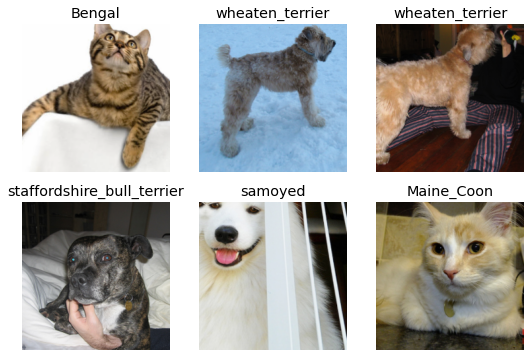
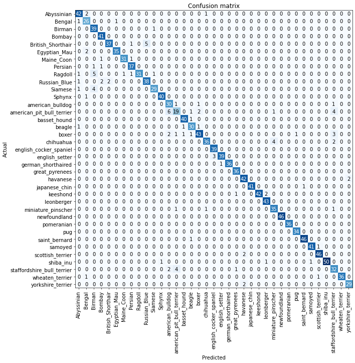
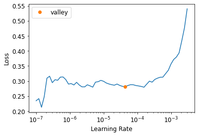
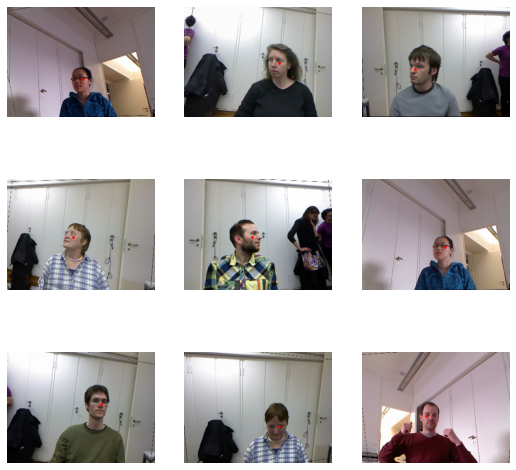

+++
title = "Fastai - Deep Learning for Coders, by Jeremy Howard"
description = "My personal notes of the Fastai book/course."
date = "2022-01-01"
[taxonomies]
tags = ["books","machine learning", "deep learning", "python"]
[extra]
comment = true
+++


My personal notes of the Fastbook/Fastai course [Practical Deep Learning for Coders](https://fastai.github.io/fastbook2e/)


## Chapters 1 to 4 - Introduction

Fastbook is a book is focused on the practical side of deep learning. It starts with the big picture, such as definitions and general applications of deep learning, and progressively digs beneath the surface into concrete examples.

The book is based on _fastai_ API, an API on top of Pytorch that makes it easier to use state-of-the-art methods in deep learning. It doesn't need you to understand models such as Convolutional Neural Networks and how they work, but it definitely have helped me following the book.

The fastbook package includes fastai and several easy-access datasets to test the models.

### 1.1 Install fastai API

**Installing fastai in Segamaker Studio Lab:**

1. Initiate a Terminal and create a conda environment:

```bash
conda create -n fastai python=3.8
conda activate fastai
```

2. Install Pytorch and Fastai:

```bash
# Pytorch
conda install pytorch torchvision torchaudio
# Fastai
conda install -c fastchan fastai
```

3. Import fastai:

```python
import fastbook
fastbook.setup_book()
from fastai.vision.all import *
from fastai.vision import *
```

**Installing fastai locally**

Please notice that unless you have a really powerful GPU (e.g. Nvidia 3080+) you won't get the same training times than training the models in Google Colab or Amazon Segamaker.

The instructions are very similar, you only have to take care of the CUDA Toolkit first.

1. [Install CUDA Toolkit 11.3](https://developer.nvidia.com/cuda-11.3.0-download-archive?target_os=Windows&target_arch=x86_64&target_version=10) . Follow the link and install.

2. Create a new clean Python environment using [miniconda](https://docs.conda.io/en/latest/miniconda.html) :

```bash
conda create -n fastai python=3.8
conda activate fastai
```

3. Install Pytorch and Fastai:

```bash
# Pytorch
conda install pytorch torchvision torchaudio cudatoolkit=11.3 -c pytorch
# Fastai
conda install -c fastchan fastai
```

4. Test Pytorch and Fastai:

If Pytorch was successfully installed you should see you GPU name by running:

```python
import torch
x = torch.cuda.get_device_name(0) if torch.cuda.is_available() else None
print(x)
```

If Fastai was successfully installed you should load fastai without any error:

```python
import fastbook
fastbook.setup_book()
from fastai.vision.all import *
from fastai.vision import *
```

### 1.2 Machine Learning Intro

Machine Learning: The training of programs developed by allowing a computer to learn from its experience, rather than through manually coding the individual steps.

Deep Learning is a branch of Machine Learning focus in Neural Networks. Visually, this is how they work:


Neural Networks, in theory, can solve any problem to any level of accuracy based on the parametrization of the weights - _Universal approximation theorem_.

### 1.3 Weights

The key for the parametrization to be correct is updating the weight. The weights are "responsible" of finding the right solution to the problem at hand. For example, weighting correctly the pixels in a picture to solve the question "Is a Dog or a Cat picture?".

The weight updating is made by Stochastic gradient descent (SGD).

### 1.4 Terminology

The terminology has changed. Here is the modern deep learning terminology for all the pieces we have discussed:

- The functional form of the _model_ is called its **architecture** (but be careful—sometimes people use _model_ as a synonym of _architecture_, so this can get confusing).

- The _weights_ are called **parameters**.

- The **predictions** are calculated from the _independent variable_, which is the _data_ not including the _labels_.

- The _results_ of the model are called _predictions_.

- The measure of _performance_ is called the **loss**. This measure of performance is only relevant **for the computer** to see if the model is doing better or worse in order **to update the parameters**.

- The loss depends not only on the predictions, but also the correct _labels_ (also known as _targets_ or the _dependent variable_); e.g., "dog" or "cat."

- **Metric** is a function that measures quality of the model prediction **for you**. For example, the % of true labels predicted accurately. It can be the case that the loss change but identify the same number of true labels.

Clarification: In the course they use "regression" not as a linear regression but as any prediction model in which the result is a continuous variable.

After making these changes, our diagram looks like:


More important terminology:

- Data Ethics: Positive feedback loop

Positive feedback loop is the effect of a small increase in the values of one part of a system that increases other values in the remaining system. Given that the definition is kinda technical, let's use the case of a predictive policing model.

Let's say that a predictive policing model is created based on where arrests have been made in the past. In practice, this is not actually predicting crime, but rather predicting arrests, and is therefore partially simply reflecting biases in existing policing processes. Law enforcement officers then might use that model to decide where to focus their police activity, resulting in creased arrests in those areas.

These additional arrests would then feed back to re-training future versions of the model. The more the model is used, the more biased the data becomes, making the model even more biased, and so forth.

This is an example of a Positive feedback loop, where the system is this predictive policing model and the values are arrests.

**You cannot avoid positive feedback loop, use human interaction to notice the weird stuff that your algorithm might create.**

- Proxy bias

Taking the previous example - If the proxy for the variable that you are interested (arrests as proxied for crime) is bias, the variable that you are predicting too.

- Transfer learning

Using a pretrained model for a task different to what it was originally trained for. It is key to use models with less data. Basically, instead of the model starting with random weights, it is already trained by someone else and parametrized.

- Fine tuning

A transfer learning technique where the parameters of a pretrained model are updated by training for additional epochs using a different task to that used for pretaining.

An epoch is how many times the model looks at the data.

A more extended dictionary:


### 1.5 P-values principles

The practical importance of a model is not given by the p-values but by the results and implications. **It only says that the confidence of the event happening by chance.**

1. P-values can indicate how incompatible the data are with a specified statistical model.

2. P-values do not measure the probability that the studied hypothesis is true, or the probability that the data were produced by random chance alone.

3. Scientific conclusions and business or policy decisions should not be based only on whether a P-value passes a specific threshold.

4. Proper inference requires full reporting and transparency.

5. A P-value, or statistical significance, does not measure the size of an effect or the importance of a result.

The threshold of statistical significance that is commonly used is a P-value of 0.05. This is conventional and arbitrary.

6. By itself, a P-value does not provide a good measure of evidence regarding a model or hypothesis.

### 1.6 Starting a Machine Learning Project: Defining the problem

First, define the problem that you want to solve and the levers or variables that you can pull to change the outcome. **What its the point of predicting an outcome if you cannot do anything about it?**

## Chapter 5 - Image Classification

This chapter focused on building an image classification model.

### 5.1 Oxford-IIIT Pet Dataset

We will use a images dataset with 37 pet breeds classes and roughly 200 images for each class. The images have large variations in scale, pose, and lighting (here the [original source](https://www.robots.ox.ac.uk/~vgg/data/pets/)).

```python
# Downloading the Oxford-IIIT Pet Dataset
path = untar_data(URLs.PETS)
```

We can use the `ls` method from fastai to see what is in our dataset and folders

```python
Path.BASE_PATH = path
print(path.ls())
(path/"images").ls()


    [Path('annotations'), Path('images')]

    (#7393) [Path('images/newfoundland_31.jpg'),Path('images/Ragdoll_79.jpg'),Path('images/yorkshire_terrier_31.jpg'),Path('images/havanese_172.jpg'),Path('images/newfoundland_61.jpg'),Path('images/Abyssinian_175.jpg'),Path('images/leonberger_164.jpg'),Path('images/saint_bernard_86.jpg'),Path('images/boxer_108.jpg'),Path('images/scottish_terrier_195.jpg')...]
```

### 5.2 DataBlocks

Fastai uses DataBlocks to load the data. Here we load the images of the folder into this `DataBlock`. Most of the arguments of the functions are quite intuitive to guess, but they are explained below in any case.

- `DataBlock` is the envelope of the structure of the data. Here you tell fastai API how you organized the data.

- `blocks` is how you tell fastai what inputs are images (`ImageBlock`) and what are the targets for the categories (`CategoryBlock`).

- `get_items` is how you tell fastai to assemble our items inside the `DataBlock`.

- `splitter` is used to divide the images in training and validation set randomly.

- `get_y` is used to create target values. The images are not labeled, they are just 7393 jpgs. We extract the target label (y) from the name of the file using regex expressions `RegexLabeller`.

```python
pets = DataBlock(blocks = (ImageBlock, CategoryBlock),
                 get_items=get_image_files,
                 splitter=RandomSplitter(seed=42),
                 get_y=using_attr(RegexLabeller(r'(.+)_\d+.jpg$'), 'name'),
                 item_tfms=Resize(460),
                 batch_tfms=aug_transforms(size=224, min_scale=0.75))

# Tell DataBlock where the "source" is
dls = pets.dataloaders(path/"images")
```

We can take the first image and print the path using `.ls()` method as well.

```python
fname = (path/"images").ls()[0]
fname


    /root/.fastai/data/oxford-iiit-pet/images/newfoundland_31.jpg
```

Using regex we can extract the target from the jpg name

```python
re.findall(r'(.+)_\d+.jpg$', fname.name)

          ['newfoundland']
```

The last 2 methods are about data augmentation strategy, what fastai call _presizing_.

**Presizing** is a particular way to do image augmentation that is designed to speed up computation and improve model accuracy.

- `item_tfms` resize so all the images have the same dimension (In this case 460x460). It is needed so they can collate into tensors to be passed to the GPU. By default, it crops the image (not squish like when you set the background of your computer screen). On the training set, the crop area is chosen randomly. On the validation set, the center square of the image is always chosen.

- `batch_tfms` randomly random crops and augment parts of the images. It's only done once, in one batch. On the validation set, it only resizes to the final size needed for the model. On the training set, it first random crops and performs any augmentations, and then it resizes.

- `aug_transforms` function can be used to create a list of images flipped, rotated, zoomed, wrapped, or with changed lighting. It helps the training process and avoids overfitting. `min_scale` determines how much of the image to select at minimum each time (More [here](https://docs.fast.ai/vision.augment.html#aug_transforms))


### 5.3 Other resizing methods

With `show_batch` we can print a batch of images of the training set.

```python
# Show some images
dls.show_batch(max_n=6)
```



We can squish the images, or add padding to the sides or crop it by copying the model with `.new` method and modifying the part of the model that you want to change.

Here we squish the images:

```python
pets = pets.new(item_tfms= Resize(256, ResizeMethod.Squish))
dls = pets.dataloaders(path/"images")
dls.show_batch(max_n=6)
```


Here we add padding to the images:

```python
pets = pets.new(item_tfms= Resize(256, ResizeMethod.Pad, pad_mode='zeros'))
dls = pets.dataloaders(path/"images")
dls.show_batch(max_n=6)
```


**Remember that by cropping the images we removed some of the features that allow us to perform recognition.**

Instead, what we normally do in practice is to randomly select part of the image and crop it. On each epoch (which is one complete pass through all of our images in the dataset) we randomly select a different crop of each image. We can use `RandomResizedCrop` for that.

This means that our model can learn to focus on, and recognize, different features in our images at different epochs. It also reflects how images work in the real world as different photos of the same thing may be framed in slightly different ways.

```python
pets = pets.new(item_tfms= RandomResizedCrop(128, min_scale=0.3))
dls = pets.dataloaders(path/"images")
# Unique=True to have the same image repeated with different versions of this RandomResizedCrop transform
dls.show_batch(max_n=6, unique=True)
```


We can alwasy use `new` method to get back to the first resizing method chosen (`aug_transforms`):

```python
pets = pets.new(item_tfms=Resize(460), batch_tfms=aug_transforms(size=224, min_scale=0.75))
dls = pets.dataloaders(path/"images")
dls.show_batch(max_n=6, unique = True)
```


### 5.4 Creating a baseline model

We can see the shape of the data by printing one batch. Here we printed the labels `y`. There are 64 listed numbers printed as the batch size is 64. The range of the numbers goes from 0 to 36 as it represents the labels for the 37 pet breeds.

```python
x, y = dls.one_batch()
y

    TensorCategory([ 9,  1,  2, 22, 14, 35, 27, 28, 17, 31,  0,  9, 13, 12,  0, 12, 15, 36,  2,
    13,  9,  1, 14, 11, 33, 29,  7, 27, 13, 10,  4, 30, 5, 24, 20, 32, 14,  8, 18, 35, 15,
    23, 11, 24, 21, 22,  9, 18, 9, 17, 12, 15, 14, 17, 36, 18, 18, 33, 21,  0, 10, 17, 12,  7]
    , device='cuda:0')
```

Training a powerful baseline model requires 2 lines of code:

```python
learn = cnn_learner(dls, resnet34, metrics= error_rate)
learn.fine_tune(2)
```

- `dls` is our data.
- `restnet34` is a certain pre-trained CNN architecture.
- The `metric` requested is `error_rate`.
- By default, fast ai chooses the loss function that best fit our kind of data. With image data and a categorical outcome, fastai will default to using `cross-entropy loss`.
- `fine_tune(2)` indicates the number of epochs with the default model configuration.

This is the magic and simplicity of fastai. Once you have the data correctly loaded, the modeling with pre-trained models cannot be easier. Fastai automatically download the pre-trained architecture, choses an appropriate loss function and prints the metric results:

<table style="center">
  <thead>
    <tr>
      <th>epoch</th>
      <th>train_loss</th>
      <th>valid_loss</th>
      <th>error_rate</th>
      <th>time</th>
    </tr>
  </thead>
  <tbody>
    <tr>
      <td>0</td>
      <td>1.532038</td>
      <td>0.331124</td>
      <td>0.112991</td>
      <td>01:07</td>
    </tr>
  </tbody>
</table>

<table border="0" class="dataframe">
  <thead>
    <tr style="text-align: center; overflow-x:auto;">
      <th>epoch</th>
      <th>train_loss</th>
      <th>valid_loss</th>
      <th>error_rate</th>
      <th>time</th>
    </tr>
  </thead>
  <tbody>
    <tr>
      <td>0</td>
      <td>0.514930</td>
      <td>0.295484</td>
      <td>0.094046</td>
      <td>01:12</td>
    </tr>
    <tr>
      <td>1</td>
      <td>0.330700</td>
      <td>0.223524</td>
      <td>0.071042</td>
      <td>01:12</td>
    </tr>
  </tbody>
</table>

The second column show the cross-entropy loss in the training and validation set. The fourth column show less than 1% of error classifying the images.

It even includes handy shortcuts like `show_results` to print the real and predicted labels for a quick check test of labels and predictions:

```python
learn.show_results()
```


### 5.5 Model interpretation

After building a model, you don't want to know only how many targets got right. You might want to know which targets are harder to predict or which images got wrong to train it better. fastai includes a `ClassificationInterpretation` class from which you can call `plot_confusion_matrix`, `most_confused` or `plot_top_losses` methods to extract this information easily.

```python
interp = ClassificationInterpretation.from_learner(learn)
interp.plot_confusion_matrix(figsize = (12,12), dpi=60)
```



We can see which are the labels that the model more struggles to differentiate:

```python
interp.most_confused(min_val = 4)

    [('american_pit_bull_terrier', 'american_bulldog', 6),
     ('British_Shorthair', 'Russian_Blue', 5),
     ('Ragdoll', 'Birman', 5),
     ('Siamese', 'Birman', 4),
     ('american_pit_bull_terrier', 'staffordshire_bull_terrier', 4),
     ('chihuahua', 'miniature_pinscher', 4),
     ('staffordshire_bull_terrier', 'american_pit_bull_terrier', 4)]
```

And the the most "wrong" predictions:

```python
interp.plot_top_losses(5, nrows = 5)
```


### 5.6 Exporting and importing a model

Models with multiple layers, epochs, and parameters can take hours to train. Instead of starting over every time you run the notebook, the model can be saved and loaded again.

**Saving/Exporting a model**:

```python
learn.export(os.path.abspath('./my_export.pkl'))
```

To check that the model is saved, you can either navigate the folder and see the `.pkl`, or also you can call the `path.ls()` method and see the file printed.

**Loading/Importing a model**:

```python
learn_inf = load_learner('my_export.pkl')
```

### 5.7 Testing the model outside the fastai environment

To see if the model would work outside the dataloader environment, I googled "Bengal cat" in google images and drag a random image into the Google Colab folder. I consider the image as tricky, as it contains a human holding a Bengal cat:


I simply called the `predict` method of the model trained before to see if it is as easy at it looks to use fastai.

```python
learn_inf.predict('test_image.jpg')
```

    ('Bengal',
     tensor(1),
     tensor([9.6365e-07, 9.9558e-01, 5.0118e-09, 2.5665e-08, 5.0663e-08, 4.2385e-03, 1.6677e-04, 1.0780e-08, 3.7194e-08, 1.1227e-07, 7.4500e-09, 3.3078e-06, 4.6680e-08, 8.1986e-07, 1.0533e-07, 8.3078e-08,
             9.4154e-08, 2.7704e-08, 2.7787e-07, 2.6699e-06, 2.5465e-06, 7.7660e-09, 8.5412e-09, 1.5087e-07, 3.9640e-08, 3.1239e-08, 9.4404e-07, 3.2094e-08, 5.2541e-08, 7.1558e-09, 4.6352e-09, 1.7388e-08,
             6.1503e-08, 6.6123e-08, 7.2059e-09, 9.4673e-08, 5.6627e-07]))

Surprisingly, it got the label of the image right. Loading the training data was less than 10 lines of code and the model itself is 1 line. It could handle random animal images and classify them regardless of the input image size, image format, or anything else.

### 5.8 Improving Our Model

The one-line-of-code model is great, but we might want to tweak the model and compare the results to increase the accuracy. We will explore 4 techniques or tools that can improve the model:

1. Learning rate finder
2. Transfer Learning
3. Discriminative Learning rates
4. Selecting the right number of epochs

#### 5.8.1 Learning rate finder

The general idea of a _learning rate finder_ is to start with a very very small learning rates, watch the loss function, and iterating with bigger and bigger learning rates.

We start with some number so small that we would never expect it to be too big to handle, like .00000007. We use that for one mini-batch, track the loss, and double the learning rate. We keep doing it until the loss gets worse. Once it started to get worse and worse, we should select a learning rate a bit lower than that point.

fastai method `lr_find()` does all this loop for us:

```python
learn = cnn_learner(dls, resnet34, metrics = error_rate)
learn.lr_find()
```

    SuggestedLRs(valley=tensor(0.0025))


```python
# Let's call it the "leslie_smith_lr" in honor to the author of the orignal paper
leslie_smith_lr = 0.0025
learn = cnn_learner(dls, resnet34, metrics = error_rate)
learn.fine_tune(2, base_lr = leslie_smith_lr)
```

<table border="0" class="dataframe">
  <thead>
    <tr style="text-align: center;">
      <th>epoch</th>
      <th>train_loss</th>
      <th>valid_loss</th>
      <th>error_rate</th>
      <th>time</th>
    </tr>
  </thead>
  <tbody>
    <tr>
      <td>0</td>
      <td>1.261431</td>
      <td>0.310061</td>
      <td>0.102842</td>
      <td>01:10</td>
    </tr>
  </tbody>
</table>

<table border="0" class="dataframe">
  <thead>
    <tr style="text-align: center;">
      <th>epoch</th>
      <th>train_loss</th>
      <th>valid_loss</th>
      <th>error_rate</th>
      <th>time</th>
    </tr>
  </thead>
  <tbody>
    <tr>
      <td>0</td>
      <td>0.547525</td>
      <td>0.373586</td>
      <td>0.115020</td>
      <td>01:14</td>
    </tr>
    <tr>
      <td>1</td>
      <td>0.348811</td>
      <td>0.226233</td>
      <td>0.068336</td>
      <td>01:14</td>
    </tr>
  </tbody>
</table>

Compared with the baseline model we reduced slightly the error_rate. In the next tables, I will keep track of the improvements and the comparison of the methods.

#### 5.8.2 Transfer Learning and Freezing

**Transfer learning**

The last layer in a CNN is the classification task. This pet breed classification task is a layer with 37 neurons with a softmax function that gives the probability of the image for each of the 37 classes.

But how can we use all this hard-consuming weighting parametrization in another image classification task?

We can take the model, ditch the last layer and substitute it for our new classification task. That's transfer learning - using the knowledge learned from a task and re-using it for another different.

In practical terms,we take the parameters/weights of the model and we substitute the last layer for the new task without starting the weighting from scratch. It saves time and also produces better results. `restnet34` is an example of this, as it is a pre-trained model with its custom parametrization.

**Freezing**

Transfer learning can be applied by a technique called freezing. By freezing you tell the model not to touch certain layers. They are "frozen".

_Why you would want to freeze layers?_

To focus on the layer that matters. As I said, `restnet34` is already trained beforehand. We can tell the model to focus more on the last layer, our classification task, and keep the former ones untouched. Freeze and unfreeze effectively allow you to decide which specific layers of your model you want to train at a given time.

Freezing is especially handy when you want to focus not only on the weighting but also on some parameters like the learning rate.

To allow transfer learning we can use `fit_one_cycle` method, instead of `fine_tune`. Here we load the model with our data and train it for 3 epochs:

```python
learn = cnn_learner(dls, resnet34, metrics = error_rate)
learn.fit_one_cycle(3, leslie_smith_lr)
```

<table border="0" class="dataframe">
  <thead>
    <tr style="text-align: center;">
      <th>epoch</th>
      <th>train_loss</th>
      <th>valid_loss</th>
      <th>error_rate</th>
      <th>time</th>
    </tr>
  </thead>
  <tbody>
    <tr>
      <td>0</td>
      <td>1.220214</td>
      <td>0.328361</td>
      <td>0.103518</td>
      <td>01:13</td>
    </tr>
    <tr>
      <td>1</td>
      <td>0.559653</td>
      <td>0.242575</td>
      <td>0.080514</td>
      <td>01:11</td>
    </tr>
    <tr>
      <td>2</td>
      <td>0.340312</td>
      <td>0.220747</td>
      <td>0.069689</td>
      <td>01:11</td>
    </tr>
  </tbody>
</table>

Consider this model parametrization "froze". Using `unfreeze()` method allows the model to start over from the already weighting from `fit_one_cyle`, so it doesn't start from random weighting but the "frozen" parameters from the 3 first epochs of `fit_one_cyle`.

```python
learn.unfreeze()
```

It is is easier for the model to start from a pre-trained weighting than with random weighting. To illustrate this point let's try to search for an optimal learning rate again:

```python
learn.lr_find()
```

    SuggestedLRs(valley=4.365158383734524e-05)



In this graph, the Loss axis is way smaller than the previous one. The model is already trained beforehand and therefore trying mini-batches of different learning rates and iterating is easier.

To apply "transfer learning" we train the model with another 6 epochs that will start from the previous parametrization. We use the new learning rate as well.

```python
leslie_smith_lr_2 = 4.365158383734524e-05
learn.fit_one_cycle(6, leslie_smith_lr_2)
```

Instead of printing the epoch results, from here on I'll show the results of the last epoch and the comparison with the other models:

<table border="0" class="dataframe">
  <thead>
    <tr style="text-align: center;">
      <th>Model</th>
      <th>Train Loss</th>
      <th>Validation Loss</th>
      <th>Error rate</th>
    </tr>
  </thead>
  <tbody>
    <tr>
      <td>ResNet-34 Baseline (2 epochs)</td>
      <td>0.330700</td>
      <td>0.223524</td>
      <td>0.071042</td>
    </tr>
    <tr>
      <td>ResNet-34 with Learning rate finder (2 epochs)</td>
      <td>0.348811</td>
      <td>0.226233</td>
      <td>0.068336</td>
    </tr>
    <tr>
      <td><b>ResNet-34 with Transfer Learning (6 epochs)</b></td>
      <td><b>0.534172</b></td>
      <td><b>0.261891</b></td>
      <td><b>0.083897</b></td>
    </tr>
  </tbody>
</table>

#### 5.8.3 Discriminative learning rates

Like many good ideas in deep learning, the idea of **_Discriminative learning rates_** is extremely simple: use a lower learning rate for the early layers of the neural network,
and a higher learning rate for the later layers

The first layer learns very simple foundations, like image edges and gradient detectors; these are likely to be just as useful for nearly any task. The later layers learn much more complex concepts, like the concept of “eye” and “sunset,” which might not be useful in your task at all - maybe you’re classifying car models, for instance. So it makes sense to let the later layers fine-tune more quickly than earlier layers.

By default, fastai `cnn_learner` uses discriminative learning rates.

Let’s use this approach to replicate the previous training, but this time using Discriminative learning rates using a slice range in the learning rate parameter: `lr_max=slice(4e-6,4e-4)`.

- The first value (`4e-6`) is the learning rate in the earliest layer of the neural network.

- The second value (`4e-4`) is the learning rate of the final layer.

- The layers in between will have learning rates that scale up equidistantly throughout that range - from the first until they reach the second value.

```python
# Model
learn = cnn_learner(dls, resnet34, metrics = error_rate)
# Pre-train the model
learn.fit_one_cycle(3, leslie_smith_lr)
learn.unfreeze()
# Train the model with a learning rate range
learn.fit_one_cycle(12, lr_max=slice(4e-6,4e-4))
```

<table border="0" class="dataframe">
  <thead>
    <tr style="text-align: center;">
      <th>Model</th>
      <th>Train Loss</th>
      <th>Validation Loss</th>
      <th>Error rate</th>
    </tr>
  </thead>
  <tbody>
    <tr>
      <td>ResNet-34 Baseline (2 epochs)</td>
      <td>0.330700</td>
      <td>0.223524</td>
      <td>0.071042</td>
    </tr>
    <tr>
      <td>ResNet-34 with Learning rate Finder (2 epochs)</td>
      <td>0.348811</td>
      <td>0.226233</td>
      <td>0.068336</td>
    </tr>
    <tr>
      <td>ResNet-34 with Transfer Learning (6 epochs)</td>
      <td>0.534172</td>
      <td>0.261891</td>
      <td>0.083897</td>
    </tr>
    <tr>
      <td><b>ResNet-34 with Discriminative learning rates (12 epochs)</b></td>
      <td><b>0.049675</b></td>
      <td><b>0.181254</b></td>
      <td><b>0.048714</b></td>
    </tr>
  </tbody>
</table>

#### 5.8.4 Selecting the Number of Epochs

The more epochs, the more time and tries the model has to learn the trained data. Your first approach to training should be to simply pick a specific number of epochs that you are happy to wait for, and look at the training and validation loss plots.

Using `.plot_loss()` you can see if the validation loss keeps getting better with more epochs. If not, it is a waste of time to use more than the necessary epochs.

For some machine learning problems is worth keep training the model for a day to earn 1% more accuracy, such as programming competitions, but in most cases choosing the right model or better parametrization is going to be more important than squishing the last marginal accuracy point with 300 more epochs.

```python
learn.recorder.plot_loss()
```


### 5.9 Deeper Architectures

In general, a model with more parameters can describe your data more accurately. A larger version of a ResNet will always be able to give us a better training loss, but it can suffer more from overfitting, basically because it has more parameters to suffer from overfitting.

Another downside of deeper architectures is that they take quite a bit longer to
train. One technique that can speed things up a lot is **mixed-precision training**. This
refers to using less-precise numbers (half-precision floating point, also called fp16)
where possible during training.

Instead of using `.fit_one_cycle()` and then `unfreeze()` methods we tell fastai how many epochs to freeze with `freeze_epochs` since we are not changing the learning rates from one step to the other like in Discriminative learning rates.

```python
from fastai.callback.fp16 import *
learn = cnn_learner(dls, resnet50, metrics=error_rate).to_fp16()
learn.fine_tune(6, freeze_epochs=3)
```

<table border="0" class="dataframe">
  <thead>
    <tr style="text-align: center;">
      <th>epoch</th>
      <th>train_loss</th>
      <th>valid_loss</th>
      <th>error_rate</th>
      <th>time</th>
    </tr>
  </thead>
  <tbody>
    <tr>
      <td>0</td>
      <td>1.260760</td>
      <td>0.327534</td>
      <td>0.095399</td>
      <td>01:07</td>
    </tr>
    <tr>
      <td>1</td>
      <td>0.595598</td>
      <td>0.297897</td>
      <td>0.089310</td>
      <td>01:07</td>
    </tr>
    <tr>
      <td>2</td>
      <td>0.431712</td>
      <td>0.256303</td>
      <td>0.089986</td>
      <td>01:07</td>
    </tr>
  </tbody>
</table>

<table border="0" class="dataframe">
  <thead>
    <tr style="text-align: center;">
      <th>epoch</th>
      <th>train_loss</th>
      <th>valid_loss</th>
      <th>error_rate</th>
      <th>time</th>
    </tr>
  </thead>
  <tbody>
    <tr>
      <td>0</td>
      <td>0.286988</td>
      <td>0.246470</td>
      <td>0.079161</td>
      <td>01:09</td>
    </tr>
    <tr>
      <td>1</td>
      <td>0.323408</td>
      <td>0.258964</td>
      <td>0.091340</td>
      <td>01:08</td>
    </tr>
    <tr>
      <td>2</td>
      <td>0.262799</td>
      <td>0.315306</td>
      <td>0.083221</td>
      <td>01:09</td>
    </tr>
    <tr>
      <td>3</td>
      <td>0.167648</td>
      <td>0.242762</td>
      <td>0.073072</td>
      <td>01:09</td>
    </tr>
    <tr>
      <td>4</td>
      <td>0.090543</td>
      <td>0.180670</td>
      <td>0.056834</td>
      <td>01:09</td>
    </tr>
    <tr>
      <td>5</td>
      <td>0.060775</td>
      <td>0.174947</td>
      <td>0.050068</td>
      <td>01:09</td>
    </tr>
  </tbody>
</table>

### 5.10 Final model results comparison

Based on the validation loss and the error rate, a deeper and more complex architecture(RestNet50) and the model with discriminative learning rates hold the best results.

<table border="0" class="dataframe">
  <thead>
    <tr style="text-align: center;">
      <th>Model</th>
      <th>Train Loss</th>
      <th>Validation Loss</th>
      <th>Error rate</th>
    </tr>
  </thead>
  <tbody>
    <tr>
      <td>ResNet-34 Baseline (2 epochs)</td>
      <td>0.330700</td>
      <td>0.223524</td>
      <td>0.071042</td>
    </tr>
    <tr>
      <td>ResNet-34 with Learning rate Finder (2 epochs)</td>
      <td>0.348811</td>
      <td>0.226233</td>
      <td>0.068336</td>
    </tr>
    <tr>
      <td>ResNet-34 with Transfer Learning (6 epochs)</td>
      <td>0.534172</td>
      <td>0.261891</td>
      <td>0.083897</td>
    </tr>
    <tr>
      <td>ResNet-34 with Discriminative learning rates (12 epochs)</td>
      <td>0.049675</td>
      <td>0.181254</td>
      <td><b>0.048714</b></td>
    </tr>
    <tr>
      <td>Mixed-Precision ResNet-50 (6 epochs)</td>
      <td>0.060775</td>
      <td><b>0.174947</b></td>
      <td>0.050068</td>
    </tr>
  </tbody>
</table>

In any case, these techniques should be tried and evaluated for every image classification problem, as the results depend on the specific data. This is just an example of the applications and could easily improve any initial model baseline.

## Chapter 6 - Other Computer Vision Problems

- Multi-label classification
- Regression.

I will use Google Colab to run the code, as in Chapter 5 notes.

```python
!pip install -Uqq fastbook

     |████████████████████████████████| 727kB 29.0MB/s
     |████████████████████████████████| 1.2MB 45.6MB/s
     |████████████████████████████████| 194kB 47.3MB/s
     |████████████████████████████████| 51kB 7.9MB/s
     |████████████████████████████████| 61kB 9.2MB/s
     |████████████████████████████████| 61kB 9.0MB/s

```

```python
import fastbook
fastbook.setup_book()
from fastai.vision.all import *

    Mounted at /content/gdrive
```

### 6.1 Multi-label classification

**Multi-label classification** is when you want to predict more than one label per image (or sometimes none at all). In practice, it is probably more common to have some images with zero matches or more than one match, we should probably expect in practice that multi-label classifiers are more widely applicable than single-label classifiers.

**PASCAL Visual Object Classes Challenge 2007 Dataset**

```python
path = untar_data(URLs.PASCAL_2007)
```

```python
df = pd.read_csv(path/'train.csv')
df.head()
```

<table>
  <thead>
    <tr>
      <th>fname</th>
      <th>labels</th>
      <th>is_valid</th>
    </tr>
  </thead>
  <tbody>
    <tr>
      <td>000005.jpg</td>
      <td>chair</td>
      <td>True</td>
    </tr>
    <tr>
      <td>000007.jpg</td>
      <td>car</td>
      <td>True</td>
    </tr>
    <tr>
      <td>000009.jpg</td>
      <td>horse person</td>
      <td>True</td>
    </tr>
    <tr>
      <td>000012.jpg</td>
      <td>car</td>
      <td>False</td>
    </tr>
    <tr>
      <td>000016.jpg</td>
      <td>bicycle</td>
      <td>True</td>
    </tr>
  </tbody>
</table>

**Building the DataBlock**

The data is not preprocessed, so we will need to shape it correctly to use Fastai.

1. Get the input path and the target variable

The original dataset is a collection that returns a tuple of your independent and dependent variable for a single item. To use the `DataLoader` of Fastai we will need to format and preprocess the data. In a `DataLoader`, each mini-batch contains a batch of independent variables and a batch of dependent variables.

We can see the current shape of the data by calling `DataBlock.datasets` to create a Datasets object from the source.

```python
dblock = DataBlock()
dsets = dblock.datasets(df)
```

```python
dsets.train[0]
```

    (fname       002815.jpg
     labels          person
     is_valid          True
     Name: 1414, dtype: object,

     fname       002815.jpg
     labels          person
     is_valid          True
     Name: 1414, dtype: object)

```python
dsets.valid[1]
```

    (fname             000892.jpg
     labels      person motorbike
     is_valid               False
     Name: 443, dtype: object,

     fname             000892.jpg
     labels      person motorbike
     is_valid               False
     Name: 443, dtype: object)

The data is in the wrong format. Instead of a path to the images and the corresponding label, it simply returns a row of the DataFrame, twice. This is because by default, the **`DataBlock` assumes we have two things: input and target**. Here we don't have a path or the target specified, so it returns the input twice.

We are going to need to grab the appropriate fields from the DataFrame, which we can do by passing `get_x` and `get_y` functions.

- `get_x`: to create a function that points out the path of the files (in the _fname_ column).

```python
def get_images_name(r):
  return path/'train'/r['fname']
```

- `get_y`: to create a function that takes the targets from the labels column and splits on the space character as there are several labels.

```python
def get_target_name(r):
  return r['labels'].split(' ')
```

We will try `DataBlock.datasets` again, now with the data formatted using the functions:

```python
# We add the data format to the DataBlock
dblock = DataBlock(get_x = get_images_name,
                   get_y = get_target_name)
# We update de dataset feeded to the DataBlock
dsets = dblock.datasets(df)
```

```python
dsets.train[34]

    (Path('/root/.fastai/data/pascal_2007/train/002359.jpg'),
    ['dog'])
```

Now it returns correctly the datablock format: input (the _jpg_), and the target (the image label).

2. Transform the data into tensors

We can use the parameter `ImageBlock` to transform these inputs and targets into tensors. It is a good practice to specify the `MultiCategoryBlock` method so fastai knows that is a multiclassification type of problem.

In any case, fastai would know that is this type of problem because of the multiple labeling.

```python
dblock = DataBlock(blocks =(ImageBlock, MultiCategoryBlock),
                   get_x = get_images_name,
                   get_y = get_target_name)

dsets = dblock.datasets(df)
```

```python
dsets.train[0]

    (PILImage mode=RGB size=500x336,
     TensorMultiCategory([0., 0., 0., 0., 0., 0., 1.,
                          0., 0., 0., 0., 0., 0., 1.,
                          1., 0., 0., 0., 0., 0.]))
```

By adding `ImageBlock`, each element is transformed into a tensor with a 1 representing the label of the image. The categories are **hot-encoded**. A vector of 0s and 1s in each location is represented in the data, to encode a list of integers. There are 20 categories, so the length of this list of 0s and 1 equals 20.

The reason we can't just use a list of category indices is that each list would be a different length. For example, an image with 2 labels would have 2 elements in a list and a length of 2. An image with 1 label would be a list of length 1. Pytorch/fastai require tensors where targets have to have the same length and that's why we use hot-encoding.

3. Create a training and validation data split

For now, the dataset is not divided correctly into train and validation dataset. If we take a look at the dataset, it contains a column called `is_valid` that we have been ignoring. This column is a boolean that signals that the data belongs to the train set or the validation set.

```python
df.head()
```

<table>
  <thead>
    <tr>
      <th>fname</th>
      <th>labels</th>
      <th>is_valid</th>
    </tr>
  </thead>
  <tbody>
    <tr>
      <td>000005.jpg</td>
      <td>chair</td>
      <td>True</td>
    </tr>
    <tr>
      <td>000007.jpg</td>
      <td>car</td>
      <td>True</td>
    </tr>
    <tr>
      <td>000009.jpg</td>
      <td>horse person</td>
      <td>True</td>
    </tr>
    <tr>
      <td>000012.jpg</td>
      <td>car</td>
      <td>False</td>
    </tr>
    <tr>
      <td>000016.jpg</td>
      <td>bicycle</td>
      <td>True</td>
    </tr>
  </tbody>
</table>

`DataBlock` has been using a random split of the data by default. However, we can create a simple splitter function that takes the values in which `is_valid` is `False` and stored them in a variable called `train`, and if `True` stored them in a variable called `valid`.

```python
def splitter(df):
  train = df.index[~df['is_valid']].tolist()
  valid = df.index[df['is_valid']].tolist()
  return train,valid
```

This function separates train and validation datasets to make the split. As long as it returns these 2 elements (train and validation), the `splitter` method of `DataBlock` can take it.

```python
dblock = DataBlock(blocks=(ImageBlock, MultiCategoryBlock),
                   splitter = splitter,
                   get_x = get_images_name,
                   get_y = get_target_name)
dsets = dblock.datasets(df)
```

```python
dsets.train[0]

    (PILImage mode=RGB size=500x333,
     TensorMultiCategory([0., 0., 0., 0., 0., 0., 1.,
                          0., 0., 0., 0., 0., 0., 0.,
                          0., 0., 0., 0., 0., 0.]))
```

Now, the split of train and validation has the correct labeling.

4. Input resizing

Lastly, for the `DataBlock` to be converted into a `DataLoader` it needs that every item is of the same size. To do this, we can use `RandomResizedCrop`.

To prove that, we can try the previous `DataBlock` without resizing:

```python
dls = dblock.dataloaders(df)
dls.show_batch(nrows=1, ncols=3)

    ---------------------------------------------------------------------------

    RuntimeError                              Traceback (most recent call last)

    <ipython-input-127-98aca4c77278> in <module>()
          1 dls = dblock.dataloaders(df)
    ----> 2 dls.show_batch(nrows=1, ncols=3)


    /.../core.py in show_batch(self, b, max_n, ctxs, show, unique, **kwargs)
         98             old_get_idxs = self.get_idxs
         99             self.get_idxs = lambda: Inf.zeros
    --> 100         if b is None: b = self.one_batch()
        101         if not show: return self._pre_show_batch(b, max_n=max_n)
        102         show_batch(*self._pre_show_batch(b, max_n=max_n), ctxs=ctxs, max_n=max_n, **kwargs)


[...]

    RuntimeError: stack expects each tensor to be equal size,
    but got [3, 500, 441] at entry 0 and [3, 333, 500] at entry 1
```

By including resizing, the `DataBlock` is correctly loaded and transformed into a `DataLoader`:

```python
dblock = DataBlock(blocks=(ImageBlock, MultiCategoryBlock),
                   splitter = splitter,
                   get_x = get_images_name,
                   get_y = get_target_name,
                   item_tfms = RandomResizedCrop(128, min_scale=0.35))
dls = dblock.dataloaders(df)

dls.show_batch(nrows=1, ncols=3)
```


Fastai includes a method called `summary` to check if anything goes wrong when you create your dataset. Besides the previous printing of the batch, we can call it to see errors, if any.

```python
dblock.summary

    <bound method DataBlock.summary of
    <fastai.data.block.DataBlock object at 0x7f01e42df2d0>>
```

**Binary Cross Entropy and Categorical Cross Entropy**

Now that we have our `DataLoaders` object we can move to define the loss function that we will use: **_Binary Cross Entropy_** (BCE).

BCE is a kind of loss function for **multiple-labels** classification problem. It is slightly different from **_Categorical Cross Entropy_**, the default loss function of **single-label** classification problem.

- In **Categorical Cross Entropy**, all the nodes of the final layer of the neural network go through a `softmax` transformation function that takes the most positive as the label predicted. The biggest positive value is transformed to 1 and the rest of the label values to 0.

- In **Binary Cross Entropy**, all the nodes of the final layer pass through a `sigmoid` function that transforms all the positive values above a threshold to 1, and the rest to 0. Several values can be above the threshold, as multiple labels could be present in the image.

The _"Binary"_ comes from having a prediction **for every category**. Every label is either 0 or 1, depending on if the label is present in the image.

<p class="mark">Why do we use sigmoid instead of softmax in multi-labeling?</p>

Well, the image **in single-label classification cannot be 2 things at the same time**. An image is either labeled as "dog" or "cat", but cannot be both. Makes sense to use softmax and use the maximum value for the most probable predicted label - That would be a 1, and the rest 0s.

The problem in multi-labeling is different. In **multicalss classification an image can contain several labels that are independent**. For example a dog, a cat, and a person in the same photo. Therefore, the probability of the label "dog" should not depend on the probability of the label "person".

**Sigmoid transformation in practice**

To illustrate how sigmoid and the BCE loss function works we will build a simple model using the data that we formated before.

We will use Restnet18 and pass a small batch to explore the outputs.

```python
# Model
learn = cnn_learner(dls, resnet18)

# Making sure that both the model and the data are processed in the GPU
learn.model = learn.model.cuda()
learn.dls.to('cuda')

# Passing one batch
X,y = dls.train.one_batch()

# Exploring the outputs of the last layer of the model
outputs = learn.model(X)
print(outputs.shape)
print(outputs[0])


    torch.Size([64, 20])
    tensor([ 0.0786,  0.6746, -1.7760,  2.8992,  0.9360, -0.1045, -2.5859,
            -0.3760, -0.6101, -0.6136,  3.0267, -0.5890, -0.2249, -0.5697,
            -1.4767,  0.2276,  0.2324, -2.0516,  0.7298, -1.1993],
            device='cuda:0', grad_fn=<SelectBackward>)
```

<p class="mark"> What are these tensor values?</p>

These are values corresponding to the nodes of the last layer. Note that these values haven't gone yet through the transformation function (sigmoid/softmax/others) that gets you the final label prediction. **After** the transformation function, these outputs will be either 0s (not that label) or 1s (label identified).

<p class="mark"> What represents the "64" and "20" in torch.Size([64, 20])? </p>

64 Refers to the number of images in the batch. Every batch is made of 64 images. Trying to select the 65th image (`outputs[64]`) will show an out-of-range error because a batch contains only 64 images.

```python
outputs[64]


    ---------------------------------------------------------------------------

    IndexError                                Traceback (most recent call last)

    <ipython-input-134-2751f6a48786> in <module>()
    ----> 1 outputs[64]


    IndexError: index 64 is out of bounds for dimension 0 with size 64
```

The "20" are the number of categories or labels. It represents the last layer in the neural network. It has 20 nodes corresponding to the 20 different categories/labels.

Now that we know the output of the model, we can apply to them a sigmoid transformation and the Binary Cross Entropy loss. We will take the first image of the batch `output[0]` and can call the `sigmoid()` method on it to see the difference in the results:

```python
print(outputs[0])

    tensor([ 0.0786,  0.6746, -1.7760,  2.8992,  0.9360,
            -0.1045, -2.5859, -0.3760, -0.6101, -0.6136,
             3.0267, -0.5890, -0.2249, -0.5697, -1.4767,
             0.2276,  0.2324, -2.0516,  0.7298, -1.1993],
           device='cuda:0', grad_fn=<SelectBackward>)

print(outputs.sigmoid()[0])

    tensor([0.5196, 0.6625, 0.1448, 0.9478, 0.7183,
            0.4739, 0.0700, 0.4071, 0.3520, 0.3512,
            0.9538, 0.3569, 0.4440, 0.3613, 0.1859,
            0.5566, 0.5578, 0.1139, 0.6748, 0.2316],
           device='cuda:0', grad_fn=<SelectBackward>)
```

Notice that the sigmoid function transforms all the predictions of the model (outputs) into a **range 0 to 1**. This is very useful for Binary Cross Entropy loss as it requires every label to be either a 1 or a 0.

Remember that each of the 20 values of the `tensor` represents a label, and the number resulting from this transformation represents the probability of this label.

<p class="mark"> How do we select which predictions are 1s and which ones 0s? </p>

The easiest solution is **setting a threshold**, a value, positive enough that we consider that the label is predicted. All the values more than this threshold are transformed to 1, or labels predicted.

For example, let's take the last outputs in `outputs.sigmoid()[0]` above and set a threshold of 0.7. The label associated with the node with the value `0.9478` and `0.7183` are the predicted labels, for the 18 other labels are not activated as they are below the threshold.

Here we have shown the transformation for the first image - index 0 (`[0]`). In practice, we apply sigmoid for every batch of the model and select the values for Binary Cross Entropy into the same step as we see next.

**Sigmoid Threshold Optimiazion**

The default threshold used for the Sigmoid transformation is 0.5. However, it can be other values as we saw in the last section setting 0.7. There is **no way to see if the default value is a good threshold before you try with several** thresholds.

To test this, we will build the model with different thresholds and give them some epochs to see if the accuracy changes.

```python
# Deeper Model with more batches
learn = cnn_learner(dls, resnet50,
                    metrics = partial(accuracy_multi, thresh = 0.2))

# Optimize the learning rate
lr_suggested = learn.lr_find()[0]

# Freeze the first 5 epochs and run 5 epochs
learn.fine_tune(5, base_lr = lr_suggested, freeze_epochs= 5)
```

<table>
  <thead>
    <tr>
      <th>epoch</th>
      <th>train_loss</th>
      <th>valid_loss</th>
      <th>accuracy_multi</th>
      <th>time</th>
    </tr>
  </thead>
  <tbody>
    <tr>
      <td>0</td>
      <td>0.988882</td>
      <td>0.733648</td>
      <td>0.200498</td>
      <td>00:40</td>
    </tr>
    <tr>
      <td>1</td>
      <td>0.897558</td>
      <td>0.651835</td>
      <td>0.226036</td>
      <td>00:40</td>
    </tr>
    <tr>
      <td>2</td>
      <td>0.797924</td>
      <td>0.555892</td>
      <td>0.264064</td>
      <td>00:40</td>
    </tr>
    <tr>
      <td>3</td>
      <td>0.654679</td>
      <td>0.331369</td>
      <td>0.504701</td>
      <td>00:40</td>
    </tr>
    <tr>
      <td>4</td>
      <td>0.454360</td>
      <td>0.168649</td>
      <td>0.888008</td>
      <td>00:41</td>
    </tr>
  </tbody>
</table>

<table border="0" class="dataframe">
  <thead>
    <tr style="text-align: left;">
      <th>epoch</th>
      <th>train_loss</th>
      <th>valid_loss</th>
      <th>accuracy_multi</th>
      <th>time</th>
    </tr>
  </thead>
  <tbody>
    <tr>
      <td>0</td>
      <td>0.192024</td>
      <td>0.137152</td>
      <td>0.931693</td>
      <td>00:45</td>
    </tr>
    <tr>
      <td>1</td>
      <td>0.164923</td>
      <td>0.118155</td>
      <td>0.942410</td>
      <td>00:46</td>
    </tr>
    <tr>
      <td>2</td>
      <td>0.139310</td>
      <td>0.108408</td>
      <td>0.952570</td>
      <td>00:46</td>
    </tr>
    <tr>
      <td>3</td>
      <td>0.118630</td>
      <td>0.106424</td>
      <td>0.950259</td>
      <td>00:45</td>
    </tr>
    <tr>
      <td>4</td>
      <td>0.104928</td>
      <td>0.105443</td>
      <td>0.952151</td>
      <td>00:46</td>
    </tr>
  </tbody>
</table>

Please note that instead of changing the entire model you can use `metrics` and `partial`. The sigmoid threshold only applies to the last layer of the neural network.

```python
learn.metrics = partial(accuracy_multi, thresh = 0.5)
learn.validate()

    (#2) [0.10544303804636002,0.9638046622276306]
```

Using `validate()` returns the validation loss (`valid_loss`) and the metrics loss (`accuracy_multi` in this case). A threshold of 0.5 produces a slightly better accuracy loss (0.964 vs previous 0.952)

As you can imagine, there must be a way to loop over several thresholds instead of trying all possible thresholds by hand.

To loop over different values we can make a batch of predictions using `get_preds` and use this batch of predictions to loop a range of possible thresholds and compare accuracy.

```python
# Batch of predictions
train, targs = learn.get_preds()

# Possible sigmoid thresholds, from 0.05 to 0.95
thr = torch.linspace(0.05,0.95,29)

# Accuracy loop
accs = [accuracy_multi(train, targs, thresh=i, sigmoid=False) for i in thr]

# plot them
plt.plot(xs,accs)
```


The x-axis denotes the threshold values, and the y-axis the accuracy values. We can see that a sigmoid threshold between 0.45 and 0.7 gives us around 0.96 accuracies in the validation set.

`get_preds()` apply by default sigmoid, so you will have to set `accuracy_multi(sigmoid=False)` in the model to not pass the transformation twice.

### 6.2 Regression

**Regression** is when your labels are one or several numbers - a quantity instead of a category.

Image regression refers to learning from a dataset in which the independent variable is an image or element, and **the dependent variable is one or more floats**.

Perhaps we have an independent variable that’s an image, and a dependent that’s text (e.g. generating a caption from an image); or perhaps we have an independent variable
that’s text and a dependent that’s an image (e.g. generating an image from a caption).

To illustrate this kind of model we’re going to do a **key point model**. A key point refers to a specific location represented in an image. So the input is face images, and the output should be a float with the coordinates of the center of the face.

**Head Pose Dataset**

The data needs a little preprocessing and formating. The idea is the same as before, creating a function that points to the path of the data and create targets.

The path of the images is inside objects formatted as `obj`. The targets will be created with a function that calculates the center of the image. The model will try to predict the coordinates of the center of the image.

```python
# Load data
path = untar_data(URLs.BIWI_HEAD_POSE)
```

<div>
    <style>
        /* Turns off some styling */
        progress {
            /* gets rid of default border in Firefox and Opera. */
            border: none;
            /* Needs to be in here for Safari polyfill so background images work as expected. */
            background-size: auto;
        }
        .progress-bar-interrupted, .progress-bar-interrupted::-webkit-progress-bar {
            background: #F44336;
        }
    </style>
  <progress value='452321280' class='' max='452316199' style='width:300px; height:20px; vertical-align: middle;'></progress>
  100.00% [452321280/452316199 00:09<00:00]
</div>

The data is inside this objects `obj` and there are 24 objects.

```
path.ls()

    (#50) [Path('/root/.fastai/data/biwi_head_pose/14.obj'),
           Path('/root/.fastai/data/biwi_head_pose/18'),
           Path('/root/.fastai/data/biwi_head_pose/06.obj'),
           Path('/root/.fastai/data/biwi_head_pose/io_sample.cpp'),
           ...]
```

Every object has 1000 images and labeled poses.

```
(path/'01').ls()

    (#1000) [Path('/root/.fastai/data/biwi_head_pose/01/frame_00307_pose.txt'),
             Path('/root/.fastai/data/biwi_head_pose/01/frame_00159_pose.txt'),
             Path('/root/.fastai/data/biwi_head_pose/01/frame_00363_pose.txt'),
             Path('/root/.fastai/data/biwi_head_pose/01/frame_00434_pose.txt'),
             ...]
```

We will create the function `img2pose` to extract the pose path.

```python
img_files = get_image_files(path)
# write a function that converts an image filename
def img2pose(x): return Path(f'{str(x)[:-7]}pose.txt')
```

Now that we have the pose and the image path, we should have the images in _jpg_ and the labels in _txt_ format under the same identifier.

```python
print(img_files[0])
print(img2pose(img_files[0]))

    /root/.fastai/data/biwi_head_pose/18/frame_00518_rgb.jpg
    /root/.fastai/data/biwi_head_pose/18/frame_00518_pose.txt
```

Let's take a look at an image.

```python
im = PILImage.create(img_files[0])
im.to_thumb(224)
```


We extract the center of the image creating a function that returns the coordinates as a tensor of two items. However, the details of the function are not important. Every dataset will require a different cleaning a formatting process.

```python
cal = np.genfromtxt(path/'01'/'rgb.cal', skip_footer=6)
```

```python
def get_ctr(f):
  ctr = np.genfromtxt(img2pose(f), skip_header=3)
  c1 = ctr[0] * cal[0][0]/ctr[2] + cal[0][2]
  c2 = ctr[1] * cal[1][1]/ctr[2] + cal[1][2]
  return tensor([c1,c2])
```

```python
# The center of the image is the label that we are trying to predict
get_ctr(img_files[0])

    tensor([344.3451, 330.0573])
```

**Building the DataBlock**

```python
biwi_data = DataBlock(
    blocks=(ImageBlock, PointBlock),
    get_items=get_image_files,
    get_y=get_ctr,
    # Splitter function that returns True for just one person,
    # as we dont want to train with the same person all over and over.
    splitter=FuncSplitter(lambda o: o.parent.name=='13'),
    # Data augmentation and normalization
    batch_tfms=[*aug_transforms(size=(240,320)),
                Normalize.from_stats(*imagenet_stats)]
)
```

```python
dls = biwi_data.dataloaders(path)
dls.show_batch()
```



The input is the image, and the target is the red dots. The batch of data looks correct.

**Modeling**

```python
learn = cnn_learner(dls, resnet18, y_range=(-1,1))
```

When coordinates are used as the dependent variable, most of the time we’re likely to be trying to predict something as close as possible, so we would like to use the MSE loss function. We can check the default loss function using `loss_func`:

```python
learn.loss_func

    FlattenedLoss of MSELoss()
```

Fastai applied the loss function correctly. Let's find a good learning rate and fit the model. You can use `one_cyle_fit` instead of `fine_tune` to save time using large learning rates (more [here](https://fastai1.fast.ai/callbacks.one_cycle.html) and [here](https://arxiv.org/abs/1708.07120)).

```python
lr_finder = learn.lr_find()
learn.fine_tune(7, lr_finder[0])
```

<table border="0" class="dataframe">
  <thead>
    <tr style="text-align: left;">
      <th>epoch</th>
      <th>train_loss</th>
      <th>valid_loss</th>
      <th>time</th>
    </tr>
  </thead>
  <tbody>
    <tr>
      <td>0</td>
      <td>0.111715</td>
      <td>0.004949</td>
      <td>03:32</td>
    </tr>
  </tbody>
</table>

<table border="0" class="dataframe">
  <thead>
    <tr style="text-align: left;">
      <th>epoch</th>
      <th>train_loss</th>
      <th>valid_loss</th>
      <th>time</th>
    </tr>
  </thead>
  <tbody>
    <tr>
      <td>0</td>
      <td>0.009237</td>
      <td>0.001873</td>
      <td>04:41</td>
    </tr>
    <tr>
      <td>1</td>
      <td>0.003953</td>
      <td>0.000574</td>
      <td>04:41</td>
    </tr>
    <tr>
      <td>2</td>
      <td>0.002914</td>
      <td>0.000619</td>
      <td>04:41</td>
    </tr>
    <tr>
      <td>3</td>
      <td>0.002445</td>
      <td>0.000372</td>
      <td>04:41</td>
    </tr>
    <tr>
      <td>4</td>
      <td>0.001847</td>
      <td>0.000476</td>
      <td>04:41</td>
    </tr>
    <tr>
      <td>5</td>
      <td>0.001449</td>
      <td>0.000187</td>
      <td>04:41</td>
    </tr>
    <tr>
      <td>6</td>
      <td>0.001440</td>
      <td>0.000143</td>
      <td>04:41</td>
    </tr>
  </tbody>
</table>

The predicted center points are quite close to the real center of the faces!

```python
learn.show_results(ds_idx=1, max_n = 3)
```


In problems that are at first glance completely different (single-label classification,
multi-label classification, and regression), we end up using the same model with just
different numbers of outputs. The loss function is the one thing that changes, which
is why it’s important to double-check that you are using the right loss function for
your problem using `loss_func`.

## Chapter 7 - Training a State-of-the-Art Model

### 7.1 Imagenette Dataset

Imagenette is a lighter version of the dataset ImageNet.

- **ImageNet**: 1.3 million images of various sizes, around 500 pixels across, in 1,000 categories.

- **Imagenette**: Smaller version of ImageNet that takes only 10 classes that looks very different from one another.

Trayining models using ImageNet took several hours so fastai created this lighter version. The philosophy behind is that you should aim to have an iteration speed of no more than a couple of minutes - that is, when you come up with a new idea you want to try out, you should be able to train a model and see how it goes within a couple of minutes.

```python
# Imagenette
path = untar_data(URLs.IMAGENETTE)
```

```python
dblock = DataBlock(blocks=(ImageBlock(), CategoryBlock()),
                   get_items=get_image_files,
                   get_y=parent_label,
                   item_tfms=Resize(460),
                   batch_tfms=aug_transforms(size=224, min_scale=0.75))
# bs indicates how many samples per batch to load
dls = dblock.dataloaders(path, bs=64)
```

### 7.2 Normalization

When training a model, it helps if your input data is normalized — that is, has a mean
of 0 and a standard deviation of 1. But most images and computer vision libraries use
values between 0 and 255 for pixels, or between 0 and 1; in either case, your data is
not going to have a mean of 0 and a standard deviation of 1.

To normalize the dat, you can add `batch_tfms` to the datablock to transform the mean andstandard deviation that you want to use.

```python
dblock_norm = DataBlock(blocks=(ImageBlock(), CategoryBlock()),
                   get_items=get_image_files,
                   get_y=parent_label,
                   item_tfms=Resize(460),
                   batch_tfms= [*aug_transforms(size=224, min_scale=0.75),
                                # Normalization
                                Normalize.from_stats(*imagenet_stats)])

dls_norm = dblock_norm.dataloaders(path, bs=64)
```

Let's compare two models, one with normalized data and one without normalization. The baseline model is `xResNet50`. To keep it short, `xResNet50` is a twist of `ResNet50` that have shown favourable results when compared to other RestNets **when training from scratch**. For testing use `fit_one_cycle()` and not`fine_tune()`, as it faster.

1. **Non-normalzied xRestNet50**

```python
model = xresnet50()
learn = Learner(dls, model, loss_func = CrossEntropyLossFlat(), metrics=accuracy)
learn.fit_one_cycle(5, 3e-3)
```

<table  class="dataframe">
  <thead>
    <tr style="text-align: left;">
      <th>epoch</th>
      <th>train_loss</th>
      <th>valid_loss</th>
      <th>accuracy</th>
      <th>time</th>
    </tr>
  </thead>
  <tbody>
    <tr>
      <td>0</td>
      <td>1.639044</td>
      <td>7.565507</td>
      <td>0.211725</td>
      <td>02:20</td>
    </tr>
    <tr>
      <td>1</td>
      <td>1.264875</td>
      <td>1.688994</td>
      <td>0.523152</td>
      <td>02:16</td>
    </tr>
    <tr>
      <td>2</td>
      <td>0.961111</td>
      <td>1.115392</td>
      <td>0.664302</td>
      <td>02:17</td>
    </tr>
    <tr>
      <td>3</td>
      <td>0.717251</td>
      <td>0.651410</td>
      <td>0.789768</td>
      <td>02:22</td>
    </tr>
    <tr>
      <td>4</td>
      <td>0.589625</td>
      <td>0.550697</td>
      <td>0.825243</td>
      <td>02:16</td>
    </tr>
  </tbody>
</table>

2. **Normalized xRestNet50**

```python
# Normalized data
learn_norm = Learner(dls_norm, model, loss_func = CrossEntropyLossFlat(), metrics=accuracy)
learn_norm.fit_one_cycle(5, 3e-3)
```

<table class="dataframe">
  <thead>
    <tr style="text-align: left;">
      <th>epoch</th>
      <th>train_loss</th>
      <th>valid_loss</th>
      <th>accuracy</th>
      <th>time</th>
    </tr>
  </thead>
  <tbody>
    <tr>
      <td>0</td>
      <td>0.817426</td>
      <td>1.625511</td>
      <td>0.572069</td>
      <td>02:17</td>
    </tr>
    <tr>
      <td>1</td>
      <td>0.790636</td>
      <td>1.329097</td>
      <td>0.592233</td>
      <td>02:15</td>
    </tr>
    <tr>
      <td>2</td>
      <td>0.671544</td>
      <td>0.681273</td>
      <td>0.781553</td>
      <td>02:17</td>
    </tr>
    <tr>
      <td>3</td>
      <td>0.501642</td>
      <td>0.431404</td>
      <td>0.864078</td>
      <td>02:15</td>
    </tr>
    <tr>
      <td>4</td>
      <td>0.395240</td>
      <td>0.387665</td>
      <td>0.875280</td>
      <td>02:17</td>
    </tr>
  </tbody>
</table>

**Normalizing the data helped achive 4% to 5% more accuracy!**

Normalization is specially important in pre-trained models. If the model was trained with normalized data (pixels with mean 1 and standard deviation 1), then it will perform better if your data is also normalized. Matching the statistics is very important for transfer learning to work well.

The default behaviour in fastai `cnn_learner` is adding the proper `Normalize` function automatically, but you will have to add it manually when training models from scratch.

### 7.3 Progressive Resizing

Progressive resizing is gradually using larger and larger images as you train the model.

Benefits:

- Training complete much faster, as most of the epochs are used training small images.

- You will have better generalization of your models, as progressive resizing is just a method of data augmentation and therefore tend to improve external validity.

How it works?

First, we create a `get_dls` function that calls the exactly same datablock that we made before, **but with arguments for the size of the images and the size of the batch** - so we can test different batch sizes.

```python
def get_dls(batch_size, image_size):
  dblock_norm = DataBlock(blocks=(ImageBlock(), CategoryBlock()),
                    get_items=get_image_files,
                    get_y=parent_label,
                    item_tfms=Resize(460),
                    batch_tfms= [*aug_transforms(size=image_size, min_scale=0.75),
                                  Normalize.from_stats(*imagenet_stats)])

  return dblock_norm.dataloaders(path, bs=batch_size)
```

Let's start with 128 batch of images of 128 pixels each:

```python
dls = get_dls(128, 128)
learn = Learner(dls, xresnet50(), loss_func=CrossEntropyLossFlat(), metrics=accuracy)
learn.fit_one_cycle(4, 3e-3)
```

<table class="dataframe">
  <thead>
    <tr style="text-align: left;">
      <th>epoch</th>
      <th>train_loss</th>
      <th>valid_loss</th>
      <th>accuracy</th>
      <th>time</th>
    </tr>
  </thead>
  <tbody>
    <tr>
      <td>0</td>
      <td>1.859451</td>
      <td>2.136631</td>
      <td>0.392084</td>
      <td>01:14</td>
    </tr>
    <tr>
      <td>1</td>
      <td>1.297873</td>
      <td>1.321736</td>
      <td>0.585138</td>
      <td>01:12</td>
    </tr>
    <tr>
      <td>2</td>
      <td>0.979822</td>
      <td>0.863942</td>
      <td>0.723674</td>
      <td>01:12</td>
    </tr>
    <tr>
      <td>3</td>
      <td>0.761521</td>
      <td>0.687464</td>
      <td>0.781927</td>
      <td>01:11</td>
    </tr>
  </tbody>
</table>

As with transfered learning, we take the model and we train it 5 more batches with 64 more images but this time with a larger size of 224 pixels:

```python
learn.dls = get_dls(64, 224)
learn.fine_tune(5, 1e-3)
```

<table class="dataframe">
  <thead>
    <tr style="text-align: left;">
      <th>epoch</th>
      <th>train_loss</th>
      <th>valid_loss</th>
      <th>accuracy</th>
      <th>time</th>
    </tr>
  </thead>
  <tbody>
    <tr>
      <td>0</td>
      <td>0.863330</td>
      <td>1.115129</td>
      <td>0.645631</td>
      <td>02:16</td>
    </tr>
  </tbody>
</table>

<table class="dataframe">
  <thead>
    <tr style="text-align: left;">
      <th>epoch</th>
      <th>train_loss</th>
      <th>valid_loss</th>
      <th>accuracy</th>
      <th>time</th>
    </tr>
  </thead>
  <tbody>
    <tr>
      <td>0</td>
      <td>0.677025</td>
      <td>0.756777</td>
      <td>0.762136</td>
      <td>02:15</td>
    </tr>
    <tr>
      <td>1</td>
      <td>0.659812</td>
      <td>0.931320</td>
      <td>0.712099</td>
      <td>02:15</td>
    </tr>
    <tr>
      <td>2</td>
      <td>0.592581</td>
      <td>0.682786</td>
      <td>0.775579</td>
      <td>02:15</td>
    </tr>
    <tr>
      <td>3</td>
      <td>0.481050</td>
      <td>0.454066</td>
      <td>0.855863</td>
      <td>02:17</td>
    </tr>
    <tr>
      <td>4</td>
      <td>0.427033</td>
      <td>0.425391</td>
      <td>0.868185</td>
      <td>02:23</td>
    </tr>
  </tbody>
</table>

Pregressive resizing can be done at more epochs and for as big an image as you wish, but notice that you will not get any benefit by using an image size larger that the size of the images.

### 7.4 Test Time augmentation

We have been using random cropping as a way to get some useful data augmentation,
which leads to better generalization, and results in a need for less training data. When
we use random cropping, fastai will automatically use center-cropping for the validation
set — that is, it will select the largest square area it can in the center of the image,
without going past the image’s edges.

This can often be problematic. For instance, in a multi-label dataset, sometimes there
are small objects toward the edges of an image; these could be entirely cropped out by
center cropping.

_Squishing_ could be a solution but also can make the image recognition
more difficult for our model. It has to learn how to recognize squished and
squeezed images, rather than just correctly proportioned images.

**Test Time Augmentation (TTA)** is a method that instead of centering or squishing, takes a number of
areas to crop from the original rectangular image, pass each of them through our
model, and take the maximum or average of the predictions.

It does not change the time required to train at all, but will
increase the amount of time required for validation or inference by the number of
test-time-augmented images requested. By default, fastai will use the unaugmented
center crop image plus four randomly augmented images

To use it, pass the DataLoader to fastai’s `tta` method; by default, it will crop your validation set - you just have to store the "new validation set" in a variable.

Run it to observe the output shape:

```python
learn.tta()

    (TensorBase([[1.3654e-03, 1.1131e-04, 4.8078e-05,  ..., 8.0065e-09, 1.8123e-08,
              2.7091e-08],
             [1.8131e-04, 3.0205e-04, 4.8520e-03,  ..., 1.0132e-11, 8.4396e-12,
              1.2754e-11],
             [7.4551e-05, 4.6013e-03, 9.6602e-03,  ..., 3.2817e-09, 2.7115e-09,
              6.0039e-09],
             ...,
             [6.5209e-05, 9.8668e-01, 7.5150e-07,  ..., 1.3289e-11, 1.2414e-11,
              9.5075e-12],
             [9.9031e-01, 1.3725e-04, 3.4502e-04,  ..., 3.1489e-11, 2.6372e-11,
              2.8058e-11],
             [1.1344e-05, 6.2957e-05, 9.8214e-01,  ..., 1.0300e-11, 1.2358e-11,
              2.7416e-11]]),
     TensorCategory([4, 6, 4,  ..., 1, 0, 2]))
```

The outputs are:

- The validation set (after this "random average cropping" technique), and
- The real labels

Notice that the model do not have to be retrained because **we don't use the validation set in the training phase**. We only take cropping averages of the images in the validation set, so the model doesn't change.

```python
preds, targs = learn.tta()
accuracy(preds, targs).item()

    0.869305431842804
```

**TTA gives a little boost in performance (~1%) - taking into account that it doesn't require additional model training.**

However, it does make inference slower. For example, if you’re averaging five images for TTA inference will be five times slower.

### 7.5 Mixup

Mixup is a powerful data augmentation technique that **can provide
dramatically higher accuracy, especially when you don’t have much data** and don’t
have a pretrained model that was trained on data similar to your dataset

Mixup is a technique that uses the weighted average of random images to improve the accuracy of the model. It iterates through the images in the dataset to combine:

1. The pixel and label values of each image with;
2. The pixel and label values of a random image.

For example, the following image is a mixup of a church with a gas station image:


The constructed image is a **linear combination of the first and the second images** - like a linear regresion in which the dependent variable is the mixup image and the dependent variables the 2 images. It is built by adding 0.3 times the first one and 0.7 times the second.

In this example, should the model predict “church” or “gas station”?

The right answer is 30% church and 70% gas station, since that’s what we’ll get if we take the linear combination
of the one-hot-encoded targets.

For instance, suppose we have 10 classes,
and “church” is represented by the index 2 and “gas station” by the index 7. The onehot-
encoded representations are as follows:

```
[0, 0, 1, 0, 0, 0, 0, 0, 0, 0] and [0, 0, 0, 0, 0, 0, 0, 1, 0, 0]
```

So here is our final target:

```
[0, 0, 0.3, 0, 0, 0, 0, 0.7, 0, 0]
```

<div class="alert alert-block alert-info"> Notice that for Mixup to work, our targets need to be one-hot encoded. </div>

Here is how we train a model with Mixup:

```python
model = xresnet50()
learn = Learner(dls, model, loss_func=CrossEntropyLossFlat(),
                metrics=accuracy,
                # Mixup!
                cbs= MixUp(0.5))
learn.fit_one_cycle(46, 3e-3)
```

<table class="dataframe">
  <thead>
    <tr style="text-align: left;">
      <th>epoch</th>
      <th>train_loss</th>
      <th>valid_loss</th>
      <th>accuracy</th>
      <th>time</th>
    </tr>
  </thead>
  <tbody>
    <tr>
      <td>0</td>
      <td>2.328936</td>
      <td>1.526767</td>
      <td>0.511576</td>
      <td>01:11</td>
    </tr>
    <tr>
      <td>1</td>
      <td>1.774001</td>
      <td>1.380210</td>
      <td>0.552651</td>
      <td>01:11</td>
    </tr>
    <tr>
      <td>2</td>
      <td>1.623476</td>
      <td>1.196524</td>
      <td>0.612397</td>
      <td>01:11</td>
    </tr>
    <tr>
      <td>3</td>
      <td>1.564727</td>
      <td>1.234234</td>
      <td>0.609783</td>
      <td>01:11</td>
    </tr>
    <tr>
      <td>3</td>
      <td>1.564727</td>
      <td>1.234234</td>
      <td>0.609783</td>
      <td>01:11</td>
    </tr>
    <tr>
      <td>[...]</td>
      <td>[...]</td>
      <td>[...]</td>
      <td>[...]</td>
      <td>[...]</td>
    </tr>
    <tr>
      <td>29</td>
      <td>0.862966</td>
      <td>0.427176</td>
      <td>0.874160</td>
      <td>01:09</td>
    </tr>
    <tr>
      <td>30</td>
      <td>0.856436</td>
      <td>0.375472</td>
      <td>0.889096</td>
      <td>01:09</td>
    </tr>
    <tr>
    <tr>
      <td>[...]</td>
      <td>[...]</td>
      <td>[...]</td>
      <td>[...]</td>
      <td>[...]</td>
    </tr>
      <td>46</td>
      <td>0.714792</td>
      <td>0.288479</td>
      <td>0.922704</td>
      <td>01:08</td>
    </tr>
  </tbody>
</table>

**Mixup requires far more epochs to train to get better accuracy**, compared with other models.

With normalization, we reached 87% accuracy after 5 epochs, while by using mixup we needed 29.

The model is harder to train, because it’s harder to see what’s in each image. And the
model has to predict two labels per image, rather than just one, as well as figuring out
how much each one is weighted.

Overfitting seems less likely to be a problem, however,
because we’re not showing the same image in each epoch, but are instead showing
a random combination of two images.

### 7.6 Label Smoothing

ML models optimize for the metric that you select. If the metric is accuracy, the model search for the maximum accuracy - minimazing the loss function by SGD.

The optimization process, in practice, tells the model to return 0 for all categories but one, for which it is trained to return 1. Even 0.999 is not “good enough”; the model will get gradients and learn to predict activations with even higher confidence. This can become very harmful if your data is not perfectly labeled, and it never is in real life scenarios.

**Label smoothing** replace all the 1 with a number a bit less than 1, and the 0s with a number a bit more than 0. When you train the model, the model doesn't have to be 100% sure that it found the correct label - with 99% is good enough.

For example, for a 10 class classification problem (Imagenette) with the correct label in the index 3:

```
[0.01, 0.01, 0.01, 0.91, 0.01, 0.01, 0.01, 0.01, 0.01, 0.01]
```

Label smoothing can be incorporated in the `loss_func` argument: `loss_func=LabelSmoothingCrossEntropy()`

```python
model = xresnet50()
learn = Learner(dls, model, loss_func=LabelSmoothingCrossEntropy(),
                metrics=accuracy)
learn.fit_one_cycle(5, 3e-3)
```

<table class="dataframe">
  <thead>
    <tr style="text-align: left;">
      <th>epoch</th>
      <th>train_loss</th>
      <th>valid_loss</th>
      <th>accuracy</th>
      <th>time</th>
    </tr>
  </thead>
  <tbody>
    <tr>
      <td>0</td>
      <td>2.512356</td>
      <td>2.483313</td>
      <td>0.449216</td>
      <td>02:24</td>
    </tr>
    <tr>
      <td>1</td>
      <td>2.120067</td>
      <td>2.909898</td>
      <td>0.462659</td>
      <td>02:24</td>
    </tr>
    <tr>
      <td>2</td>
      <td>1.868167</td>
      <td>1.840382</td>
      <td>0.730769</td>
      <td>02:28</td>
    </tr>
    <tr>
      <td>3</td>
      <td>1.704343</td>
      <td>1.646435</td>
      <td>0.801344</td>
      <td>02:28</td>
    </tr>
    <tr>
      <td>4</td>
      <td>1.598507</td>
      <td>1.552380</td>
      <td>0.827110</td>
      <td>02:28</td>
    </tr>
  </tbody>
</table>

As with Mixup, you won’t generally see significant improvements from label smoothing
until you train more epochs.

## Chapter 9 - Tabular Modeling Deep Dive

For this Chapter we will use more than the `fastai` package so I let below the necessary imports:

```python
import torch
import pandas as pd
import numpy as np
import matplotlib.pyplot as plt
import seaborn as sns
import IPython
import graphviz
from dtreeviz.trees import *
from scipy.cluster import hierarchy as hc
from sklearn.model_selection import train_test_split,
                                    cross_val_score
from sklearn.tree import DecisionTreeRegressor,
                         DecisionTreeClassifier,
                         export_graphviz
from sklearn.ensemble import BaggingClassifier,
                             RandomForestClassifier,
                             BaggingRegressor,
                             RandomForestRegressor,
                             GradientBoostingRegressor
from sklearn.metrics import mean_squared_error,
                            confusion_matrix,
                            classification_report
from fastai.tabular.all import *

plt.style.use('seaborn-white')

import warnings
warnings.filterwarnings('ignore')
```

```python
x = torch.cuda.get_device_name(0) if torch.cuda.is_available() else None
print(x)

      Tesla T4
```

Tabular modeling takes data in the form of a table (like a spreadsheet or a CSV). The
objective is to predict the value in one column based on the values in the other columns.

### 9.1 Beyond Deep Learning

So far, the solution to all of our modeling problems has been to train a deep learning model. And indeed, that is a pretty good rule of thumb for complex unstructured data like images, sounds, natural language text, and so forth.

Deep learning also works very well for collaborative filtering. But it is not always the best starting point for analyzing tabular data.

Although deep learning is nearly always clearly superior for unstructured data, Ensembles of decision trees tend to give **quite similar results for many kinds of structured data**. Also, they train faster, are often easier to interpret, do not require special GPU hardware, and require less hyperparameter tuning.

### 9.2 The Dataset

The dataset we use in this chapter is from the Blue Book for Bulldozers Kaggle competition, which has the following description:

_"The goal of the contest is to predict the sale price of a particular piece of heavy equipment at auction based on its usage, equipment type, and configuration."_

```python
df = pd.read_csv('/home/studio-lab-user/sagemaker-studiolab-notebooks/TrainAndValid.csv', low_memory=False)
df.head()
```

<table class="dataframe">
  <thead>
    <tr >
      <th></th>
      <th>SalesID</th>
      <th>SalePrice</th>
      <th>MachineID</th>
      <th>ModelID</th>
      <th>datasource</th>
      <th>auctioneerID</th>
      <th>YearMade</th>
      <th>MachineHoursCurrentMeter</th>
      <th>UsageBand</th>
      <th>saledate</th>
      <th>...</th>
      <th>Undercarriage_Pad_Width</th>
      <th>Stick_Length</th>
      <th>Thumb</th>
      <th>Pattern_Changer</th>
      <th>Grouser_Type</th>
      <th>Backhoe_Mounting</th>
      <th>Blade_Type</th>
      <th>Travel_Controls</th>
      <th>Differential_Type</th>
      <th>Steering_Controls</th>
    </tr>
  </thead>
  <tbody>
    <tr>
      <th>0</th>
      <td>1139246</td>
      <td>66000.0</td>
      <td>999089</td>
      <td>3157</td>
      <td>121</td>
      <td>3.0</td>
      <td>2004</td>
      <td>68.0</td>
      <td>Low</td>
      <td>11/16/2006 0:00</td>
      <td>...</td>
      <td>NaN</td>
      <td>NaN</td>
      <td>NaN</td>
      <td>NaN</td>
      <td>NaN</td>
      <td>NaN</td>
      <td>NaN</td>
      <td>NaN</td>
      <td>Standard</td>
      <td>Conventional</td>
    </tr>
    <tr>
      <th>1</th>
      <td>1139248</td>
      <td>57000.0</td>
      <td>117657</td>
      <td>77</td>
      <td>121</td>
      <td>3.0</td>
      <td>1996</td>
      <td>4640.0</td>
      <td>Low</td>
      <td>3/26/2004 0:00</td>
      <td>...</td>
      <td>NaN</td>
      <td>NaN</td>
      <td>NaN</td>
      <td>NaN</td>
      <td>NaN</td>
      <td>NaN</td>
      <td>NaN</td>
      <td>NaN</td>
      <td>Standard</td>
      <td>Conventional</td>
    </tr>
    <tr>
      <th>2</th>
      <td>1139249</td>
      <td>10000.0</td>
      <td>434808</td>
      <td>7009</td>
      <td>121</td>
      <td>3.0</td>
      <td>2001</td>
      <td>2838.0</td>
      <td>High</td>
      <td>2/26/2004 0:00</td>
      <td>...</td>
      <td>NaN</td>
      <td>NaN</td>
      <td>NaN</td>
      <td>NaN</td>
      <td>NaN</td>
      <td>NaN</td>
      <td>NaN</td>
      <td>NaN</td>
      <td>NaN</td>
      <td>NaN</td>
    </tr>
    <tr>
      <th>3</th>
      <td>1139251</td>
      <td>38500.0</td>
      <td>1026470</td>
      <td>332</td>
      <td>121</td>
      <td>3.0</td>
      <td>2001</td>
      <td>3486.0</td>
      <td>High</td>
      <td>5/19/2011 0:00</td>
      <td>...</td>
      <td>NaN</td>
      <td>NaN</td>
      <td>NaN</td>
      <td>NaN</td>
      <td>NaN</td>
      <td>NaN</td>
      <td>NaN</td>
      <td>NaN</td>
      <td>NaN</td>
      <td>NaN</td>
    </tr>
    <tr>
      <th>4</th>
      <td>1139253</td>
      <td>11000.0</td>
      <td>1057373</td>
      <td>17311</td>
      <td>121</td>
      <td>3.0</td>
      <td>2007</td>
      <td>722.0</td>
      <td>Medium</td>
      <td>7/23/2009 0:00</td>
      <td>...</td>
      <td>NaN</td>
      <td>NaN</td>
      <td>NaN</td>
      <td>NaN</td>
      <td>NaN</td>
      <td>NaN</td>
      <td>NaN</td>
      <td>NaN</td>
      <td>NaN</td>
      <td>NaN</td>
    </tr>
  </tbody>
</table>
<p>5 rows × 53 columns</p>

The **metric** selected to evaluate the model is the **root mean squared log error (RMLSE)** between the actual and predicted auction prices. We are going to transform the sales price column into a logarithm, so when we apply the RMSE, it is already taking the logarithm into account.

```python
df['SalePrice'] = np.log(df['SalePrice'])
```

### 9.3 Categorical Embeddings

Categorical embeddings transforms the categorical variables into inputs that are both continuous and meaningful. Clustering or ordening different categories is important because models are better at understanding continuous variables.

This is unsurprising considering models are built of many continuous parameter weights and continuous activation values, which are updated via gradient descent.

Categorical embedding also:

- Reduces memory usage and speeds up neural networks compared with one-hot encoding.
- Reveals the intrinsic properties of the categorical variables - increasing their predictive power.
- It can be used for visualizing categorical data and for data clustering. The model learns an embedding for these entities that defines a continuous
  notion of distance between them.
- Avoid overfitting. It is especially useful for datasets with lots of high cardinality features, where other methods tend to overfit.

We will start by embedding the "Product Size" variable, giving it it's natural order:

```python
df['ProductSize'].unique()

    array([nan, 'Medium', 'Small', 'Large / Medium', 'Mini', 'Large',
           'Compact'], dtype=object)
```

```python
df['ProductSize'].dtype

    dtype('O')
```

```python
# Order
sizes = ['Large','Large / Medium','Medium','Small','Mini','Compact']

df['ProductSize'] = df['ProductSize'].astype('category')
df['ProductSize'] = df['ProductSize'].cat.set_categories(sizes, ordered=True)
```

```python
df['ProductSize'].dtype

    CategoricalDtype(categories=['Large', 'Large / Medium', 'Medium', 'Small', 'Mini',
                      'Compact'],
    , ordered=True)
```

**It is not needed to do hot-encoding**. For binary classification
and regression, it was shown that ordering the predictor categories in each
split leads to exactly the same splits as the standard approach. This reduces computational
complexity because only k − 1 splits have to be considered for a nominal predictor
with k categories

### 9.4 Feature Engineering: Dates

The fundamental basis of the decision tree is **bisection** — dividing a group into two.

We look at the ordinal variables and divide the dataset based on whether the variable’s value is greater (or lower) than a threshold, and we look at the categorical variables and divide the dataset based on whether the variable’s level is a particular level. So this algorithm has a way of dividing the dataset based on both ordinal and categorical data.

**But how does this apply to a common data type, the date?**

We might want our model to make decisions based on that date’s day of the week, on whether a day is a holiday, on what month it is in, and so forth. fastai comes with a function that will do this for us: `add_datepart`

```python
df = add_datepart(df, 'saledate')
```

```python
# Last 15 columns, now we added more feature columns based on the day
df.sample(5).iloc[:,-15:]
```

<table class="dataframe">
  <thead>
    <tr >
      <th></th>
      <th>Differential_Type</th>
      <th>Steering_Controls</th>
      <th>saleYear</th>
      <th>saleMonth</th>
      <th>saleWeek</th>
      <th>saleDay</th>
      <th>saleDayofweek</th>
      <th>saleDayofyear</th>
      <th>saleIs_month_end</th>
      <th>saleIs_month_start</th>
      <th>saleIs_quarter_end</th>
      <th>saleIs_quarter_start</th>
      <th>saleIs_year_end</th>
      <th>saleIs_year_start</th>
      <th>saleElapsed</th>
    </tr>
  </thead>
  <tbody>
    <tr>
      <th>295937</th>
      <td>Standard</td>
      <td>Conventional</td>
      <td>2007</td>
      <td>4</td>
      <td>16</td>
      <td>18</td>
      <td>2</td>
      <td>108</td>
      <td>False</td>
      <td>False</td>
      <td>False</td>
      <td>False</td>
      <td>False</td>
      <td>False</td>
      <td>1.176854e+09</td>
    </tr>
    <tr>
      <th>177280</th>
      <td>Standard</td>
      <td>Conventional</td>
      <td>2005</td>
      <td>3</td>
      <td>12</td>
      <td>21</td>
      <td>0</td>
      <td>80</td>
      <td>False</td>
      <td>False</td>
      <td>False</td>
      <td>False</td>
      <td>False</td>
      <td>False</td>
      <td>1.111363e+09</td>
    </tr>
    <tr>
      <th>198868</th>
      <td>NaN</td>
      <td>NaN</td>
      <td>2007</td>
      <td>3</td>
      <td>13</td>
      <td>27</td>
      <td>1</td>
      <td>86</td>
      <td>False</td>
      <td>False</td>
      <td>False</td>
      <td>False</td>
      <td>False</td>
      <td>False</td>
      <td>1.174954e+09</td>
    </tr>
    <tr>
      <th>55758</th>
      <td>NaN</td>
      <td>NaN</td>
      <td>1991</td>
      <td>5</td>
      <td>21</td>
      <td>21</td>
      <td>1</td>
      <td>141</td>
      <td>False</td>
      <td>False</td>
      <td>False</td>
      <td>False</td>
      <td>False</td>
      <td>False</td>
      <td>6.747840e+08</td>
    </tr>
    <tr>
      <th>154301</th>
      <td>NaN</td>
      <td>NaN</td>
      <td>2006</td>
      <td>2</td>
      <td>8</td>
      <td>23</td>
      <td>3</td>
      <td>54</td>
      <td>False</td>
      <td>False</td>
      <td>False</td>
      <td>False</td>
      <td>False</td>
      <td>False</td>
      <td>1.140653e+09</td>
    </tr>
  </tbody>
</table>

### 9.5 Using TabularPandas and TabularProc

A second piece of preparatory processing is to be sure we can handle strings and missing data. fastai includes `Categorify` for the fists and `FillMissing` for the second.

- `Categorify` is a TabularProc that replaces a column value with a numeric categorical transformation levels chosen consecutively as they are seen in a column.

- `FillMissing` is a TabularProc that replaces missing values with the median of the column, and creates a new Boolean column that is set to True for any row where the value was missing.

```python
procs = [Categorify, FillMissing]
```

The Kaggle training data ends in April 2012, so we will define a narrower
training dataset that consists only of the Kaggle training data from before November
2011, and we’ll define a validation set consisting of data from after November 2011.

```python
cond = (df.saleYear < 2011) | (df.saleMonth< 10)
train_idx = np.where(cond)[0]
valid_idx = np.where(~cond)[0]

splits = (list(train_idx), list(valid_idx))
```

**TabularPandas needs to be told which columns are continuous and which are categorical**. We can handle that automatically using the helper function cont_cat_split:

```python
cont, cat = cont_cat_split(df, 1, dep_var='SalePrice')

to = TabularPandas(df,
                   procs = procs,
                   cat_names=cat,
                   cont_names=cont,
                   y_names='SalePrice',
                   splits=splits)
```

```python
len(to.train), len(to.valid)


    (404710, 7988)
```

Fastai `TabularPandas` helps pre-processing the data. The following table is the first items of the orginal dataset:

```python
df.head(5)[['UsageBand', 'fiModelDesc','fiBaseModel', 'fiSecondaryDesc', 'fiModelSeries']]
```

<table class="dataframe">
  <thead>
    <tr >
      <th></th>
      <th>UsageBand</th>
      <th>fiModelDesc</th>
      <th>fiBaseModel</th>
      <th>fiSecondaryDesc</th>
      <th>fiModelSeries</th>
    </tr>
  </thead>
  <tbody>
    <tr>
      <th>0</th>
      <td>Low</td>
      <td>521D</td>
      <td>521</td>
      <td>D</td>
      <td>NaN</td>
    </tr>
    <tr>
      <th>1</th>
      <td>Low</td>
      <td>950FII</td>
      <td>950</td>
      <td>F</td>
      <td>II</td>
    </tr>
    <tr>
      <th>2</th>
      <td>High</td>
      <td>226</td>
      <td>226</td>
      <td>NaN</td>
      <td>NaN</td>
    </tr>
    <tr>
      <th>3</th>
      <td>High</td>
      <td>PC120-6E</td>
      <td>PC120</td>
      <td>NaN</td>
      <td>-6E</td>
    </tr>
    <tr>
      <th>4</th>
      <td>Medium</td>
      <td>S175</td>
      <td>S175</td>
      <td>NaN</td>
      <td>NaN</td>
    </tr>
  </tbody>
</table>

And this is how `to` dataframe looks afert the transformation:

```python
# Numerical version of the columns
to.items.head(5)[['UsageBand', 'fiModelDesc','fiBaseModel', 'fiSecondaryDesc', 'fiModelSeries']]
```

<table class="dataframe">
  <thead>
    <tr >
      <th></th>
      <th>UsageBand</th>
      <th>fiModelDesc</th>
      <th>fiBaseModel</th>
      <th>fiSecondaryDesc</th>
      <th>fiModelSeries</th>
    </tr>
  </thead>
  <tbody>
    <tr>
      <th>0</th>
      <td>2</td>
      <td>963</td>
      <td>298</td>
      <td>43</td>
      <td>0</td>
    </tr>
    <tr>
      <th>1</th>
      <td>2</td>
      <td>1745</td>
      <td>529</td>
      <td>57</td>
      <td>98</td>
    </tr>
    <tr>
      <th>2</th>
      <td>1</td>
      <td>336</td>
      <td>111</td>
      <td>0</td>
      <td>0</td>
    </tr>
    <tr>
      <th>3</th>
      <td>1</td>
      <td>3716</td>
      <td>1381</td>
      <td>0</td>
      <td>45</td>
    </tr>
    <tr>
      <th>4</th>
      <td>3</td>
      <td>4261</td>
      <td>1538</td>
      <td>0</td>
      <td>0</td>
    </tr>
  </tbody>
</table>

The conversion of categorical columns to numbers is done by simply replacing each unique level with a number. **The numbers associated with the levels are chosen consecutively as they are seen in a column**, so there’s no particular meaning to the numbers in categorical columns after conversion.

The exception is if you first convert a column to a Pandas ordered category (as we did for ProductSize earlier), in which case the ordering you chose is used. We can see the mapping by looking at the classes attribute:

```python
df['ProductSize'].unique()

    [NaN, 'Medium', 'Small', 'Large / Medium', 'Mini', 'Large', 'Compact']
    Categories (6, object): ['Large' < 'Large / Medium' < 'Medium' < 'Small' < 'Mini' < 'Compact']
```

```python
to['ProductSize'].unique()


    array([0, 3, 4, 2, 5, 1, 6], dtype=int8)
```

```python
to.classes['ProductSize']

    ['#na#', 'Large', 'Large / Medium', 'Medium', 'Small', 'Mini', 'Compact']
```

```python
# Save the progress
save_pickle('to.pkl',to)
# To load progress:
#to = load_pickle('to.pkl')
```

### 9.7 Decision Trees: Avoiding Overfitting

To begin, we define our independent and dependent variables. The `TabularPandas` dataframe knows that the dependent variable is the sale price, because we specify it at `y_names='SalePrice'` inside the transformation. It is also stored which rows are from the test and which rows are from the validation dataset as we set it by the `splits=splits` in which we splitted the data based on the condition `cond = (df.saleYear < 2011) | (df.saleMonth< 10)`

The arguments `xs`, `y`, and `train`, `valid` can be used to split the data accordingly - and very fast!

```python
# X train and y train
X, y = to.train.xs, to.train.y

# X valid and y valid
X_valid, y_valid = to.valid.xs, to.valid.y
```

Now that our data is all numeric, and there are no missing values, we can create a decision tree:

```python
tree_model = DecisionTreeRegressor(max_leaf_nodes=4)
tree_model.fit(X, y)
```

To keep it simple, we’ve told sklearn to create just four leaf nodes. To see what it’s
learned, we can display the tree:

```python
def draw_tree(t, df, size=10, ratio=0.6, precision=0, **kwargs):
    s=export_graphviz(t, out_file=None, feature_names=df.columns, filled=True, rounded=True,
                      special_characters=True, rotate=False, precision=precision, **kwargs)
    return graphviz.Source(re.sub('Tree {', f'Tree {{ size={size}; ratio={ratio}', s))
```

```python
draw_tree(tree_model, X, size=7, leaves_parallel=True, precision=2)
```


We see the importance of bisection: only dividing the dataset based on the value of `Copler_System` predicts an average value of 9.21 versus 10.1. The deeper the model, the more questions it will be able to ask separating high-value from low-value auction results.

We will use the package `dtreeviz` to see the distribution of the tree leafs, and catch possible data quality issues.

```python
# Random sample of the data
samp_idx = np.random.permutation(len(y))[:500]

# Representation for decision tree visualization and model interpretation
dtreeviz(tree_model,
         X.iloc[samp_idx],
         y.iloc[samp_idx],
         X.columns,
         'SalePrice',
         fontname='DejaVu Sans', scale=1.6, label_fontsize=10, orientation='LR')
```


We can clearly see that there’s a problem with our YearMade data: there are bulldozers made in the year 1000. Let’s replace it with 1950:

```python
X.loc[X['YearMade']<1900, 'YearMade'] = 1950
X_valid.loc[X_valid['YearMade']<1900, 'YearMade'] = 1950
```

That change makes the split much clearer in the tree visualization, even although it
doesn’t change the result of the model in any significant way. This is a great example
of how resilient decision trees are to data issues.

```python
tree_model_2 = DecisionTreeRegressor(max_leaf_nodes=4)
tree_model_2.fit(X, y)

dtreeviz(tree_model_2,
         X.iloc[samp_idx],
         y.iloc[samp_idx],
         X.columns,
         'SalePrice',
         fontname='DejaVu Sans', scale=1.6, label_fontsize=10, orientation='LR')
```


We’ll create a little function to check the root mean squared error of our model
(m_rmse), since that’s how the competition was judged:

```python

def r_mse(a, b):
    # Formula: Root mean squared error between 2 values: a and b
    return round(math.sqrt(((a-b)**2).mean()), 6)

def m_rmse(model, X, y):
    # Model application: RMSE between the predictions of the model and the y
    return r_mse(model.predict(X), y)

def print_rmse(model):
    print("Training RMSE: {}".format(m_rmse(model, X, y)))
    print("Validation RMSE: {}".format(m_rmse(model, X_valid, y_valid)))
```

To ilustrate overfitting, let the model create a tree model without a limit of leafs:

```python
tree_model_3 = DecisionTreeRegressor()
tree_model_3.fit(X, y)

print_rmse(tree_model_3)
```

    Training RMSE: 0.0
    Validation RMSE: 0.332212

The model perfectly predicts the price of the auctions on the training, but checking it on the validation sets it seems to be overfitting indeed.

```python
tree_model_3.get_n_leaves()

    324565
```

The model uses around 325k leafs for 400k datapoints - of course it is overfitting, we have nearly as many leaf nodes as data points.

Let's try a new model with at least 25 autions per leaf.

```python
tree_model_4 = DecisionTreeRegressor(min_samples_leaf=25)
tree_model_4.fit(X, y)

print_rmse(tree_model_4)


    Training RMSE: 0.211706
    Validation RMSE: 0.268875
```

```python
tree_model_4.get_n_leaves()


    12400
```

### 9.8 Random Forests

Random Forests are based on a process called _bagging_:

1. Randomly choose a subset of the rows of your data.
2. Train a model using this subset.
3. Save that model, and then return to step 1 a few times.
4. This will give you multiple trained models. To make a prediction, predict using all of the models, and then take the average of each of those model’s predictions.

Although each of the models trained on a subset of data will make more errors than a model trained on the full dataset, **those errors will not be correlated with each other**.

Different models will make different errors. The average of those errors, therefore, is
zero! So if we take the average of all of the models’ predictions, we should end up
with a prediction that gets closer and closer to the correct answer, the more models
we have.

In the following function:

- `n_estimators` defines the number of trees we want.
- `max_samples` defines how many rows to sample for training each tree.
- `max_features` defines how many columns to sample at each split point (where 0.5 means “take half the total number of columns”).
- `min_samples_leaf` specify when to stop splitting the tree nodes, effectively limiting the depth of the tree.
- `n_jobs=-1` tells sklearn to use all our CPUs to build the trees in parallel.

```python
def random_forest(X, y, n_estimators=100,
              max_samples=200_000,
              max_features=0.5,
              min_samples_leaf=5, **kwargs):

    return RandomForestRegressor(n_jobs=-1,
                                 n_estimators=n_estimators,
                                 max_samples=max_samples,
                                 max_features=max_features,
                                 min_samples_leaf=min_samples_leaf,
                                 oob_score=True).fit(X, y)
```

```python
rf_model = random_forest(X, y)
```

Our validation RMSE is now much improved over our last result produced by the `DecisionTreeRegressor`, which made just one tree using all the available data:

```python
print_rmse(rf_model)


    Training RMSE: 0.169543
    Validation RMSE: 0.231052
```

<div class="alert alert-block alert-info"> You can set <b>n_estimators</b> to as high a number as you have time to train — the more trees you have, the more accurate the model will be. </div>

### 9.10 Out-of-Bag Error and Prediction

The OOB error is a way of measuring prediction error in the training dataset by including in the calculation of a row’s error trees only where that row was _not_ included in training.

Imagining that every tree it has also has its own validation set. That validation set is simply the rows that were not selected for that tree’s training.

The OOB predictions are available in the `oob_prediction_` attribute.

```python
rf_model.oob_prediction_

    array([10.96384715, 10.89122526,  9.39799785, ...,  9.30305792,
            9.46965767,  9.5851676 ])
```

```python
r_mse(rf_model.oob_prediction_, y)

    0.20854
```

`sklearn` also have a a `oob_score_` attribute that calculates the number of correctly predicted rows from the out of bag sample.

```python
rf_model.oob_score_


    0.909784962573175
```

We can include them in the definition above to having a full picture of the RMSE loss:

```python
def print_rmse(model, X, X_valid, y, y_valid):
    print("Training RMSE: {}".format(m_rmse(model, X, y)))
    print("Validation RMSE: {}".format(m_rmse(model, X_valid, y_valid)))
    print("Out-of-Bag RMSE: {}".format(r_mse(model.oob_prediction_, y)))
    print("Out-of-Bag Accuracy: {}".format(model.oob_score_.round(3)))
```

### 9.11 Model Simplification and Improvements

For tabular data, model interpretation is particularly important. For a given model,
we are most likely to be interested in are the following:

- How confident are we in our predictions using a particular row of data?
- For predicting with a particular row of data, what were the most important factors, and how did they influence that prediction?
- Which columns are the strongest predictors, which can we ignore?
- Which columns are effectively redundant with each other, for purposes of prediction?
- How do predictions vary as we vary these columns?

This section covers the first questions above, not necessarery improving the accuracy of the model but simplyfing the variables to focus to and identifying the part of the data that the model have more problems with.

#### 9.11.1 Tree Variance for Prediction Confidence

How can we know the conficdence of the estimate? One simple way is to use the standard deviation of predictions across the tree, instead of just the mean. This tells us the relative confidence of predictions.

Therefore, the task is taking all the trees in the model, stack the different predictions and call the standard deviation between them - insteal of the mean.

The different trees from a `RandomForestRegressor` model can be called as elements of a list:

```python
rf_model[0]

    DecisionTreeRegressor(max_features=0.5, min_samples_leaf=5,
                          random_state=1600246232)
```

`predict()` can be called on individual trees - for every one of the 7988 auction predictions.

```python
rf_model[0].predict(X_valid)


    array([ 9.97461469, 10.10483758,  9.32772859, ...,  9.38366519,
            9.37713079,  9.37713079])
```

```python
len(rf_model[0].predict(X_valid))


    7988
```

All the trees are under the `m.estimators_`.

```python
len(rf_model.estimators_)


    100
```

Let's stack all the predictions. 7988 predictions, in each of 100 trees.

```python
preds_stacked = np.stack(i.predict(X_valid) for i in rf_model.estimators_)
preds_stacked

    array([[ 9.97461469, 10.10483758,  9.32772859, ...,  9.38366519,
             9.37713079,  9.37713079],
           [10.02496635,  9.99724274,  9.23241147, ...,  9.3199054 ,
             9.38743793,  9.38743793],
           [ 9.93373553,  9.96011698,  9.01997169, ...,  9.1301562 ,
             9.22006596,  9.22006596],
           ...,
           [ 9.84292495,  9.95399866,  9.43168683, ...,  9.41749875,
             9.11293326,  9.11293326],
           [ 9.91806875, 10.12426186,  9.37828723, ...,  9.47753124,
             9.22080501,  9.22080501],
           [10.29240811, 10.00102539,  9.40523815, ...,  9.34376642,
             9.50345051,  9.50345051]])
```

```python
preds_stacked.shape

    (100, 7988)
```

```python
preds_stacked[0]

    array([ 9.97461469, 10.10483758,  9.32772859, ...,  9.38366519,
            9.37713079,  9.37713079])
```

Lastly, we use `std` to calculate the standard deviation for every auction.

We are setting the axis to 0 calculate the standard deviation at a column level - it takes the 100 tree prediction of the 1st auction and compares the results, takes 100 predictions of the 2nd auction and compares the results, and so forth.

Giving 7988 standard deviations - one for every auction. The ones with a high standard deviation means that the trees dissagree more. If every tree gives the same prediction, the standard deviation would be 0.

Wrapping everything into a function:

```python
def tree_variance(model):
    # Stack the estimations for every tree
    preds_stacked = np.stack(i.predict(X_valid) for i in model.estimators_)

    # Calculate the standard deviation
    pres_std = preds_stacked.std(0)

    # Discrepancies
    max_std = pres_std.max().round(3)
    max_row = np.where(pres_std == pres_std.max())[0].astype(np.int)
    min_std = pres_std.min().round(3)
    min_row = np.where(pres_std == pres_std.min())[0].astype(np.int)

    # Checking differences
    print("The row {} have the MAX standard deviation between trees ({})".format(max_row, max_std))
    print("The row {} have the MIN standard deviation between trees ({})".format(min_row, min_std))

```

```python
tree_variance(rf_model)

    The row [7083 7084] have the MAX standard deviation between trees (0.625)
    The row [5364] have the MIN standard deviation between trees (0.058)
```

As you can see, the confidence in the predictions varies widely. For the auction in the index position 6722th, the trees disagree "a lot". For the the auction 5364th, the trees predictions varely differ.

#### 9.11.2 Feature Importance

We also want to know how the model its making predictions. The feature importances give us
this insight.

The attribute `feature_importances_` gives the list of importance of every feature the model is using to create the splits.

The feature importance algorithm loops through each tree, and then recursively explores each branch. At each branch, it looks to see what feature was used for that split, and how much the model improves as a result of that split.

The improvement (weighted by the number of rows in that group) is added to the importance score for that feature. This is summed across all branches of all trees, and finally the scores are normalized such that they add to 1.

```python
rf_model.feature_importances_


    array([5.60696687e-04, 3.31017616e-02, 2.25121316e-02, 4.93692577e-02,
           3.80074883e-03, 2.32673274e-02, 1.17510826e-01, 7.59427101e-02,
           4.71958629e-03, 1.34531419e-02, 1.60803859e-02, 8.05581866e-03,
           2.71543507e-02, 5.76569695e-04, 2.19521447e-03, 6.22032682e-04,
           2.19242811e-03, 1.59219664e-03, 3.07939210e-04, 5.75216860e-04,
           1.05861815e-03, 2.83936750e-04, 1.14647214e-03, 8.98867415e-03,
           7.09370102e-04, 2.32816635e-03, 1.42691323e-03, 9.85881769e-04,
           7.29902352e-03, 1.87666527e-03, 1.26387160e-01, 3.53398306e-02,
           3.44002655e-02, 1.95951710e-03, 9.28346841e-04, 1.29951677e-03,
           5.37011193e-04, 3.16194890e-04, 3.62936850e-04, 4.99996690e-04,
           2.58723627e-03, 2.19530794e-03, 2.28332319e-04, 2.65172973e-04,
           2.80335713e-05, 1.72524636e-05, 1.06478776e-05, 4.18794614e-06,
           0.00000000e+00, 0.00000000e+00, 1.16771593e-04, 6.35195462e-04,
           2.45309332e-02, 1.70504793e-02, 5.21241853e-02, 8.65017421e-04,
           2.74614566e-03, 1.76327989e-01, 1.73509851e-03, 1.98023956e-02,
           1.60375078e-03, 3.41878336e-03, 4.36842581e-03, 2.15207722e-03,
           4.90070273e-03, 5.05610397e-02])
```

Sadly, `.feature_importances_` doesn't provide a visual way to present the data - so we will create a function to translate the array output into a visual representation.

```python
def plot_importance(model, features, n):
    df_importance = pd.DataFrame({'Feature': features.columns, 'Importance': model.feature_importances_})
    df_importance_storted = df_importance.sort_values('Importance', ascending = False).reset_index(drop = True)
    df_importance_top = df_importance_storted.head(n)

    fig, ax = plt.subplots(figsize=(12,n))
    sns.barplot(x = 'Importance', y = 'Feature',
                data = df_importance_top,
                palette = 'Blues_r')
    plt.xticks(size=14)
    plt.yticks(size=14)
    plt.ylabel('')
    sns.despine(left=True);

```

```python
plot_importance(rf_model, X, 10)
```


#### 9.11.3 Removing Low-Importance Variables

We have 66 features in the initial mode, let's try keeping just those with a feature importance greater than 0.005:

```python
columns_keep = X.columns[rf_model.feature_importances_ > 0.005]
columns_keep


    Index(['fiModelDesc', 'fiBaseModel', 'fiSecondaryDesc', 'fiModelDescriptor',
           'ProductSize', 'fiProductClassDesc', 'ProductGroup', 'ProductGroupDesc',
           'Drive_System', 'Enclosure', 'Hydraulics', 'Tire_Size',
           'Coupler_System', 'Grouser_Tracks', 'Hydraulics_Flow', 'SalesID',
           'MachineID', 'ModelID', 'YearMade', 'saleYear', 'saleElapsed'],
          dtype='object')
```

We should trim the column both in the train and in the validation set - and then we test the model again:

```python
# Only keep important features based on `feature_importances_` attribute
X_imp = X[columns_keep]
X_valid_imp = X_valid[columns_keep]

# Retrain the model with less features
rf_model_2 = random_forest(X_imp, y)
```

```python
# New model with less features
print_rmse(rf_model_2, X_imp, X_valid_imp)


    Training RMSE: 0.180246
    Validation RMSE: 0.229436
    Out-of-Bag RMSE: 0.212309
    Out-of-Bag Accuracy: 0.906
```

```python
# Previous model
print_rmse(rf_model, X, X_valid)


    Training RMSE: 0.169543
    Validation RMSE: 0.231052
    Out-of-Bag RMSE: 0.20854
    Out-of-Bag Accuracy: 0.91
```

Our validation accuracy is about the same than before (`rf_model`), even a little bit better, and we have 45(!!) fewer columns to study:

```python
len(X.columns) - len(columns_keep)


    45
```

#### 9.11.4 Removing Redundant Features

We will create a function using Spearman or rank correlation between the variables.

Intuitively, the **Spearman correlation** between variables will be high when observations have a similar rank, and low when observations have a dissimilar (or fully opposed for a correlation of −1) rank between the two variables.

We use rank correlation because not all the variables follow the same normal distribution and range of values (a.k.a _distribution-free/nonparametric_). For example, the distribution and range of values of the `YearID` and the `Tire_Size` of the auctions are widely different.

The only requirement to Spearman correlation is that the variables follow a given order (a.k.a _monotonic_).

```python
def cluster_columns(df, figsize=(10,6), font_size=12):
    corr = np.round(scipy.stats.spearmanr(df).correlation, 4)
    corr_condensed = hc.distance.squareform(1-corr)
    z = hc.linkage(corr_condensed, method='average')
    fig = plt.figure(figsize=figsize)
    hc.dendrogram(z, labels=df.columns, orientation='left', leaf_font_size=font_size)
    plt.show()
```

```python
cluster_columns(X_imp)
```


The more correlated the features, the early the group at the right of the rank.

Out of the 21 variables `saleElapsed` and `saleYear` seems to be closelly correlated. Same goes for:

- `Hydraulics_Flow`, `Grouser_Tracks`, and `Coupler_System`.
- `ProductGroupDesc` and `ProductGroup`.
- `fiBaseModel` and `fiModelDesc`.

Let’s try removing some of these closely related features to see if the model can be simplified. We will use OOB acurracy to see the effect of removing the variables one by one.

```python
var_redundant = ['saleElapsed', 'saleYear',
                 'Hydraulics_Flow', 'Grouser_Tracks', 'Coupler_System',
                 'ProductGroupDesc', 'ProductGroup',
                 'fiBaseModel', 'fiModelDesc']
```

```python
def random_forest_redundancy(X, redundant_variables):
    print("Baseline Model with the {} most important variables".format(len(X.columns)), random_forest(X, y).oob_score_.round(3))
    {print("Model Accuracy without", i, ":", random_forest(X.drop(i, axis = 1), y).oob_score_.round(3)) for i in redundant_variables}

```

```python
random_forest_redundancy(X_imp, var_redundant)

    Baseline Model with the 21 most important variables 0.906
    Model Accuracy without saleElapsed : 0.901
    Model Accuracy without saleYear : 0.906
    Model Accuracy without Hydraulics_Flow : 0.907
    Model Accuracy without Grouser_Tracks : 0.906
    Model Accuracy without Coupler_System : 0.907
    Model Accuracy without ProductGroupDesc : 0.906
    Model Accuracy without ProductGroup : 0.907
    Model Accuracy without fiBaseModel : 0.906
    Model Accuracy without fiModelDesc : 0.906
```

As we see, removing redundant variables doesn't seem to affect the accuracy.

We can try to keep 4 and remove 5 that seems redundant, and see the accuracy impact - e.g. from `['Hydraulics_Flow', 'Grouser_Tracks', 'Coupler_System']` only keeping `Grouser_Tracks`.

```python
var_drop = ['saleElapsed', 'Hydraulics_Flow', 'Grouser_Tracks', 'ProductGroupDesc','fiBaseModel']
```

```python
# We remove the redundant variables
X_final = X_imp.drop(var_drop, axis=1)
X_valid_final = X_valid_imp.drop(var_drop, axis=1)

# Fit the model with the reduced features dataset
rf_model_3 = random_forest(X_final, y)
```

```python
print_rmse(rf_model_3, X_final, X_valid_final)


    Training RMSE: 0.188442
    Validation RMSE: 0.230612
    Out-of-Bag RMSE: 0.219032
    Out-of-Bag Accuracy: 0.9
```

The validation RMSE and Out-of-Bag RMSE is the metrics that we most care about, as they rely on data that the model hasn't seen before. And they are looking good!

We made a model with 17 features that achieve almost the same loss as the model using 53 features.

```python
X_final.to_csv('data/X_final.csv', index=False)
X_valid_final.to_csv('data/X_valid_final.csv', index=False)
```

#### 9.11.5 Partial Dependence

Partial dependence plots try to answer the question: if a row varied on nothing other than the feature in question, how would it impact the dependent variable?

As we’ve seen, the two most important predictors are `ProductSize` and `YearMade`.

What we do is replace every single value in the `YearMade` column with 1950, and then calculate the predicted sale price for every auction, and take the average over all auctions. Then we do the same for 1951, 1952, and so forth until our final year of 2011. This isolates the effect of only YearMade

```python
from sklearn.inspection import plot_partial_dependence
```

```python
fig,ax = plt.subplots(figsize=(12, 4))
plot_partial_dependence(rf_model_3, X_valid_final, ['YearMade','ProductSize'], ax=ax);
```


- The `YearMade` partial plot show a nearly linear relationship between `YearMade` and `Salesprice` after year 1970

- The `ProductSize` partial shows that for 5 and 6 classes the auctions have the lowest `Salesprice`.

This kind of insights can give an extra advantage to squish a bit of accuracy in, for example, Kaggle competitions.

#### 9.11.6 Data Leakage

Data leakage is another way to get an advantage in programming competitions.

Tips to identify data leakages:

- Check whether the accuracy of the model is **too good to be true**.
- Look for **important predictors that don’t make sense in practice**.
- Look for **partial dependence plot** results that don’t make sense in practice.

The only question that remains is:

_For predicting with a particular row of data, what were the most important factors, and how did they influence that prediction?_

### 9.12 Tree-models and Extrapolation

A problem with random forests, like all machine learning or deep learning algorithms, is that they don’t always generalize well to new data.

Let’s consider the simple task of creating a `RandomForestRegressor()` that learns from the first 30 points and try to predict the next 10. The "features" is a one-dimensional tensor and the "target" is the same one-dimensional tensor plus some noise mady by adding random numbers from a normal distribution.

Therefore, the relation between the features and the target is almost linear plus noise - they are almost the same number. Any human could see the corralation between the `X` numbers and the `y` numbers in the tensors below:

```python
X = torch.linspace(0,20, steps=40)
target = X + torch.randn_like(X)
```

```python
X


    tensor([ 0.0000,  0.5128,  1.0256,  1.5385,  2.0513,  2.5641,  3.0769,  3.5897,
             4.1026,  4.6154,  5.1282,  5.6410,  6.1538,  6.6667,  7.1795,  7.6923,
             8.2051,  8.7179,  9.2308,  9.7436, 10.2564, 10.7692, 11.2821, 11.7949,
            12.3077, 12.8205, 13.3333, 13.8462, 14.3590, 14.8718, 15.3846, 15.8974,
            16.4103, 16.9231, 17.4359, 17.9487, 18.4615, 18.9744, 19.4872, 20.0000])
```

```python
target

    tensor([-4.8952e-01,  1.1971e-02,  2.6504e+00,  1.0710e+00,  3.3717e+00,
             7.5045e-01,  1.3698e+00,  2.2385e+00,  5.2067e+00,  4.5659e+00,
             5.5455e+00,  4.8772e+00,  7.8788e+00,  5.7786e+00,  6.2888e+00,
             6.7935e+00,  8.7160e+00,  9.1112e+00,  8.8788e+00,  1.0618e+01,
             1.0592e+01,  1.2324e+01,  1.1950e+01,  1.1621e+01,  1.1374e+01,
             1.1379e+01,  1.4004e+01,  1.4633e+01,  1.4821e+01,  1.5068e+01,
             1.4898e+01,  1.4943e+01,  1.6194e+01,  1.6307e+01,  1.8478e+01,
             1.7215e+01,  1.9295e+01,  1.9452e+01,  2.0081e+01,  1.9914e+01])
```

```python
fig, (ax1, ax2, ax3) = plt.subplots(1, 3, figsize=(15,5))
ax1.title.set_text('Generated "features"')
ax2.title.set_text('Generated target')
ax3.title.set_text('Relationship')
ax1.plot(X)
ax2.plot(target)
ax3.scatter(X, target)
```


The linear relationship is really straightforward, as we can see in the "Relationship" plot - X and y values are very correlated.

It should be easy for the model to take the relationship between the first 30 points and extrapolate it to predict the next 10 right? Let's try!

```python
X = X.unsqueeze(1)
# Fitting the first 30 datapoints
tree_model = RandomForestRegressor().fit(X[:30], target[:30])
# Predictions
y_preds = tree_model.predict(X)
```

```python
# Real values in blue
plt.scatter(X, target)
# Predictions in red
plt.scatter(X, y_preds, color='red', alpha=0.5);
```


**The random forest is not able to see the "clear" linear relationship between our linear points!**

Remember that a random forest just averages the predictions of a number of trees. And a tree simply predicts the average value of the rows in a leaf. Therefore, **a tree and a random forest can never predict values outside the range of the training data**.

**This is particularly problematic for data indicating a trend over time, such as inflation, and you wish to make predictions for a future time. Your predictions will be systematically too low.**

Random forests are not able to extrapolate outside the types of data they have seen, in a more general sense. That’s why we need to make sure our validation set does not contain out-of-domain data.

### 9.13 Finding Out-of-Domain Data

The main problem above is that test set is distributed in a different way than the training data. **If the tree model hasn't seen a value more than 16, it will never predict more than 16**.

Sometimes it is hard to know whether your test set is distributed in the same way as your training data or, if it is different, which columns reflect that difference. There’s
an easy way to figure this out, which is ironically using a random forest!

But in this case, we don’t use the random forest to predict our actual dependent variable. Instead, **we try to predict whether a row is in the validation set or the training set**. To see this in action, let’s combine our training and validation sets, create a dependent variable that represents which dataset each row comes from, build a random forest using that data, and get its feature importance

```python
# Create a column with the target
X_final['is_valid'] = 0
X_valid_final['is_valid'] = 1

# Concat the dfs and create variables
X = pd.concat([X_final, X_valid_final])
is_valid = X['is_valid'].copy()

# Drop the new variable from the features dataset
X = X.drop('is_valid', axis=1)
X_final = X_final.drop('is_valid', axis=1)
X_valid_final = X_valid_final.drop('is_valid', axis=1)

# Create a model with the target being `is_valid`
rf_model_ODD = random_forest(X, is_valid)
```

```python
plot_importance(rf_model_ODD, X, 10)
```


- The difference in `SalesID` suggests that identifiers for auction sales might increment over time, we'll find bigger `SalesID` values in the validation set.
- `saleYear` suggest that the latest auctions are in the validation set.
- `MachineID` suggests something similar might be happening for individual items sold in those auctions, we'll find bigger `MachineID` values in the validation set.
- `YearMade`, same same.

All these features that are different in the training and validation set have something in common: **they encode the date of the auction**. This is an issue because we are training the past datapoints to predict future datapoints, and as we have seen in the _Tree-models and Extrapolation_ section this works badly.

Let's try to remove the "date variables" to see if we lose accuracy removing the variables 1 by 1:

```python
random_forest_redundancy(X_final, ['SalesID', 'saleYear', 'MachineID'])


    Baseline Model with the 16 most important variables 0.9
    Model Accuracy without SalesID : 0.899
    Model Accuracy without saleYear : 0.842
    Model Accuracy without MachineID : 0.901
```

We should not remove `saleYear`, as we see a drop in the accuracy.But we can remove `SalesID` and `MachineID`.

We should look as well at the RMSE loss, not only the accuracy:

```python
# Reduced datasets
X_final_2 = X_final.drop(['SalesID', 'MachineID'], axis = 1)
X_valid_final_2 = X_valid_final.drop(['SalesID', 'MachineID'], axis = 1)

# Re-train the model
rf_model_4 = random_forest(X_final_2, y)
```

```python
# New model
print_rmse(rf_model_4, X_final_2, X_valid_final_2)


    Training RMSE: 0.200645
    Validation RMSE: 0.227668
    Out-of-Bag RMSE: 0.219294
    Out-of-Bag Accuracy: 0.9
```

We have improved a bit the model wrt the previous one:

- Training RMSE: 0.188482
- Validation RMSE: 0.230356
- Out-of-Bag RMSE: 0.219128
- Out-of-Bag Accuracy: 0.9

What we do with `salesYear`. The distrubtion of this variable is different in the training and in the validation set, but remocing it reduces the accuracy. However... can we trim it?

One thing that might help in our case is to simply avoid using old data. Often, old
data shows relationships that just aren’t valid anymore. Let’s try just using the most
recent few years of the data:

```python
X['saleYear'].hist();
```


```python
X_final_2[X_final_2['saleYear'] > 2004]
```

<table class="dataframe">
  <thead>
    <tr >
      <th></th>
      <th>fiModelDesc</th>
      <th>fiSecondaryDesc</th>
      <th>fiModelDescriptor</th>
      <th>ProductSize</th>
      <th>fiProductClassDesc</th>
      <th>ProductGroup</th>
      <th>Drive_System</th>
      <th>Enclosure</th>
      <th>Hydraulics</th>
      <th>Tire_Size</th>
      <th>Coupler_System</th>
      <th>ModelID</th>
      <th>YearMade</th>
      <th>saleYear</th>
    </tr>
  </thead>
  <tbody>
    <tr>
      <th>0</th>
      <td>963</td>
      <td>43</td>
      <td>0</td>
      <td>0</td>
      <td>59</td>
      <td>6</td>
      <td>0</td>
      <td>3</td>
      <td>1</td>
      <td>17</td>
      <td>0</td>
      <td>3157</td>
      <td>2004</td>
      <td>2006</td>
    </tr>
    <tr>
      <th>3</th>
      <td>3716</td>
      <td>0</td>
      <td>0</td>
      <td>4</td>
      <td>8</td>
      <td>4</td>
      <td>0</td>
      <td>3</td>
      <td>1</td>
      <td>0</td>
      <td>0</td>
      <td>332</td>
      <td>2001</td>
      <td>2011</td>
    </tr>
    <tr>
      <th>4</th>
      <td>4261</td>
      <td>0</td>
      <td>0</td>
      <td>0</td>
      <td>40</td>
      <td>3</td>
      <td>0</td>
      <td>1</td>
      <td>4</td>
      <td>0</td>
      <td>1</td>
      <td>17311</td>
      <td>2007</td>
      <td>2009</td>
    </tr>
    <tr>
      <th>5</th>
      <td>500</td>
      <td>59</td>
      <td>0</td>
      <td>0</td>
      <td>2</td>
      <td>1</td>
      <td>2</td>
      <td>6</td>
      <td>0</td>
      <td>0</td>
      <td>0</td>
      <td>4605</td>
      <td>2004</td>
      <td>2008</td>
    </tr>
    <tr>
      <th>7</th>
      <td>749</td>
      <td>43</td>
      <td>0</td>
      <td>0</td>
      <td>2</td>
      <td>1</td>
      <td>2</td>
      <td>6</td>
      <td>0</td>
      <td>0</td>
      <td>0</td>
      <td>3539</td>
      <td>2001</td>
      <td>2005</td>
    </tr>
    <tr>
      <th>...</th>
      <td>...</td>
      <td>...</td>
      <td>...</td>
      <td>...</td>
      <td>...</td>
      <td>...</td>
      <td>...</td>
      <td>...</td>
      <td>...</td>
      <td>...</td>
      <td>...</td>
      <td>...</td>
      <td>...</td>
      <td>...</td>
    </tr>
    <tr>
      <th>412693</th>
      <td>490</td>
      <td>108</td>
      <td>0</td>
      <td>5</td>
      <td>13</td>
      <td>4</td>
      <td>0</td>
      <td>1</td>
      <td>12</td>
      <td>0</td>
      <td>0</td>
      <td>21435</td>
      <td>2005</td>
      <td>2012</td>
    </tr>
    <tr>
      <th>412694</th>
      <td>491</td>
      <td>108</td>
      <td>0</td>
      <td>5</td>
      <td>17</td>
      <td>4</td>
      <td>0</td>
      <td>1</td>
      <td>4</td>
      <td>0</td>
      <td>0</td>
      <td>21436</td>
      <td>2005</td>
      <td>2012</td>
    </tr>
    <tr>
      <th>412695</th>
      <td>490</td>
      <td>108</td>
      <td>0</td>
      <td>5</td>
      <td>13</td>
      <td>4</td>
      <td>0</td>
      <td>1</td>
      <td>4</td>
      <td>0</td>
      <td>0</td>
      <td>21435</td>
      <td>2005</td>
      <td>2012</td>
    </tr>
    <tr>
      <th>412696</th>
      <td>490</td>
      <td>108</td>
      <td>0</td>
      <td>5</td>
      <td>13</td>
      <td>4</td>
      <td>0</td>
      <td>1</td>
      <td>4</td>
      <td>0</td>
      <td>0</td>
      <td>21435</td>
      <td>2006</td>
      <td>2012</td>
    </tr>
    <tr>
      <th>412697</th>
      <td>491</td>
      <td>108</td>
      <td>0</td>
      <td>5</td>
      <td>17</td>
      <td>4</td>
      <td>0</td>
      <td>1</td>
      <td>4</td>
      <td>0</td>
      <td>0</td>
      <td>21436</td>
      <td>2006</td>
      <td>2012</td>
    </tr>
  </tbody>
</table>
<p>230144 rows × 14 columns</p>

```python
y[X_final_2['saleYear']>2004]


    0         11.097410
    3         10.558414
    4          9.305651
    5         10.184900
    7         10.203592
                ...
    412693     9.210340
    412694     9.259130
    412695     9.433484
    412696     9.210340
    412697     9.472705
    Name: SalePrice, Length: 230144, dtype: float32
```

```python
X_trimmed =       X_final_2[X_final_2['saleYear'] > 2004]
X_valid_trimmed = X_valid_final_2[X_valid_final_2['saleYear'] > 2004]
y_trimmed =       y[X_final_2['saleYear']>2004]

rf_model_5 = random_forest(X_trimmed, y_trimmed)
```

```python
# Previous RMSE
print_rmse(rf_model_4, X_final_2, X_valid_final_2, y, y_valid)


    Training RMSE: 0.200645
    Validation RMSE: 0.227668
    Out-of-Bag RMSE: 0.219294
    Out-of-Bag Accuracy: 0.9
```

```python
# New RMSE
print_rmse(rf_model_5, X_trimmed, X_valid_trimmed, y_trimmed, y_valid)


    Training RMSE: 0.19193
    Validation RMSE: 0.227894
    Out-of-Bag RMSE: 0.218182
    Out-of-Bag Accuracy: 0.904
```

It’s a tiny bit better, which shows that you shouldn’t always use your entire dataset - sometimes a subset can be better.

Let’s see if using a neural network we can increase even further the accuracy.

### 9.14 Neural Networks for tabular data

We can use the same approach to build a neural network model. Let’s first replicate
the steps we took to set up the TabularPandas object:

```python
X_final_2
```

<table class="dataframe">
  <thead>
    <tr >
      <th></th>
      <th>fiModelDesc</th>
      <th>fiSecondaryDesc</th>
      <th>fiModelDescriptor</th>
      <th>ProductSize</th>
      <th>fiProductClassDesc</th>
      <th>ProductGroup</th>
      <th>Drive_System</th>
      <th>Enclosure</th>
      <th>Hydraulics</th>
      <th>Tire_Size</th>
      <th>Coupler_System</th>
      <th>ModelID</th>
      <th>YearMade</th>
      <th>saleYear</th>
    </tr>
  </thead>
  <tbody>
    <tr>
      <th>0</th>
      <td>963</td>
      <td>43</td>
      <td>0</td>
      <td>0</td>
      <td>59</td>
      <td>6</td>
      <td>0</td>
      <td>3</td>
      <td>1</td>
      <td>17</td>
      <td>0</td>
      <td>3157</td>
      <td>2004</td>
      <td>2006</td>
    </tr>
    <tr>
      <th>1</th>
      <td>1745</td>
      <td>57</td>
      <td>0</td>
      <td>3</td>
      <td>62</td>
      <td>6</td>
      <td>0</td>
      <td>3</td>
      <td>1</td>
      <td>12</td>
      <td>0</td>
      <td>77</td>
      <td>1996</td>
      <td>2004</td>
    </tr>
    <tr>
      <th>2</th>
      <td>336</td>
      <td>0</td>
      <td>0</td>
      <td>0</td>
      <td>39</td>
      <td>3</td>
      <td>0</td>
      <td>6</td>
      <td>4</td>
      <td>0</td>
      <td>1</td>
      <td>7009</td>
      <td>2001</td>
      <td>2004</td>
    </tr>
    <tr>
      <th>3</th>
      <td>3716</td>
      <td>0</td>
      <td>0</td>
      <td>4</td>
      <td>8</td>
      <td>4</td>
      <td>0</td>
      <td>3</td>
      <td>1</td>
      <td>0</td>
      <td>0</td>
      <td>332</td>
      <td>2001</td>
      <td>2011</td>
    </tr>
    <tr>
      <th>4</th>
      <td>4261</td>
      <td>0</td>
      <td>0</td>
      <td>0</td>
      <td>40</td>
      <td>3</td>
      <td>0</td>
      <td>1</td>
      <td>4</td>
      <td>0</td>
      <td>1</td>
      <td>17311</td>
      <td>2007</td>
      <td>2009</td>
    </tr>
    <tr>
      <th>...</th>
      <td>...</td>
      <td>...</td>
      <td>...</td>
      <td>...</td>
      <td>...</td>
      <td>...</td>
      <td>...</td>
      <td>...</td>
      <td>...</td>
      <td>...</td>
      <td>...</td>
      <td>...</td>
      <td>...</td>
      <td>...</td>
    </tr>
    <tr>
      <th>412693</th>
      <td>490</td>
      <td>108</td>
      <td>0</td>
      <td>5</td>
      <td>13</td>
      <td>4</td>
      <td>0</td>
      <td>1</td>
      <td>12</td>
      <td>0</td>
      <td>0</td>
      <td>21435</td>
      <td>2005</td>
      <td>2012</td>
    </tr>
    <tr>
      <th>412694</th>
      <td>491</td>
      <td>108</td>
      <td>0</td>
      <td>5</td>
      <td>17</td>
      <td>4</td>
      <td>0</td>
      <td>1</td>
      <td>4</td>
      <td>0</td>
      <td>0</td>
      <td>21436</td>
      <td>2005</td>
      <td>2012</td>
    </tr>
    <tr>
      <th>412695</th>
      <td>490</td>
      <td>108</td>
      <td>0</td>
      <td>5</td>
      <td>13</td>
      <td>4</td>
      <td>0</td>
      <td>1</td>
      <td>4</td>
      <td>0</td>
      <td>0</td>
      <td>21435</td>
      <td>2005</td>
      <td>2012</td>
    </tr>
    <tr>
      <th>412696</th>
      <td>490</td>
      <td>108</td>
      <td>0</td>
      <td>5</td>
      <td>13</td>
      <td>4</td>
      <td>0</td>
      <td>1</td>
      <td>4</td>
      <td>0</td>
      <td>0</td>
      <td>21435</td>
      <td>2006</td>
      <td>2012</td>
    </tr>
    <tr>
      <th>412697</th>
      <td>491</td>
      <td>108</td>
      <td>0</td>
      <td>5</td>
      <td>17</td>
      <td>4</td>
      <td>0</td>
      <td>1</td>
      <td>4</td>
      <td>0</td>
      <td>0</td>
      <td>21436</td>
      <td>2006</td>
      <td>2012</td>
    </tr>
  </tbody>
</table>
<p>404710 rows × 14 columns</p>

```python
df_nn = pd.read_csv('TrainAndValid.csv', low_memory=False)
df_nn['ProductSize'] = df_nn['ProductSize'].astype('category')
df_nn['ProductSize'].cat.set_categories(sizes, ordered=True, inplace=True)
df_nn['SalePrice'] = np.log(df_nn['SalePrice'])
df_nn = add_datepart(df_nn, 'saledate')
df_nn_final = df_nn[list(X_final_2.columns) + ['SalePrice']]
```

Categorical columns are handled very differently in neural networks, compared to decision tree approaches - **For Neural Networks we will use embeddings**.

To create embeddings, fastai needs to determine which columns should be treated as categorical variables. It does this by comparing the number of distinct levels in the variable to the value of the `max_card` parameter. If it’s lower, fastai will treat the variable as categorical. Embedding sizes larger than 10,000 should generally be used only after you’ve tested whether there are better ways to group the variable, so we’ll use 9,000 as our max_card value:

```python
cont_nn, cat_nn = cont_cat_split(df_nn_final, max_card=9000, dep_var='SalePrice')
```

```python
cat_nn

    ['fiModelDesc',
     'fiSecondaryDesc',
     'fiModelDescriptor',
     'ProductSize',
     'fiProductClassDesc',
     'ProductGroup',
     'Drive_System',
     'Enclosure',
     'Hydraulics',
     'Tire_Size',
     'Coupler_System',
     'ModelID',
     'YearMade',
     'saleYear']
```

In this case, however, there’s one variable that we absolutely do not want to treat as
categorical: `saleYear`. A categorical variable cannot, by definition, extrapolate
outside the range of values that it has seen, but we want to be able to predict auction
sale prices in the future. Therefore, we need to make this a continuous variable:

```python
cont_nn.append('saleYear')
cat_nn.remove('saleYear')
```

```python
df_nn_final[cat_nn].nunique()


    fiModelDesc           5059
    fiSecondaryDesc        177
    fiModelDescriptor      140
    ProductSize              6
    fiProductClassDesc      74
    ProductGroup             6
    Drive_System             4
    Enclosure                6
    Hydraulics              12
    Tire_Size               17
    Coupler_System           2
    ModelID               5281
    YearMade                73
    dtype: int64
```

We can create our TabularPandas object in the same way as when we created our random forest, with one very important addition: **normalization**. A random forest does not need any normalization—the tree building procedure cares only about the order of values in a variable, not at all about how they are scaled.

Neural networks are definitely affected by the scale of the values. Therefore, we add the Normalize processor when we build our TabularPandas object:

```python
procs_nn = [Categorify, FillMissing, Normalize]
to_nn = TabularPandas(df_nn_final,
                      procs_nn,
                      cat_nn,
                      cont_nn,
                      splits=splits,
                      y_names='SalePrice')
```

We load the data into a `DataLoader`, and set a range for the target. It’s a good idea to set `y_range` for regression models, so let’s find
the min and max of our dependent variable:

```python
# Features into the dataloader
dls = to_nn.dataloaders(1024)
# Target
y = to_nn.train.y

# Range
y.min(),y.max()


    (8.465899, 11.863583)
```

Lastly, we build the model:

```python
learn = tabular_learner(dls, y_range=(8,12), layers=[500,250], n_out=1, loss_func=F.mse_loss)
```

There’s no need to use fine_tune, so we’ll train with fit_one_cycle for a few epochs
and see how it looks:

```python
learn.fit_one_cycle(10, learn.lr_find()[0])
```

<table class="dataframe">
  <thead>
    <tr style="text-align: left;">
      <th>epoch</th>
      <th>train_loss</th>
      <th>valid_loss</th>
      <th>time</th>
    </tr>
  </thead>
  <tbody>
    <tr>
      <td>0</td>
      <td>0.040625</td>
      <td>0.051301</td>
      <td>00:03</td>
    </tr>
    <tr>
      <td>1</td>
      <td>0.043241</td>
      <td>0.052923</td>
      <td>00:03</td>
    </tr>
    <tr>
      <td>2</td>
      <td>0.043518</td>
      <td>0.053630</td>
      <td>00:03</td>
    </tr>
    <tr>
      <td>3</td>
      <td>0.042394</td>
      <td>0.054047</td>
      <td>00:03</td>
    </tr>
    <tr>
      <td>4</td>
      <td>0.040913</td>
      <td>0.052986</td>
      <td>00:03</td>
    </tr>
    <tr>
      <td>5</td>
      <td>0.040410</td>
      <td>0.052649</td>
      <td>00:03</td>
    </tr>
    <tr>
      <td>6</td>
      <td>0.038336</td>
      <td>0.051216</td>
      <td>00:03</td>
    </tr>
    <tr>
      <td>7</td>
      <td>0.037320</td>
      <td>0.052022</td>
      <td>00:03</td>
    </tr>
    <tr>
      <td>8</td>
      <td>0.036384</td>
      <td>0.051955</td>
      <td>00:03</td>
    </tr>
    <tr>
      <td>9</td>
      <td>0.036191</td>
      <td>0.051794</td>
      <td>00:03</td>
    </tr>
  </tbody>
</table>


We can use our r_mse function to compare the result to the random forest result we
got earlier:

```python
preds,targs = learn.get_preds()
r_mse(preds,targs)


    0.227582
```

This gives us a similiar result than the best random forest achieved previously. Before we move on, let’s save our model in case we want to come back to it again later:

```python
learn.save('nn')

    Path('models/nn.pth')
```

We can always try to hypertune the model from here.

### 9.15 Ensembling

We have two very different models, trained using very different algorithms: random forest and neural networks.

It would be reasonable to expect that the kinds of errors that each one makes would be quite different. Therefore, we might **expect that the average of their predictions would be better than either one’s individual predictions**.

When ensembling the results together, one minor issue we have to be aware of is that our PyTorch model and our sklearn model create data of different types.

- PyTorch gives us a rank-2 tensor (a column matrix)
- NumPy gives us a rank-1 array (a vector).

```python
learn.get_preds()


    (tensor([[10.2192],
             [10.0230],
             [ 9.3750],
             ...,
             [ 9.3017],
             [ 9.2062],
             [ 9.2062]]),
     tensor([[10.0432],
             [10.0858],
             [ 9.3927],
             ...,
             [ 9.3501],
             [ 9.1050],
             [ 8.9554]]))
```

```python
rf_model_5.predict(X_valid_final_2)

    array([10.07742579, 10.03322471,  9.35772406, ...,  9.34768389,
            9.24583077,  9.24583077])
```

`squeeze` removes any unit axes from a tensor, and to_np converts it into a Numpy array:

```python
to_np(preds.squeeze())

    array([10.219167, 10.023037,  9.375016, ...,  9.301746,  9.206213,
            9.206213], dtype=float32)
```

Now that both predictions are in numpy arraym they can be ensembled.

```python
ensemble_preds = (to_np(preds.squeeze()) + rf_model_5.predict(X_valid_final_2))/2
```

```python
r_mse(ensemble_preds, y_valid)


    0.22322
```

Notice that an RMSE of 0.223 is the best result so far - better than the most tunned random forest and the neural network!

### 9.16 Boosting

In another important approach to ensembling, called boosting, where we add models instead of averaging them.

Here is how boosting works:

1. Train a small model that underfits your dataset.
2. Calculate the predictions in the training set for this model.
3. Subtract the predictions from the targets; these are called the residuals and represent
   the error for each point in the training set.
4. Go back to step 1, but **instead of using the original targets, use the residuals as
   the targets for the training**.
5. Continue doing this until you reach a stopping criterion, such as a maximum
   number of trees, or you observe your validation set error getting worse.

Using this approach, each new tree will be attempting to fit the error of all of the previous
trees combined.

Note that, unlike with random forests, with this approach, **there is nothing to stop us from overfitting**.

Using more trees in a random forest does not lead to overfitting, because each tree is independent of the others. But **in a boosted ensemble, the more trees you have, the better the training error becomes**, and eventually you will see overfitting on the validation set.

### 9.17 Tabular models conclusion

We have discussed two approaches to tabular modeling: decision tree ensembles and neural networks. We’ve also mentioned two decision tree ensembles: random forests and gradient boosting machines. Each is effective but also requires compromises:

- **Random forests** are the easiest to train, because they are extremely resilient to hyperparameter choices and require little preprocessing. They are fast to train, and should not overfit if you have enough trees. But they can be a little less accurate, especially if extrapolation is required, such as predicting future time periods.

- **Gradient boosting** machines in theory are just as fast to train as random forests, but in practice you will have to try lots of hyperparameters. They can overfit, but they are often a little more accurate than random forests.

- **Neural networks** take the longest time to train and require extra preprocessing, such as normalization - this normalization needs to be used at inference time as well. They can provide great results and extrapolate well, but only if you are careful with your hyperparameters and take care to avoid overfitting.

**We suggest starting your analysis with a random forest**. This will give you a strong baseline, and you can be confident that it’s a reasonable starting point. You can then use that model for feature selection and partial dependence analysis, to get a better understanding of your data.
