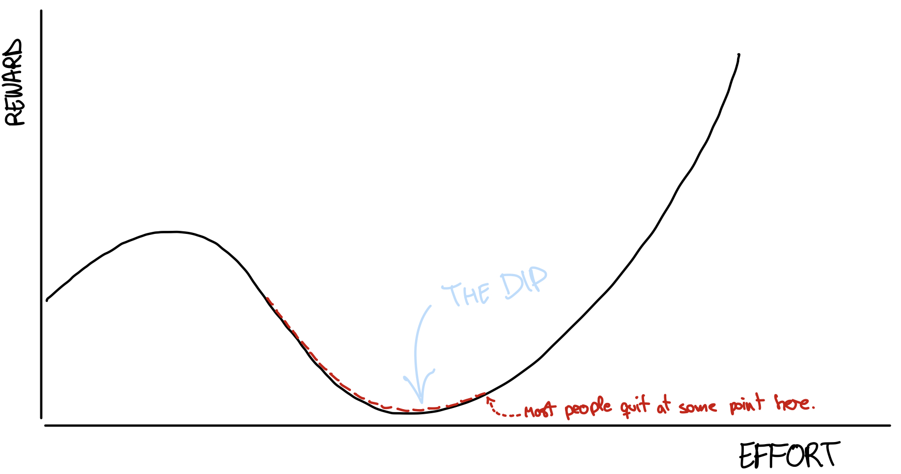
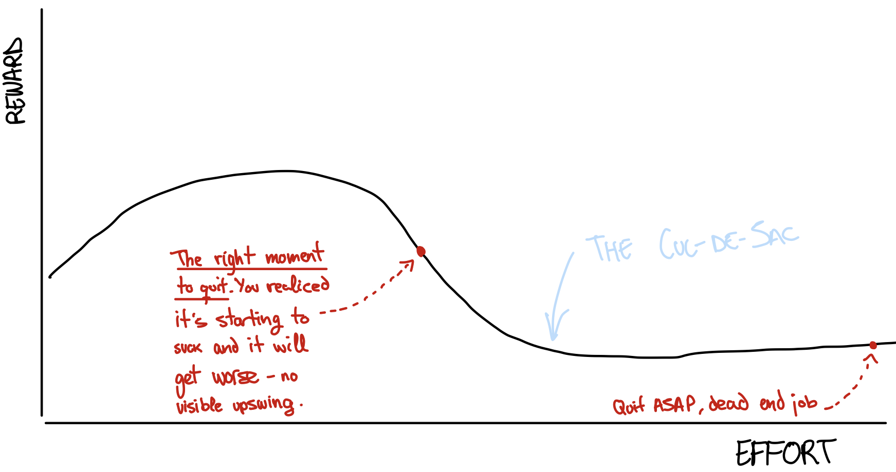
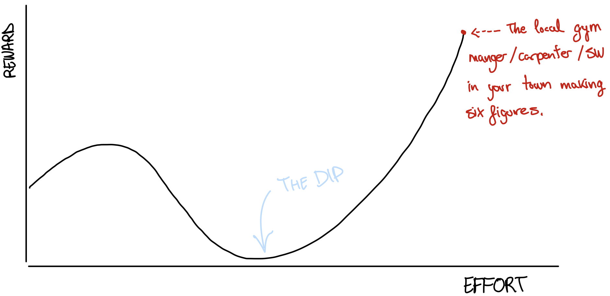
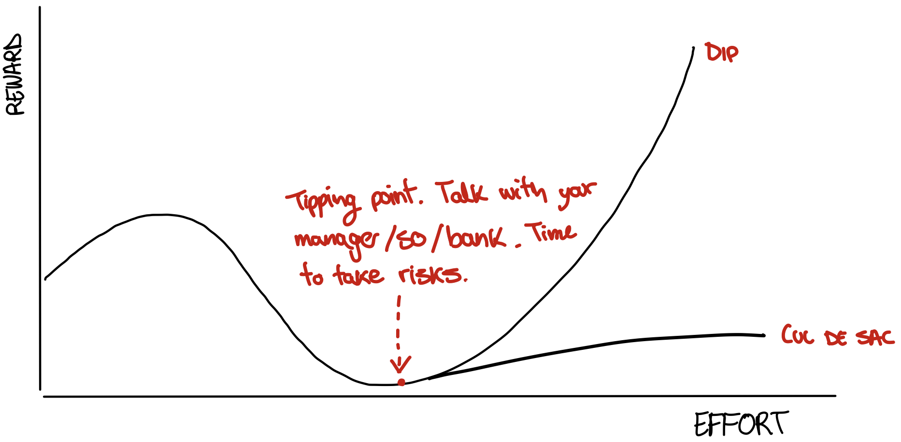

+++
title = "The Dip, by Seth Godin"
description = "Short book on when (and how) to quit."
date = "2023-04-23"
[taxonomies]
tags = ["books", "quitting"]
[extra]
comment = true
+++

## What's The Dip ?

> The Dip is the long slog between starting and mastery. A long slog that’s actually a shortcut, because it gets you where you want to go faster than any other path.

This period is characterized by frustration, hard work, and the need to push through obstacles in order to achieve success. Not everyone has the perseverance and determination needed to go through the dip. As most people quit before they reach the other side of the dip, the scarcity of people that make it makes them very valuable.

> Whatever you do for a living, or for fun, it’s probably somehow based on a system that’s based on quitting. Quitting creates scarcity; scarcity creates value.

But facing a dip doesn't mean that its always worth it to do through it - not all dips are created equal. Some dips are temporary, and pushing through them can lead to great rewards. Others are dead-ends, and it is better to quit and focus on something else.

Godin argues that quitting can be a strategic move in certain situations, and that knowing when to quit and when to push through "the dip" is essential for achieving success.

> Winners quit all the time. They just quit the right stuff at the right time.

## How to know what dip is worth it ?

> Believe it or not, quitting is often a great strategy, a smart way to manage your life and your career. Sometimes, though, quitting is exactly the wrong thing to do. It turns out that there’s a pretty simple way to tell the difference.

When you are in the dip, there are only two situations that you will face: either it gets better or it doesn't. You should quit if it doesn't get better - that's it.

Seth Godin define most of the situations that doesn't get better as _The Cul-de-Sac_:

> The Cul-de-Sac (French for “dead end”) is so simple it doesn’t even need a chart. It’s a situation where you work and you work and you work and nothing much changes. It doesn’t get a lot better, it doesn’t get a lot worse. It just is.

There’s no reason to keep investing in something that is not going to get better._The Cul-de-Sac_ are all of the relations that do not go anywhere, the business that are leading nowhere, or those jobs that are purposeless.

> That’s why they call those jobs dead-end jobs. There’s not a lot to say about the Cul-de-Sac except to realize that it exists and to embrace the fact that when you find one, you need to get off it, fast. That’s because a dead end is keeping you from doing something else. The opportunity cost of investing your life in something that’s not going to get better is just too high.

> You should quit if you’re on a dead-end path. You should quit if the project you’re working on has a Dip that isn’t worth the reward at the end. Quitting the projects that don’t go anywhere is essential if you want to stick out the right ones.

He recommends to quit as fast as you recognize you are in a _Cul-de-Sac_. The biggest obstacle to success in life is our inability to quit these situations soon enough.

> Quitting a job is not quitting your quest to make a living or a difference or an impact. Quitting a job doesn’t have to mean giving up. A job is just a tactic, a way to get to what you really want. As soon as your job hits a dead end, it makes sense to quit and take your quest to a bigger marketplace—because every day you wait puts your goal further away.

## Beating the Dip

The Dip is hard, either when it's worth it and when it's not. But once you know in which kind of Dip, the author recommends to embrace it - as almost everything in life worth doing it has a Dip.

> Successful people don’t just ride out the Dip. They don’t just buckle down and survive it. No, they lean into the Dip. They push harder, changing the rules as they go. Just because you know you’re in the Dip doesn’t mean you have to live happily with it. Dips don’t last quite as long when you whittle at them.

By this point, either you know if you should quite (_Cul-de-Sac_) or keep going.

> The challenge is simple: Quitting when you hit the Dip is a bad idea. If the journey you started was worth doing, then quitting when you hit the Dip just wastes the time you’ve already invested.

One tip he mentions is reminding the purpose of the Dip.

> Short-term pain has more impact on most people than long-term benefits do, which is why it’s so important for you to amplify the long-term benefits of not quitting. You need to remind yourself of life at the other end of the Dip

## After the Dip, being the Best in the World

Alright, the right (not _Cul-de-Sac_ ) Dip is worth it so you must keep going...but what it makes it worth it?

> The people who set out to make it through the Dip—the people who invest the time and the energy and the effort to power through the Dip—those are the ones who become the best in the world. They are breaking the system because, instead of moving on to the next thing, instead of doing slightly above average and settling for what they’ve got, they embrace the challenge.

Basically being _the Best in the World_. My first reaction reading this was that it's basically BS. You do not need to be the best in the world to succeed, and trying to get into seems like a rat race. However... it makes sense once you add some constraints.

> The Best in the World? Anyone who is going to hire you, buy from you, recommend you, vote for you, or do what you want them to do is going to wonder if you’re the best choice. Best as in: best for them, right now, based on what they believe and what they know. And in the world as in: their world, the world they have access to. So if I’m looking for a freelance copy editor, I want the best copy editor in English, who’s available, who can find a way to work with me at a price I can afford. That’s my best in the world.

## Tips on quitting

1. Say no, quit before even staring.

> If you’re going to quit, quit before you start. Reject the system. Don’t play the game if you realize you can’t be the best in the world. [...] Please understand this: If you’re not able to get through the Dip in an exceptional way, you must quit. And quit right now. Because if your order book is 80 percent filled with prospects where you just sort of show up, you’re not only wasting your time, you’re also stealing your energy from the 20 percent of the calls where you have a chance to create a breakthrough.

2. Don't get into the habit of switching lines.

> He never gets anywhere because he’s always switching lines, never able to really run for it. While starting up is thrilling, it’s not until you get through the Dip that your efforts pay off. Countless entrepreneurs have perfected the starting part, but give up long before they finish paying their dues. The sad news is that when you start over, you get very little credit for how long you stood in line with your last great venture.

3. If you are going to quit _something_, you have nothing to lose. Try everything in that situation to change it from _Cul-de-Sac_ into a Dip

> When the pain gets so bad that you’re ready to quit, you’ve set yourself up as someone with nothing to lose. And someone with nothing to lose has quite a bit of power. You can go for broke. Challenge authority. Attempt unattempted alternatives. Lean into a problem; lean so far that you might just lean right through it.

4. The time to look for a new job is when you don’t need one.

5. Quitting as a short-term strategy is a bad idea. Quitting for the long term is an excellent idea.
a
6. Plan _when_ to quit.

> When should I quit? I need to decide now, not when I’m in the middle of it, and not when part of me is begging to quit. [...] Decide in advance when you’re going to quit. You can always quit later—so wait until you’re done panicking to decide. When the pressure is greatest to compromise, to drop out, or to settle, your desire to quit should be at its lowest.

I found this tip more insightful than it might seem. Deciding beforehand when to quite ensures that:

- You will make a rational decision, and not based on the emotions of the moment.
- Embrace better the hard moments, as you have a marked day that you will quit.
- Avoid any rationalization, or act of trying to convince yourself that the _Cul-de-Sac_ is a Dip. Once you have done the worse part, it is difficult to quit. Even if the reward isn't worth it.

## Two questions to answer before quitting

There are actually three, but only these two made sense for me.

1. Am I panicky?

> Never quit something with great long-term potential just because you can’t deal with the stress of the moment.

Do not quit because its hard. Quit because the effort is leading nowhere.

2. What measurable progress am I making ?

> If you’re trying to succeed in a job or a relationship or at a task, you’re either moving forward, falling behind, or standing still. There are only three choices.

Moving forward involves tangible progress, something that you clearly can point out that it is improving and getting better.
