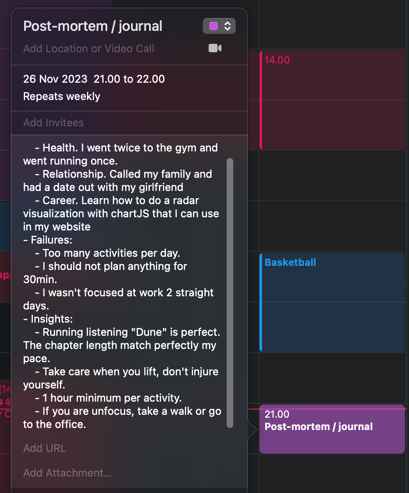
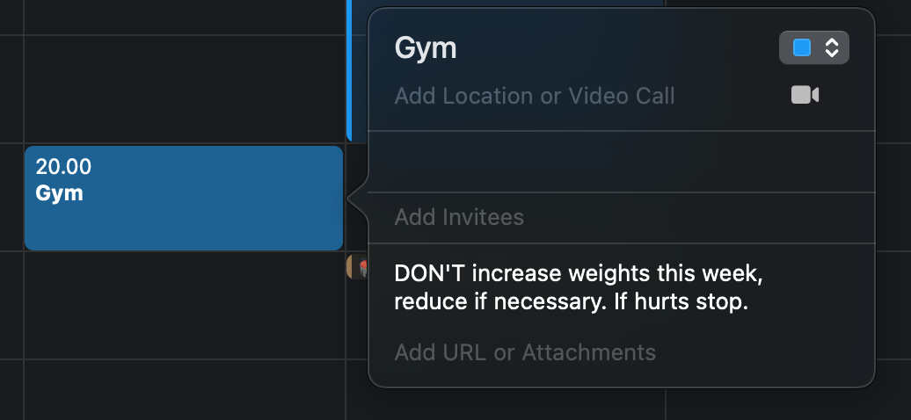

+++
title= "The 3 alarms, by Eric Partaker"
description= "Literally setting 3 alarms to help you focus."
date = "2022-01-01"
updated = "2022-05-01"
[taxonomies]
tags= ["books", "productivity"]
[extra]
comment = true
+++

The 3 alarms are literally 3 alarms on your phone to remind you to take care of the important things.

> What if I set three alarms on my phone to trigger me: one to remind me I want to be healthy, one to remind me I want to be wealthy, and one to remind me I want to be a great husband and dad?

The idea behind is that you can only perform up to the maximum of your abilities (**"peak performance"**) if you take care of:

- Your relationships.

- Your health.

- Your career.

Setting the 3 alarms help to refocus on the specific goal at that part of the day and zoom out of the others.

> When the alarm goes off, you can think of yourself as stepping into that new identity—transforming into you at your best within that area.

The book takes a holistic view of success. The 3 pilars are interconnected - if you neglect one it affect negatively the others.

This idea deeply resonated with me.

I'm sure that every person can pin-point a stage in life that they neglected their relationships, career, or health and had negative consequences in the their overall life and happiness.

The 3 alarms themselves are only **reminders of the kind of person you _are_**. It is more likely that you do things because it is part of your identity rather than because "you have to do it". The concept is the same as identity-based habits, treated extensively in *Atomic Habits*.

You go to the gym because you are healthy. You take your job seriously because you are a professional. You take care of your relationships because you are a caring person. You do what you do because you **are** that kind of person, not because you **have to**.

Let say that you have an alarm for 8:00 for work (_career_), 17:00 to stop working and taking care of your family (_relationships_) and at 20:00 to do a workout (_health_).

## 3 productivity tips I actually use from the book.

There are many "productivity tips" in the book, including:

- Cultivate antifragility.
- See actions under 80/20 Pareto lenses.
- Set big goals.
- Set a calendar around your energy levels and goals.
- Focus on starting.
- Deep focus.
- ...

I have read the above in many other self-help books, and in my case they do not drive any real change. They all convey to the same techniques and it's mostly ["productiviy p*rn"](https://calebschoepp.com/blog/2022/productivity-porn/).

However, there are 4 small bits that they are practical and they take from 20 seconds to 30 minutes max and are useful.

### 1. Collect champion proofs, not items in checklist.

These alarms are not reminders of what you have to do, they are reminders of the person are. Every time you actually follow the alarms with actions you prove yourself that you are that person.

Eric Partaker call these actions _"champion proofs"_.

> I needed something to prove I was being who I said I wanted to be. So I created a concept called "champion proofs". Champion proofs let you rack up small wins, day after day, to prove you're stepping into the person you're capable of being.

**Go to bed everyday having done at least one champion proof** for each identity that gets you closer to the person you want to be.

Try to do one action per day that contribute to your best-self identity. Even if it is a very small action for 30 minutes, it stack and compound over time.

> We "win the day" not because we achieved what we planned, but because we did what was most important despite our plans.

If you feel overwhelmed, identify the biggest gap between your best-self and the daily actions. Is it health, relationships, or career ?

Focus on setting one champion proof every day for only for one of the 3 aspects, and progressively add champions proofs for the other two.

### 2. Digital sunset.

> Devices can reduce the production of the sleep-inducing hormone melatonin by up to 50%. Without enough melatonin in the body, you'll find it difficult to sleep a full eight hours, and even if you do, it's not likely to be as deep and restorative as it should.

I like to turn off screens by 23:00, with the exception of my kindle.

I sleep better, and also start more energised my next day. The other side effect is that I read way more than before as I usually use the time before midnight reading instead of scrolling.

In the future I might do it an earlier digital sunset, but for now 23:00 does the trick.

### 3. Brief weekly reviews.

This is a review your personal and professional life. What went good and bad in the week, and what could have planned better in hindsight.

**Don't take this as an opportunity to self inflict pain by going over what you should have done**. For me, this is an exercise of self-awareness. I simply apply the learnings from one week to the next one.

As an **example**, this is how a random weekly review in my life looks like.

- Successes:
  - Health. I went twice to the gym and went running once.
  - Relationship. Called my family and had a date out with my partner.
  - Career. I learnt how to do a radar visualisation with chartJS that I can use in my website.
- Failures:
  - Planned too many activities per day.
  - I should not plan anything for 30min or less.
  - I wasn't focused at work 2 straight days.
- Insights/Actions:
  - Running listening "Dune" is great. The chapter length match perfectly my pace.
  - Take care when you lift, don't injure yourself.
  - Plan 1 hour minimum per activity, even if takes less.
  - If you are unfocused while working, take a walk or go to the office.

This review not a complicated system. I write this as part of a journal routine in my calendar app every Sunday. It takes 5 to 10 minutes.

I also spend another 5 minutes adding the insights for the next week's scheduled activities as a reminder.

The return on investment of these 15 minutes is huge. This exercise of reflection brings me instant clarity and increase the probability of achiving my goals for the following week.
