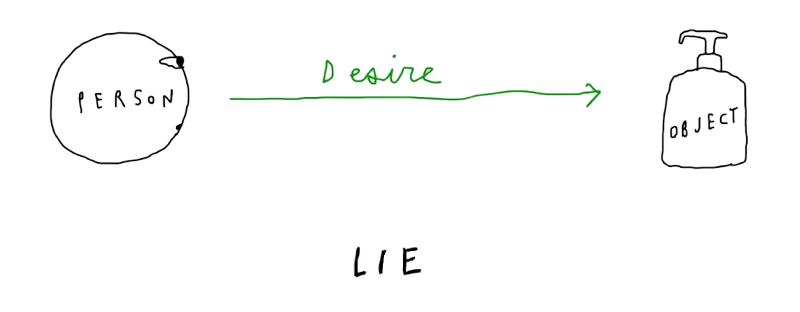
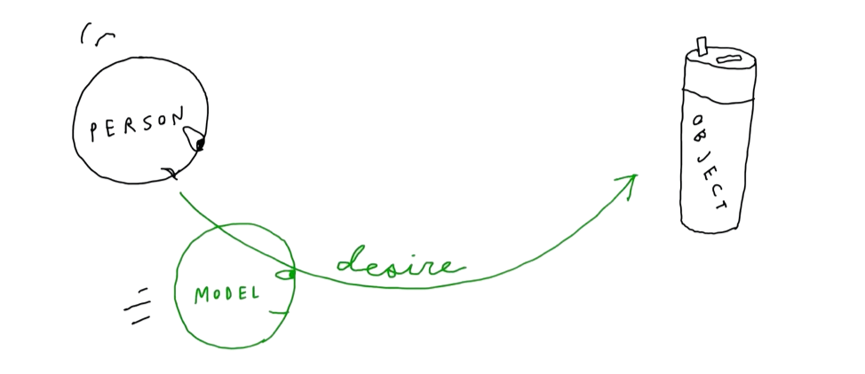
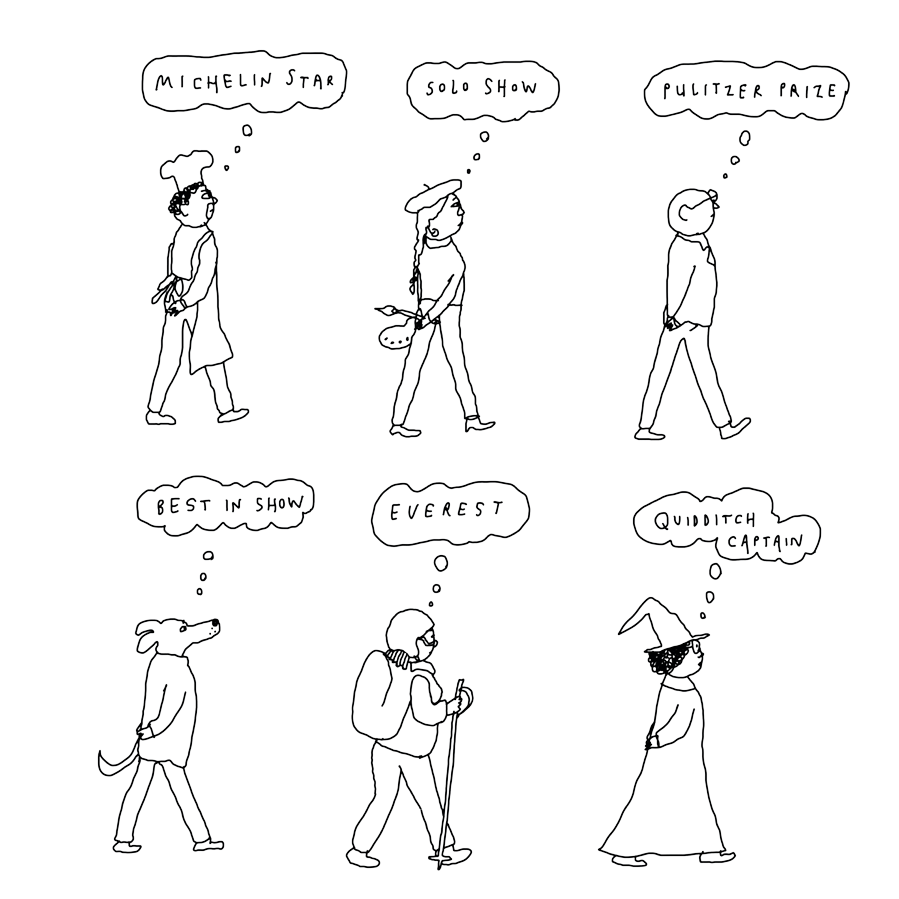
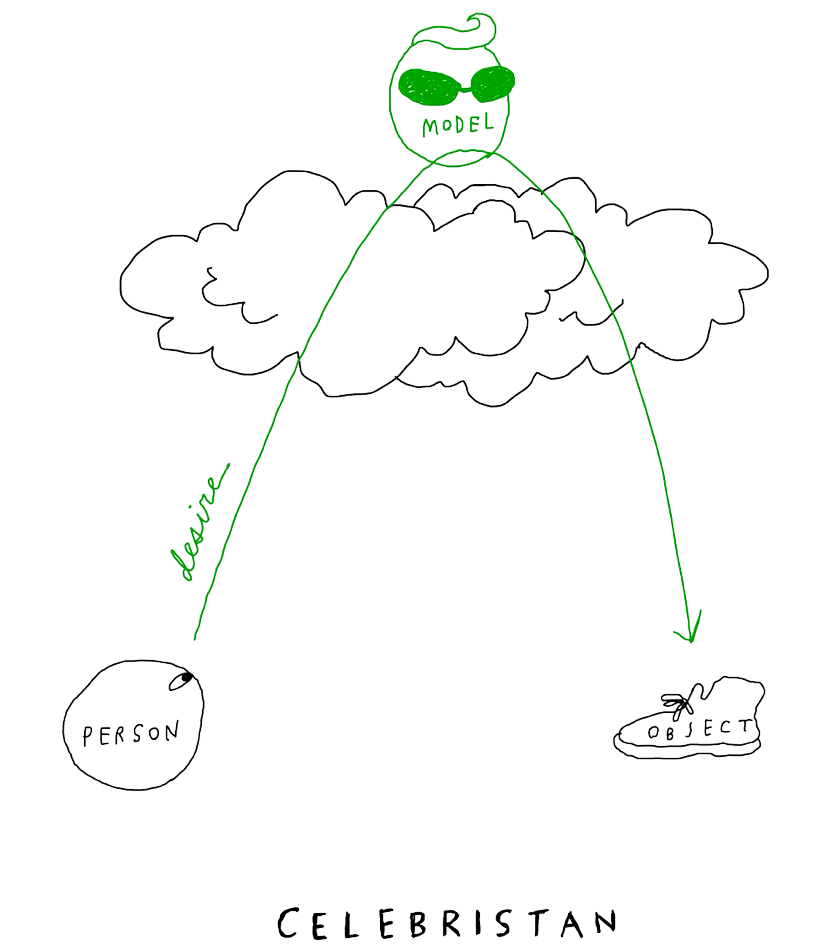
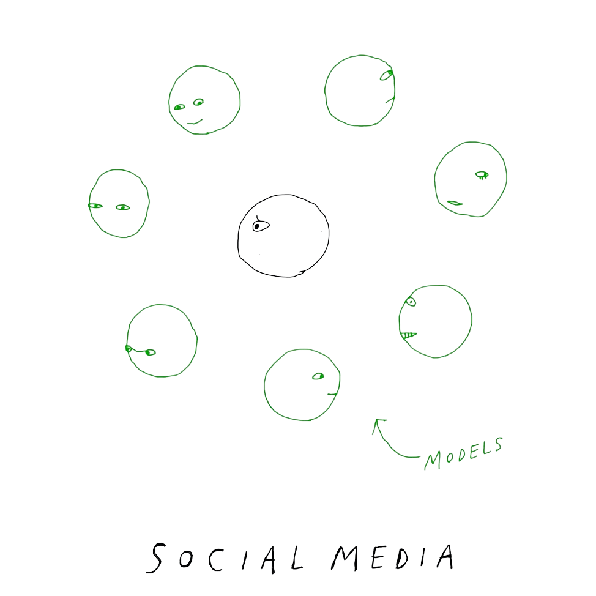
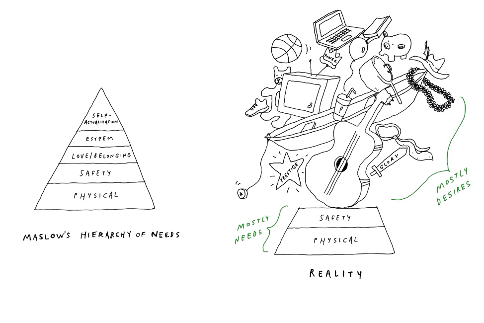
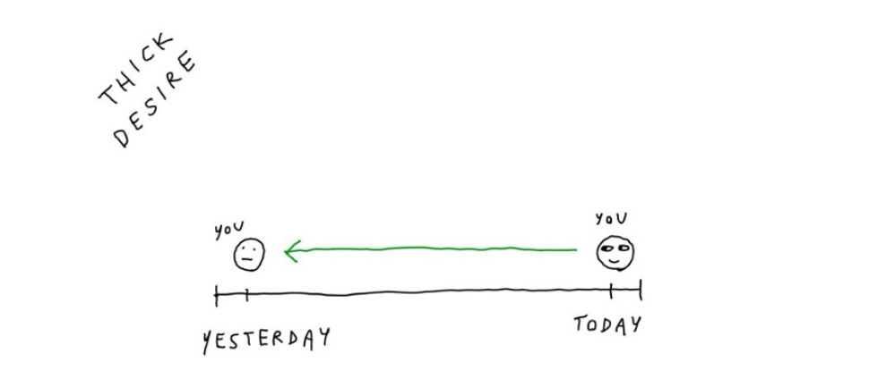
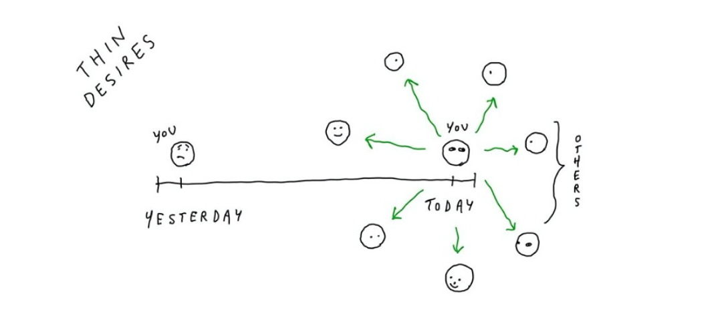

+++
title= "Wanting, by Luke Burgis"
description= "Why we want what we want."
date = "2025-05-04"
[taxonomies]
tags= ["books", "human behaviour"]
+++

Learnings and notes from the book **"Wanting: The Power of Mimetic Desire in Everyday Life, by Luke Burgis"**. Drawings belong to Luke Burgis.

## Main idea of the book

Luke Burgis, the author, popularizes the works of René Girard, a French historian philosopher (1923-2015).

The central theme of the book is *mimetic desires*.

Under this theory, all human desires and wants are derived from other people. You are not sovereign of your own desires. You want what you want because you learned from other people.

Desires are not seeking food, shelter or sex. Those are biological needs embedded in our system for survival or the spice. After all primary needs are covered, in a relatively new environment for humans, humans need to figure out what to want to do. How do they do it?

By copying other humans.

The idea of your own desires is a lie. Most people understand that their desires are influenced by advertisement and celebrities, but what I understood after reading the book is that I am not influenced - I am mirroring them.

As a human, there is no other way for me to understand what is worth wanting and pursuing than looking at others. In Girard lingo, we look at "desire models".

We may want to escape this model and have "unique desires", but it is the way we are.

 > Desires are discerned, not decided.

Whether we like it or not, we all hold "mimetic desires". Things that we don't currently have but other people do and we would like as our own. One does not "overcome" desires, we need them to direct our actions. Not desiring is not an option.

The book simply reveals the pattern so we understand our behavior.

## Types of Desire models

When the desire comes from high-status models, Burgis calls the place "Celebristan". When the desire comes from peer or same status models, the model is from "Freshmanistan".

There are no good or bad models by simply being *celebristan* (high status) or *freshmanistan* (same status). It is just a categorization of the desire source.

Note that even celebrities have people they admire and look up to, and desire things they don't have from their own desire models. It reminds me to the old Kanye's song "Everying thing I am" from his album Graduation, in which [he opens up his insecurities about not being as great as his idols](https://genius.com/Kanye-west-everything-i-am-lyrics). Even 2008' Kanye, arguably peak high status at the time, has desire models.

### High Status models

These models dictate what is greatly desirable. There is no competing behavior for people looking at these desires as their own and it is generally acceptable that we all want those things.

> In Celebristan, there is always a barrier that separates the models from their imitators. They might be separated from us by time (because dead), space (because they live in a different country or aren’t on social media), or social status (a billionaire, rock star, or member of a privileged class).

LeBron James' mansion, touring around the world, trophy husband/wife, having a bestseller book... There is no possibility of competing with your actual peers for these and therefore they do not create any competitive behavior between peers, the distance from you to these desires is too long.

### Same status models

These models dictate what is mostly desirable, and they represent competing desires. A strong source of stress and anxiety as every desire seems only one step away from your models. You only need to do more, be more or earn more.

The classic pressure to "keeping up with the Joneses" comes from these models.

> Most of us know by now that Facebook is more than just a passive way of updating friends; it’s a tool for forging identities, real and desired (are you really a family of outdoorsy hikers or is that vacation photo your first hike ever?). It provides an endless stream of models in the form of other people’s curated lives. That is the source of its seductive hold on us, as well as our ambivalent feelings about it. Facebook symbolizes the world’s entry into Freshmanistan, in which we spend most of our time looking down at our screens—which means simultaneously looking sideways at our neighbors.

Your neighbor's new kitchen renovation, promotion, new car. Making as much money or having as many Instagram followers as your friends.

## Why some desires are dangerous

Desires can make or break a fulfilling life because they are the main driver of actions and we cannot control them directly. They are all the messy, difficult to unpack, compound of wants after we have fulfilled basic needs.

### 1. Desires define us by derivation

Being reductive: I am what I do. I do what I want. I want what my desire models tell me to.

I have to admit that the idea of not being in control of what you want is scary. It creates a sense of rejection, not because it doesn't make sense but because it hurts thinking that you are not living your life according to 'your own terms'.

The truth is that I want what I want because I saw it defined by others as worth it.

 > If you look hard enough, you will find a model (or a set of models) for almost everything—your personal style, the way you speak, the look and feel of your home.

Others can drive your decisions via desires if you do not filter your models.

### 2. Technology make desires homogeneous

Technology and hyper connectivity make everyone in the world a potential model. Social media has a predominant role deciding what is worth it and deciding the current status symbol.

 > Technology companies have the power to engineer desire because they increasingly stand as mediators between people and the things they want.

As algorithms feed us more and more content aligned with what we already think, they create closer and closer systems of desire. They provide clear indications of similar desire models of what to want, what to like, what is acceptable and what you should imitate.

Technology creates desires less broad, more compiting, demanding, and material than ever before.

### 3. Desires do not follow rationality

People wouldn't get into debt to pay for $1500 smartphones otherwise. An iPhone represents a status symbol that we share with people completely outside their social sphere.

iPhones are incredibly engineered products, don't get me wrong, but I believe their main value is the desirability across all statuses and generations.

> Desire is not a function of data. It’s a function of other people’s desires.

Desires can be strong enough to pull us in the direction that ads, social marketers and tech engineers want to.

### 4. Desires are hidden

Humans do not walk around yelling at others what they should want to buy. However, we wear logos. We do not tell others to focus on their careers but we congratulate them on promotions. We celebrate buying bigger homes (housewarming parties), having children (baby showers), or getting into selective jobs or institutions (linkedin).

 > In the passage from childhood to adulthood, the open imitation of the infant becomes the hidden mimesis of adults. We’re secretly on the lookout for models while simultaneously denying that we need any. Mimetic desire operates in the dark. Those who can see in the dark take full advantage.

These are constant signals everywhere telling us what is worth. Society enforcing these behaviors makes them more desirable.

Desires that are hidden are more powerful as they can be confused with desires you thought you made on your own.

### 5. Desires take a long time to get rid of

A first step is understanding that you want something because of mimetic imitation. The second step, that can take years, is to stop wanting that something.

The fact that you acknowledge that some desires are unhealthy for you doesn't make them disappear automatically. I can acknowledge that wanting a Porsche is purely a thin desire based on imitation of high status, but that doesn't stop me from wanting the damn car.

Replacing "thin" desires for "thick" desires is good start for stop wanting unhealthy desires.

## Types of Desires

Burgis distinguishes between *thin desires* and *thick desires*. The first are based on rapid imitation of others' wants, the latter is based on more rooted desires that developed over time.

### Thin desires

Mimetic desires based in other people's views.

The things you want because they are modeled by the people you look up to. Quick to build and produce very powerful feelings of need. Ads, celebrities' lifestyles, high status material things.

You can identify them based on how you feel after you fulfill them, as they leave an empty feeling after some hours or you simply forget about it.

We all know that set of clothes, technology and whatnot that after the first use simply stops mattering. The desire disappears, leaving an object that you probably do not notice if it went missing.

These mimetic desires are not rooted in who we are and they come and go. That's why the "Wait 30 Days Before Buying Anything Rule" [works that well for some people](https://www.reddit.com/r/simpleliving/comments/ml8wte/i_now_wait_30_days_before_purchasing_something_it/), as these desires are powerful but they change over time constantly.

### Thick desires

Desires rooted in your previous self.

They have also been built by imitation in the past, but the difference is that they are tested by time. Time is the key differentiator here.

They are "thick" in the sense that they did not go away with the next current trend in fashion, or by meeting a new group of friends (new models), or by following new people. These desires did not easily get replaced by new ones after a short time. They are a part of what makes you, you.

 > Developing thick desires protects against cheap mimetic desires, the proof is that a person can start to fulfill it today and continue to fulfill it into retirement. It grows with compound interest over many years. It has time to solidify.

Since we are wired to have desires, having fulfilling "evergreen" thick desires seems to be better than having unfulfilling temporary thin desires.

Thick desires are usually personal and local, as they are deeply dependent on you (e.g. not internationally shared like wanting *fame*).

## What I do with all of this? How to find your thick desires ?

The book offers some tips and tricks, but it is not very actionable in my opinion.

This section is an exercise of honesty I did myself based on the knowledge of the book. It has helped me hugely to understand myself and what I want.

Below, I've outlined the steps I took. Spoiler: It's a very simple exercise but mentally hard. It requires being brutally honest with yourself and giving this through process a couple of days.

It requires: A Google/Excel spreadsheet to write it down. Pen and paper would work as well. That's it.

I approached it knowing that I would destroy the doc it was written on after the exercise was over, so I could be fully honest with myself.

### 1. Write down your desire models

Acknowledging that your desires come from other people is a first step. A more thoughtful second step is sitting down with your thoughts and thinking which specific role models you look up to. What people you admire.

We are not focusing on desires but on the models around you.

Not only famous people, also friends that you look up to, common people you respect, your family members, people that you usually think about often passively, fictional characters, writers, Instagram personalities, YouTubers, your mother. People that you want to prove something to by doing, earning, being more than them.

These "desire models" hide desires that you probably imitate. The more you write the more you unpuzzle your goals and wants.

 > Every industry, every school, every family has a particular system of desire that makes certain things more or less desirable. Know which systems of desire you're living in. There's probably more than one.

Please do not forgot "the good ones"! Do not focus only on the negative influences.

> We can’t access our desires without models. And we will always follow those models that are most real to us - who possess a quality of life that we feel transcends our own. So stalk your highest and noblest desire, but you will have to find it in the form of a model. On this particular day, as you read these words, it might be a character from a book, a leader, an athlete, a saint, a sinner, a Medal of Honor winner, a love, a marriage, a heroic action, the greatest ideal you can possibly conceive.

Honest introspection is never easy.

I preferred to be dumbscrolling but I've written close to 100 rows of names. It took hours in different days of thinking about it. It's a bit shameful to be honest with yourself - I would love Marcus Aurelius to be a desire model, but instead I have an ex manager that I resent and "want to prove wrong". I had to check my social media, contacts, thinking in silence for a while.

### 2. Write down your desires

Write down things you want and personal desires on a new page. Material (a new jacket, computer, face cream), and non-material (a child, being respected, writing a book).

Human desires are endless, so I narrowed down the things I genuinely want, not all the things I could come up with.

This part was a bit easier than the previous one for me. 90 percent of it resembled a list of personal goals and a material wishlist combined. Still, 10 percent of it felt silly, shameful, or a combination of both. My list ended with ~200 rows.

Easy doesn't mean quick. This process takes time, as we often feel lost about the direction of our life or what we want to accomplish. Try to remove any dopamine (e.g. music) or any stumuli that can trigger you out of the mental exercise.

 > Silence is where we learn to be at peace with ourselves, where we learn the truth about who we are and what we want. If you’re not sure what you want, there’s no faster way to find out than to enter into complete silence for an extended period of time.

### 3. Link models with desires

With both desire models and desires in hand, place them side by side and link each desire to the model it most likely comes from.

This will reveal which models drive most of your desires, and therefore which people you are imitating. There is nothing wrong with imitating the desires of others. The main goal here is to bring to light which people are driving your desires without your awareness.

Understanding visually where some of my desires came from made me want them even more, as I realized how they represent and define me positively.

I wasn't so proud of many other desires, but I still learned about myself since I could point out how I was influenced by certain models.

I did not manage to link all the models and desires, and I doubt that anyone can map all their desires, but it pushed me to think of where the unmatched desires came from.

### 4. Decide what desire models to get rid of

There are 2 main candidates to get rid of:

1. Models that create desires that you don't want to have (e.g. desires coming from influencers, ads, toxic personal relationships...)

2. Competing desires that are not worth it. You cannot accomplish everything, therefore wanting everything is the quickest way to disappointment. Some competing desires must go.

Think if those desires are worth pursuing and if they will produce a lasting sense of fulfillment upon completion:

 > Don't take desires at face value. Find out where they lead. Sit with competing desires and project them into the future.

All of the desires that do not create this satisfaction over time are candidates to just be ephemeral, and you can be happier without them.

 > Desire is a contract that you make with yourself to be unhappy until you get what you want, [Naval Ravikant] said.

Remember that you can't decide on your desires, but you can decide what models you are exposed to. In this part, decide which desire models are creating behaviors and making you want things that you wouldn't really want if it wasn't for that model.

Since you cannot stop wanting something that easily, simply minimize or even try to eliminate completely that model from your life.

In practice, I marked with red the desires I thought would not lead me to be any happier even if I completed them (candidate 1). I also marked with orange the desires that were in conflict. I simply couldn't make all of them possible and therefore wanting all of them would only lead to remorse one way or another (candidate 2).

I spent many days musing about these models and people. Realizing people are making me want things I don't really care about. That I spend money for status, when I could spend it fulfilling desires I enjoy.

Also realizing that there are very positive people around me who are good desire models and I would love to spend more time with. Deleting some social apps, unfollowing people in others, uninstalling apps that were really ad apps dressed as utility apps.

It felt great getting "out of my life" many of those models. Many think that the main benefit of removing doom scrolling apps is the extra time to be reading, doing exercise or hobbies. I don't. The big difference is not being expose to ads, toxic desire models and silly status symbols.

It is surprising how you stop wanting some things as far as they are not shoved to your eyeballs constantly.

### 5. Decide what desire models to get in

Activelly removing desire models also created a void of time, energy and therefore boredom.

Many people try deleting their social media only to install it 3 days later, this is not what we are trying to do here. These desire models need to be replaced by other desire models.

From the sheet or paper with all the desire models, start marking with green the models leading to desires you want to have. Desires that create long lasting joy.

Try to expose yourself more to that models. It might be friends that you want to reconect, media figures that lead to you adopting health habits, or travel blogs that made you go to discover remote places in the past. This is deeply personal, so each person has it's own.

If you do not have enough thick models, you can explore more in authors, filmakers, history characters...

 > Our desires are only as big or as small as the models that we are exposed to. Fictional characters who model great, thick desires can be a counterbalance to real-life models of weak, thin desires. [...] it might be a character from a book, a leader, an athlete, a saint, a sinner, a Medal of Honor winner, a love, a marriage, a heroic action, the greatest ideal you can possibly conceive.

Luke Burgis call this process "cultivating thick desires".

  > Our choice is between living an unintentionally mimetic life or doing the hard work of cultivating thick desires. The latter may require us to suffer from the fear of missing out on the shiny mimetic objects that surround us.

This is the final and most rewarding part of the exercise. It can be summarized as actively creating the space for good people and models to enter your life more often. How wholesome is that?

## Final words

I thought the book could have been shorter and better structured. I found surprising that it doesn't mention the evident role of advertisement, product placement or influencers in modern desire creation.

Regardless, it created a profound mark on how I see people and myself. Recommended for everyone who are interested in human behaviour and social psychology. Even if you don't agree with the whole René Girard philosophical discourse, it forces you to think slow and deeply about your desires - which I had never done until reading this book.
