+++
title = "Course Notes - Neural Networks and Deep Learning"
description = "My personal notes of DeepLearning.AI deep learning course"
date = "2024-05-10"
[taxonomies]
tags = ["courses", "machine learning", "deep learning", "python"]
[extra]
comment = true
+++


## 1. Introduction to Deep Learning

### 1.1 What is a Neural Network?

Neural Networks are collection of connected units or nodes called "neurons", which loosely model the neurons in a biological brain. The combination of neurons _learn_ to perform tasks by considering examples, without being programmed with task-specific rules.

As an example, consider that we have to predict the price of houses using their size. We have 6 houses in the dataset. Every neuron applies the function in grey:

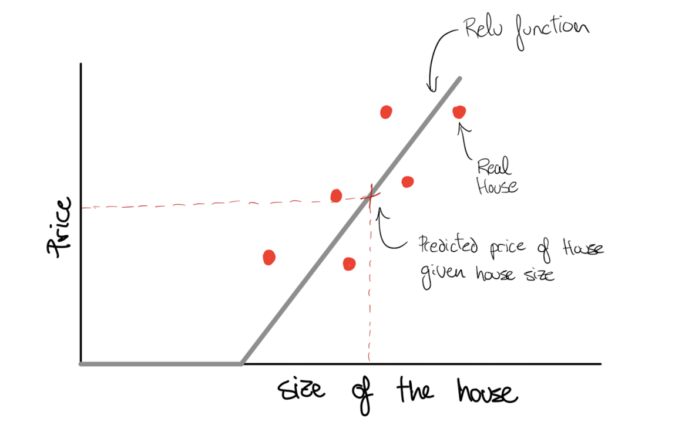

All the neuron does is taking the size of the house as input, apply a transformation equation called ReLU and the output is the estimated the price.

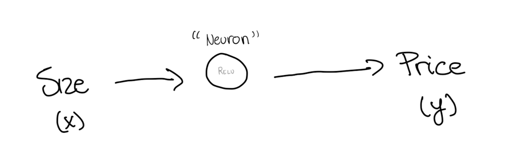

ReLU, or Rectified Linear Unit, is a simple function that takes the input and returns the same value if positive, otherwise returns zero:

```python
def relu(input):
	if input > 0:
		return input
	else:
		return 0
```

All the neurons pass ReLU, or other similar kind of functions called “activation functions”.

A **Neural Network (NN)** is created by stacking neurons together. Each of the neurons stacked implements ReLU, or some other slightly non-linear function.

A NN needs a large number of inputs and their output, a lot of examples to find the pattern that explains the output.

In the example, a large dataset of houses prices associated with their size. The "**hidden layers**" are made by the neurons themselves.

The first layer, the **input layer**, and the hidden layers are connected: every input feature is connected to every "hidden" feature.

The NN feeds the features size, the number of bedroom, zipcode, wealth and so to "hidden units" that explains the prize. This hidden units are made by the neurons without explicitly telling them. Therefore, some times you can find these models refered as "**black boxes**” due to the process not being explicit in the hidden layers:

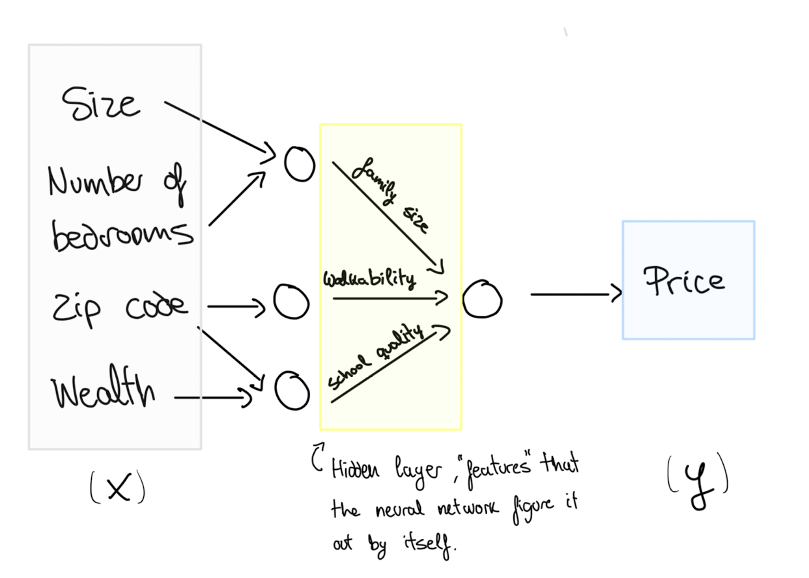

For example, the NN is modelling “family size” given the combination of size of size and number of bedrooms.

### 1.2 Supervised Learning with Neural Networks

There are different types of neural networks besides the standard architecture seen before. This classical standard architecture is still useful for tabular data, such as user information to predict online shopping. But there are other kind of problems that require other kind of neural networks.

For example Convolution Neural Network (CNN) used often for image application. Recurrent Neural Networks (RNN) are used for one-dimensional sequence data such as translating English to Chinese or a temporal component such as text transcript. Hybrid Neural Networks architecture can be used for autonomous driving model.

For now the only difference that we have to know is between structured and unstructured data:

- **Structured data**: it has a defined label, such as price and size. Also called tabular data.
- **Unstructured data**: it does not have a define meaning by itself. Like a pixel, raw audio or text.

## 2. Neural Network Basics

### 2.1 Logistic Regression as Neural Network

In a **binary classification problem**, the result is a discrete value output: a 1 or a 0. For example, trying to explain a catastrophe survival rate: a person survived (1) or did not (0).

The feature matrix shape is made "stacking" the number of features($n_x$) in different columns, one for every observation ($m$): $X.shape = (n_x, m)$.

The output shape is a 1 by $m$ dimensional matrix: $y.shape = (1,m)$.

The prediction $\hat{y}$ (0 or 1) is determined by the probability of a real $y$ given factors $X$:

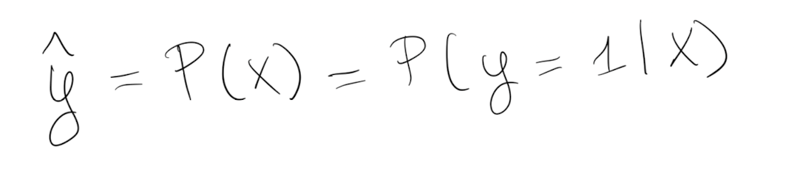

The probability is calculated by a `sigmoid` activation function that takes a linear regression $z$ as input:

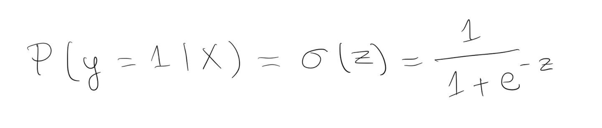

Lastly, $Z$ is just a linear regresion.

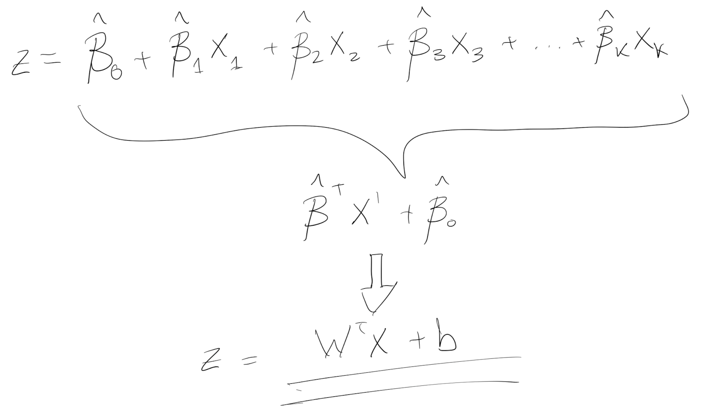

Here I took the notation of "Betas" because this is what I am used to in Economics, but from here on I’ll refer at them as “Weights” and “bias” instead. It is the same with different notation.

Please notice that a linear regression that goes into a sigmoid activation is a “Logistic regression” with different wording.

Think about a Neural Network as a collection of “neurons” or nodes that take inputs and apply a sigmoid function. The sigmoid function is simply a logistic transformation that wraps the features($n_x$) so the values of $y$ are forced to be 0 or 1.

NN = a lot of logistic regressions averaged.

Example:

We want to calculate the probability of tomorrow being sunny (1) or rainy (0). All the days in the training set have associated temperatures ($X$) to those days. Since sunny days tend to be warmer, the linear regression will give $\hat{y}$ closer to 1 when the temperatures are high, and close to zero when it rains. Sigmoid transforms the closer numbers to 1 to exactly 1 and the closer to 0 to exactly 0, and that’s the prediction $\hat{y}$.

### 2.2 Evaluating the model with Log-Loss

✍️ NOTE: added info from https://mlu-explain.github.io/logistic-regression . It assumes familiarity with linear algebra.

For now, lets continue with a simple logistic regression as a base NN.

Please notice that $z$ calculation (linear regression) only relies on $X$ that is a matrix given by the data itself and the weights $W$.

How do we set the $W$ then and how does it now that $W$ are well defined?

To explain it in an intuitive way, we can use a “comparison mechanism” to set $W$. The mechanism or function compares the $\hat{y}$ and $y$ difference. If they are the same the $W$ are good for the data, and if not it tries again with new $W$.

This comparison mechanism or equation is called “Loss function”. For logistic regression, a suitable loss function is Log-Loss, also called binary cross-entropy:

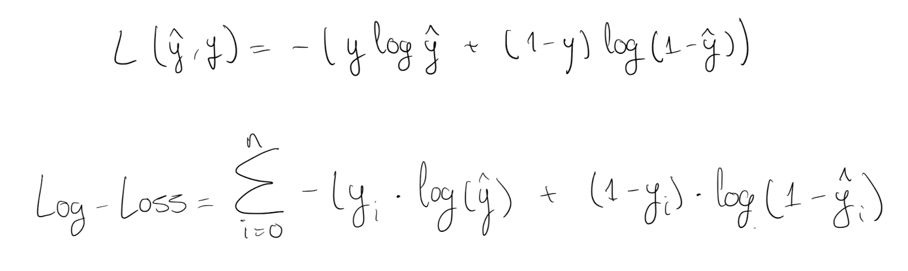

Notice that the equation is only a function of $y$ and $\hat{y}$ - it “compares” them.

It is made that way so if the real label and the predicted label are the same, it equals zero. The worse the model the higher the result is (try replacing $y=0$ and $/haty=1$ for all $i$).

That’s why it tells how well the logistics regression is doing. The lower the function value, the better the logistic regression is predicting labels.

### 2.3 Gradient Descent and Logistic Regression

From Log-Loss, the logistic regression “knows” which coefficients $W$ are better for the inputs $X$, but... How it sets the values of $W$ in the first place, and how exactly “update” them ?

A common way to estimate coefficients is to use gradient descent. The gradient calculates where the Log-Loss function is increasing, so going in the opposite direction leads us to the minimum of our function.

In simple terms:

1. Let’s start with random weights $W$ for every observation.
2. The weights determine $z$, that gives you a $\hat{y}$. With $\hat{y}$ and $y$, the Log-Loss will drop real number.
3. Let’s change the $W$ a tiny amount (think +0.00001) and calculate again the Log-Loss. The number went up or down?
4. If the number went down keep increasing the $W$ value, otherwise change direction (decrease tiny bit and see the Log-Loss).

This only works because the shape of the Log-Loss equation is convex, so the slope of the curve guides to the minimum of the equation.

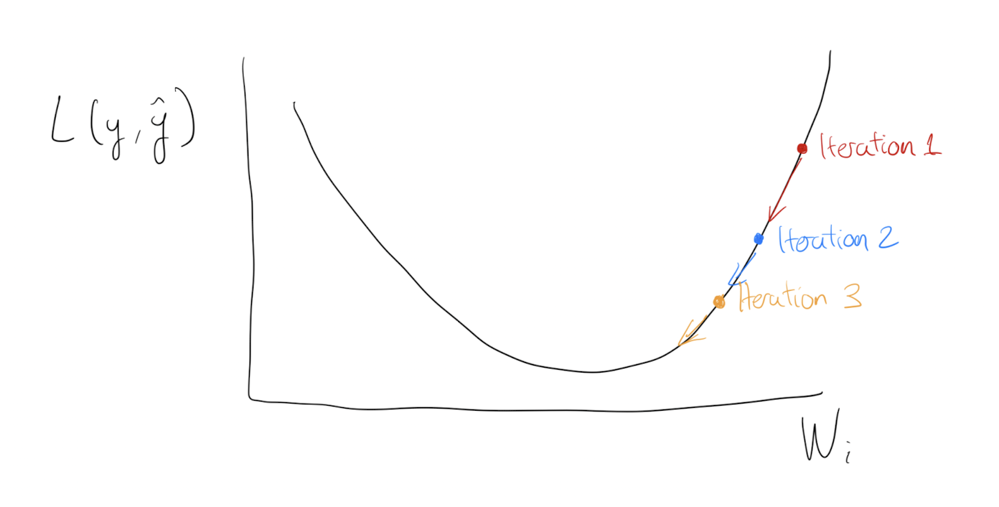

Given it’s shape, the slope of Log-Loss can be used to determine the best set of weights.

Programmatically, the scope is calculated by derivation of the function given a set of $W$. And the gradient descent algorithm is designed to iterate over tiny increments for every observation.

At each iteration, the $W$ value is updated by a tiny amount (the gradient), scaled by the step size $\alpha$ (learning rate). The bigger the learning rate, the higher the steps.

Aside from gradient descent, Maximum Likelihood Estimation (MLE) can be used to estimate the $W$.

### 2.4 Vectorization

As a side note, gradient descent calculations demonstrate why the rise of Deep Learning could not have happened in the past. It needs a huge computational power by hardware that we are lucky to have today. Notice that the logistic function output, the change in the coefficients, and the Log-Loss function have to be calculated again and again.

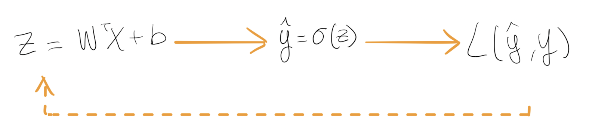

We also have had progress in the way we do the computation iteration.

In the section above I mentioned: _“And the algorithm iterates over tiny increments for every observation.”_

The iteration doesn’t use loops since it would be too computationally costly - it uses vectorization.

Gradient descent needs to compute over and over $z$ to get the prediction for all the values of $i$.

This can be done via loop or via vectorization. For loops takes +1000 times more time:

```python
import numpy as np
import time
# Data
X = np.random.rand(100000000)
W = np.random.rand(100000000)

# For loop
tic = time.time()
for i in range(100000000):
  z += X[i]*W[i]
print(z)
toc = time.time()
print('Loop took: ' + str((toc-tic)*1000) + 'ms')
 --> Loop took: 18357.781887054443ms

# Vectorization
tic = time.time()
z = np.dot(X,W)
print(z)
toc = time.time()
print('Vectorization took: ' + str((toc-tic)*1000) + 'ms')
 --> Vectorization took: 18.301010131835938ms
```

Section 3 it will show that by stacking $X$ and $W$ vectorisation the neural network is more efficient computationally.

### 2.5 Broadcasting

Another convenient process that happens in the background is “broadcasting”. It’s a matrix transformation that Python automatically applies to do faster matrix multiplications.

Python transform the constant (or 1x1 matrix) “$b$” and expand to a “$1xm$” matrix when we use it in matrix operations.

As a "General Principle": When you sum, subtract, divide or multiply $(m,n)$ matrix with a $(1,n)$ matrix the $(1,n)$ matrix will be expanded to a $(m,n)$ matrix by copying the row $m$ times to match the shape.

This allows to write quite a flexible code, but it also allows to start creating product matrices that create bugs difficult to track.

TIP: Specify the matrix shape and don't use rank 1 matrices. Use $np.random.randn(5,1)$ instead of $np.random.randn(5)$

### 2.6 Neural Network from the scratch in Python

In the exercise section it propose a simple logistic regression model identifying cats from non-cats images. They provide already the images.

Instead of the pre-made data given, I took images from Cats and Dogs from Kaggle dataset: https://www.kaggle.com/datasets/erkamk/cat-and-dog-images-dataset?resource=download

Visually, the model looks like:

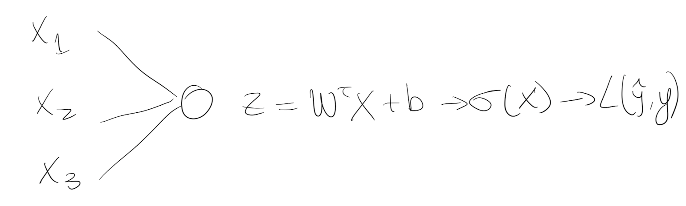

- **1. Create arrays of cats and dogs from Kaggle dataset**

```python
def extract_images(foldername):
    # Training data from Kaggle Cats and Dogs dataset
    all_images = []

    for filename in os.listdir(f'train/{foldername}'):
        f = os.path.join(f'train/{foldername}', filename)

        if os.path.isfile(f):
            image = Image.open(f).resize((64,64))
            image_array = np.array(image)
            all_images.append(image_array)

    # Arry format and normalize pixels
    all_images = np.array(all_images) / 255

    return all_images

cats = extract_images("Cat")
dogs = extract_images("Dog")
labels = pd.read_pickle("train/y.pickle")
```

- **2. Create a train and test set**

The data is not divided into test and train, so you have to create the sets.

```python
X = np.concatenate((cats,dogs), axis=0)
y = np.array(labels).reshape(-1, 1)

# Shuffle all the indexes
np.random.seed(4208)
indexes = np.random.choice(X.shape[0], 1000, replace=False)

# First 800 in the training set, 200 resting in the test set
train_index = indexes[:800]
test_index = indexes[800:]

X_train = X[train_index]
y_train = y[train_index].T
X_test = X[test_index]
y_test = y[test_index].T

print ("Number of training examples: m_train = " + str(X_train.shape[0]))
print ("Number of testing examples: m_test = " + str(X_test.shape[0]))
print ("X_train shape: " + str(X_train.shape))
print ("y_train shape: " + str(y_train.shape))
print ("X_test shape: " + str(X_test.shape))
print ("y_test shape: " + str(y_test.shape))

# Flatten the arrays to (num_px∗num_px∗3, 1)
X_train = X_train.reshape(X_train.shape[0], -1).T
X_test  = X_test.reshape(X_test.shape[0], -1).T

print ("X_train new shape: " + str(X_train.shape))
print ("X_test new shape: " + str(X_test.shape))
```

The print statements should say:

```bash
Number of training examples: m_train = 800
Number of testing examples: m_test = 200

X_train shape: (800, 64, 64, 3)
y_train shape: (1, 800)

X_test shape: (200, 64, 64, 3)
y_test shape: (1, 200)

X_train new shape: (12288, 800)
X_test new shape: (12288, 200)
```

- **3. Components of the Neural Network**

**Define Sigmoid function**

```python
def sigmoid(z):
    return (1 / (1+np.exp(-z)))
```

**Initialize weights**

This function creates a vector of zeros of shape (dim, 1) for w and initializes b to 0. In further lectures they initiate randomly (`np.random.rand()`).

```python
def initialize_with_zeros(dim):
		w = np.expand_dims(np.zeros(dim), 1)
    b = float(0)

    return w, b
```

**Forward Propagation and calculate derivatives**

`propagate` function.

- The inputs $w$ and $b$ are initially zeros, $X$ and $Y$ is the data and its labels.
- It creates a vector with all the weights and bias: $A = \sigma(w^T X + b) = (a^{(1)}, a^{(2)}, ..., a^{(m-1)}, a^{(m)})$
- It defines the cost function: $J = -\frac{1}{m}\sum_{i=1}^{m}(y^{(i)}\log(a^{(i)})+(1-y^{(i)})\log(1-a^{(i)}))$
- It derives $J$ that later will be used to update $w$ and $b$.

```python
def propagate(w, b, X, Y):
    """
    Arguments:
    w -- weights, a numpy array of size (num_px * num_px * 3, 1)
    b -- bias, a scalar
    X -- data of size (num_px * num_px * 3, number of examples)
    Y -- true "label" vector (containing 0 if non-cat, 1 if cat) of size (1, number of examples)

    Return:
    grads -- dictionary containing the gradients of the weights and bias
            (dw -- gradient of the loss with respect to w, thus same shape as w)
            (db -- gradient of the loss with respect to b, thus same shape as b)
    cost -- negative log-likelihood cost for logistic regression
    """

    #
    m = X.shape[1]
    A = sigmoid(np.dot(w.T, X) + b)
    cost = (-1/m)* (np.dot(Y,np.log(A).T)+ np.dot((1-Y),(np.log(1-A).T)))

    # Find grad (derivation of the function)
    dw = 1/m * np.dot(X,(A-Y).T)
    db = 1/m * np.sum(A-Y)

    # Format
    cost = np.squeeze(np.array(cost))
    grads = {"dw": dw,
             "db": db}

    return grads, cost
```

**Minimize Log-Loss function (J)**

`optimize` function does gradient descent.

- Runs `propagate` and takes the derivatives of $w$ and $b$ ($dw$, $db$) to update new values for $w$ and $b$.
- It runs as many times as we want given by the parameter $num_itrations$.
- Every new updated value of $w$ and $b$ is closer and closer to the optimal value that minimize the cost function (remember that the derivate is the slope os the cost function)

```python
def optimize(w, b, X, Y,
             num_iterations=100,
             learning_rate=0.009,
             print_cost=False):
    """
    Arguments:
    w -- weights, a numpy array of size (num_px * num_px * 3, 1)
    b -- bias, a scalar
    X -- data of shape (num_px * num_px * 3, number of examples)
    Y -- true "label" vector (containing 0 if non-cat, 1 if cat), of shape (1, number of examples)
    num_iterations -- number of iterations of the optimization loop
    learning_rate -- learning rate of the gradient descent update rule

    Returns:
    params -- dictionary containing the weights w and bias b
    grads -- dictionary containing the gradients of the weights and bias with respect to the cost function
    costs -- list of all the costs computed during the optimization, this will be used to plot the learning curve.
    """

    w = copy.deepcopy(w)
    b = copy.deepcopy(b)

    costs = []

    for i in range(num_iterations):
        grads, cost = propagate(w, b, X, Y)

        # Retrieve derivatives from grads
        dw = grads["dw"]
        db = grads["db"]

        # update weights and bias
        w = w - learning_rate*dw
        b = b - learning_rate*db

        # Record the costs
        if i % 100 == 0:
            costs.append(cost)

            # Print the cost every 100 training iterations
            if print_cost:
                print ("Cost after iteration %i: %f" %(i, cost))

    params = {"w": w,
              "b": b}

    grads = {"dw": dw,
             "db": db}

    return params, grads, costs
```

**Calculate predictions**

The previous function will output the learned $w$ and $b$. We are able to use $w$ and $b$ to predict the labels for a dataset $X$.

`predict()` function:

- Takes the optimized $w$ and $b$ from `optimize` function.
- Calculates prediction: $\hat{Y} = A = \sigma(w^T X + b)$
- Converts the entries of a into 0 (if activation <= 0.5) or 1 (if activation > 0.5) and stores the predictions in a vector `Y_prediction`.

```python
def predict(w, b, X):
    '''
    Arguments:
    w -- weights, a numpy array of size (num_px * num_px * 3, 1)
    b -- bias, a scalar
    X -- data of size (num_px * num_px * 3, number of examples)

    Returns:
    Y_prediction -- a numpy array (vector) containing all predictions (0/1) for the examples in X
    '''

    m = X.shape[1]
    Y_prediction = np.zeros((1, m))
    w = w.reshape(X.shape[0], 1)

    A = sigmoid(np.dot(w.T,X) + b)

   for i in range(A.shape[1]):
        if A[0,i] > 0.5:
            Y_prediction[0,i] = 1
        else:
            Y_prediction[0,i] = 0

    return Y_prediction
```

- **4. Logistic Regression Model combining all functions**

Builds the logistic regression model by calling the functions.

```python
def model(X_TRAIN, Y_TRAIN,
          X_TEST, Y_TEST,
          num_iterations=2000,
          learning_rate=0.5,
          print_cost=False):
    """
		Arguments:
    X_train -- training set represented by a numpy array of shape (num_px * num_px * 3, m_train)
    Y_train -- training labels represented by a numpy array (vector) of shape (1, m_train)
    X_test -- test set represented by a numpy array of shape (num_px * num_px * 3, m_test)
    Y_test -- test labels represented by a numpy array (vector) of shape (1, m_test)
    num_iterations -- hyperparameter representing the number of iterations to optimize the parameters
    learning_rate -- hyperparameter representing the learning rate used in the update rule of optimize()
    print_cost -- Set to True to print the cost every 100 iterations

    Returns:
    d -- dictionary containing information about the model.
    """

    dim = X_TRAIN.shape[0]
    w, b = initialize_with_zeros(dim)

    params, grads, costs = optimize(w, b, X_TRAIN, Y_TRAIN,
                                    num_iterations,
                                    learning_rate,
                                    print_cost)

    w = params["w"]
    b = params["b"]

    y_prediction_test = predict(w, b, X_TEST)
    y_prediction_train = predict(w, b, X_TRAIN)

    # Print train/test Errors
    if print_cost:
        print("Train accuracy: {} %".format(100 - np.mean(np.abs(y_prediction_train - Y_TRAIN)) * 100))
        print("Test accuracy: {} %".format(100 - np.mean(np.abs(y_prediction_test - Y_TEST)) * 100))


    d = {"costs": costs,
         "Y_prediction_test": y_prediction_test,
         "Y_prediction_train" : y_prediction_train,
         "w" : w,
         "b" : b,
         "learning_rate" : learning_rate,
         "num_iterations": num_iterations}

    return d

logistic_regression_model = model(X_train,
                                  y_train,
                                  X_test,
                                  y_test,
                                  num_iterations=10000,
                                  learning_rate=0.001,
                                  print_cost=True)
```

The model should print (if you kept the seed):

```bash
[..............]
Cost after iteration 9600: 0.401098
Cost after iteration 9700: 0.399880
Cost after iteration 9800: 0.398671
Cost after iteration 9900: 0.397471
train accuracy: 86.125 %
test accuracy: 59.5 %
```

## 3. Shallow Neural Network

### 3.1 Neural Networks Overview and Vectorized Implementation

Until now, we saw the case of logistic regression as a single layer Neural Network.


“Deep” from Deep Learning refers to the layers of a neural network - They are “deep” hidden layers that are stacked. The only layer that receives the $X$ values as inputs is the `Input layer`. After that, the output of each layer is passed to the next one.

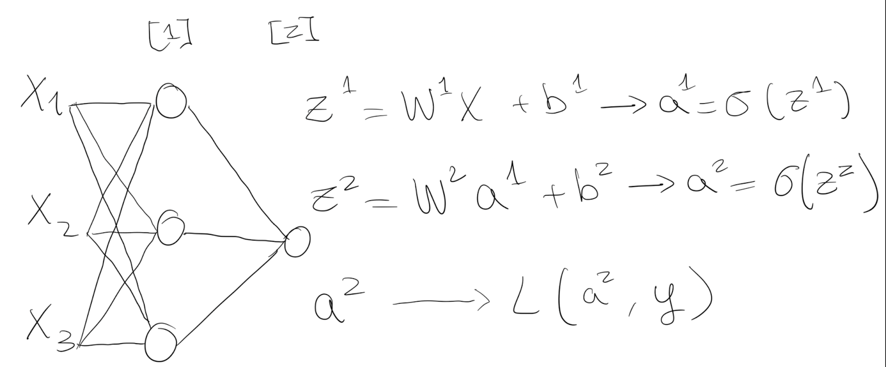

Each node computes $a$, the output of the sigmoid activation function passed through the linear regression. This calculation can be vectorized into matrix operations:

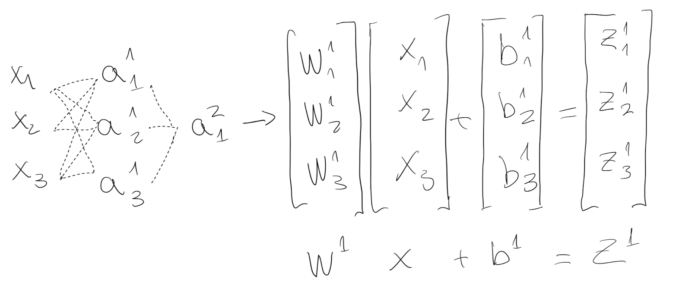

By vectorization, sigmoid transformation doesn’t have to loop each node - all $i$ weights and bias can stacked horizontally. The output $Z^1$ of the first layer goes through the activation function and $A^1$ passes to the second layer as input.

The 2-layer NN above only needs to calculate $/sigmoid(Z^1)$ and $/sigmoid(Z^2)$.

### 3.2 Activation functions

When you build your Neural Network, one of the choices you get to make is what activation function to use in the hidden layers.

Tanh or ReLU are recommended as a default, but different ones for your application.

**Tanh**

The sigmoid function goes within zero and one. An activation function that almost always works better than the sigmoid function is the tangent function or also called **hyperbolic tangent function (Tanh)**:

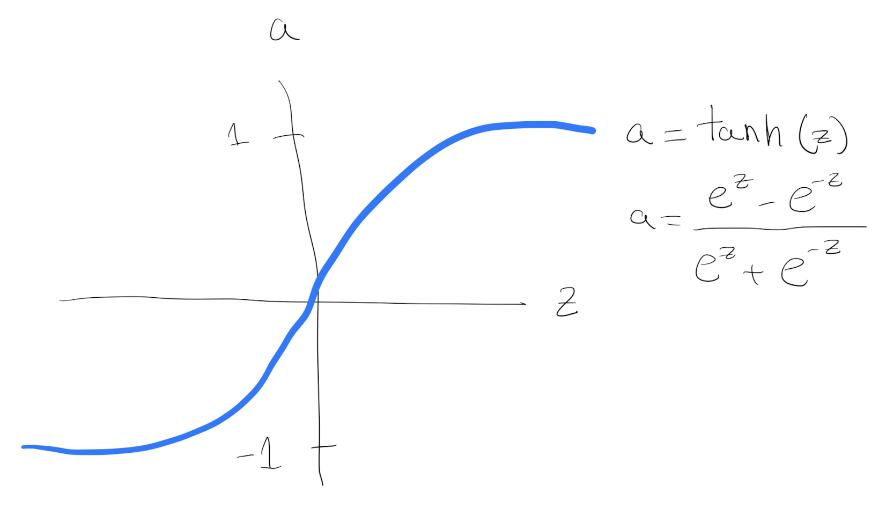

It goes between 1 and - 1. The tanh function is almost always strictly superior. The main difference is that using tanh instead of sigmoid outputs the data with mean zero (centering the data), which makes the learning for the next layer easier.

The **one exception** is for the output layer because if y is either 0 or 1, then it makes sense for y hat to be a number, the one to output that's between 0 and 1 rather than between minus 1 and 1.

One of the downsides of both the sigmoid function and the tanh function is that if $z$ is either very large or very small, then the gradient or the derivative or the slope of this function becomes very small.

**ReLU**

Another choice that is very popular in machine learning is what's called the **rectify linear unit (ReLU)**. So the value function looks like:

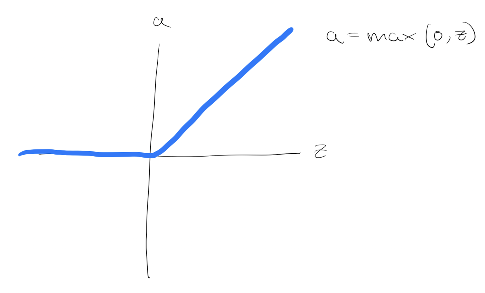

The derivative is 1 as $z$ is positive. And the derivative or slope is 0 when $z is negative. Is an increasingly popular default choice of activation function.

In practice, using the ReLU activation function, your neural network will often **learn much faster** than tanh or sigmoid activation function. The main reason is that there is less of these effects of the slope of the function going to 0, which slows down learning.

**Leaky ReLU Function**

It is similar to ReLU, but instead of returning zero for negative inputs, it returns a small negative value. This helps to avoid the "dying ReLU" problem, where some neurons can become permanently inactive during training.

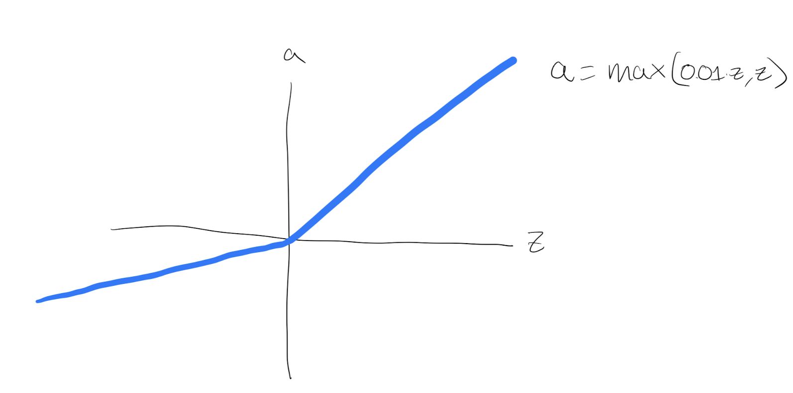

### 3.3 Gradient Descent

The left equations describe the derivation, the right ones the equivalent in python vectorization.

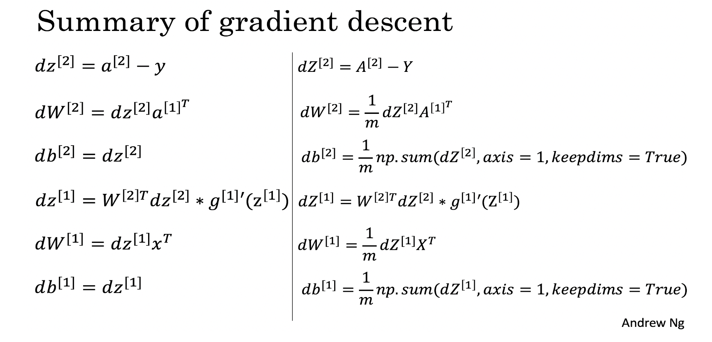

Once the parameters are set, they update based on a learning rate $$\alpha: \theta = \theta - \alpha \frac{\partial J }{ \partial \theta }$$

### 3.4 Random Initialization

When you change your neural network, it's important to initialize the weights randomly. Random initialization of the model is a common practice.

We can initialize the weights randomly and the bias at zero.

If we initialize weights and bias to zeros, all activations functions ($a_{i,j,...}$) will be equal:

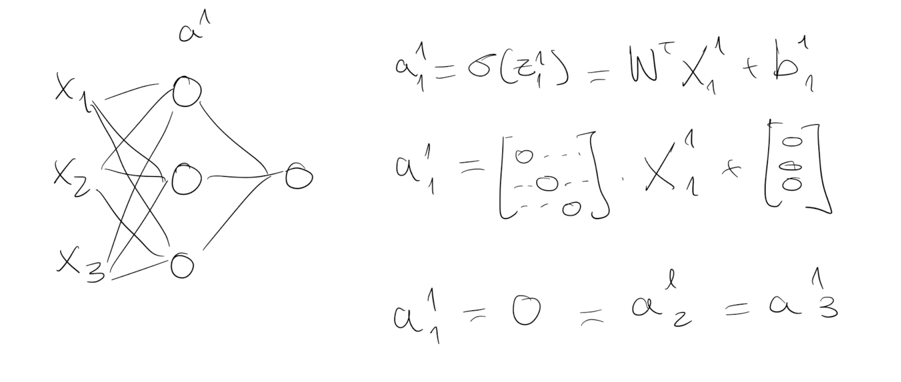

All the neurons units would start off computing the same function and therefore all the hidden neurons completely identical. Using more hidden layers would be useless, after the first layer all the sequent layers calculate the same with the same weight optimisation.

Instead, NNs starts with random initialization (bias still can be zero).

```python
def random_initialization(dim):
		w = np.expand_dims(np.random.randn(dim)*0.01, 1)
    b = float(0)

    return w, b
```

`0.01` or a very small number is chosen to not end up in the extremes of the activation function at the beginning, making the calculation of the derivations in very small steps (not that much slope).

With a small number is more likely that $w$ starts in the range of the activation function that there is more slope (think in the middle of the tanh function), and the derivations are in bigger steps making a quicker convergence.

## 4. Deep Neural Networks

Deep Neural Networks have the same structure of “shallow models” with more layers.

The number of layers is another hyperparameter that we can modify to improve the accuracy of the model.

### 4.1 Forward Propagation in Deep Networks

Same as before. In **Forward propagation**, the weight vectors and bias vectors of the next layer depends on the vectors of the previous one:

$$Z^{[1]} =  W^{[1]} X + b^{[1]}\tag{1}$$
$$A^{[1]} = \tanh(Z^{[1]})\tag{2}$$
$$Z^{[2]} = W^{[2]} A^{[1]} + b^{[2]}\tag{3}$$
$$A^{[2]} = \tanh(Z^{[2]})\tag{4}$$
$$Z^{[3]} = W^{[2]} A^{[2]} + b^{[3]}\tag{5}$$
$$A^{[3]} = \tanh(Z^{[3]})\tag{6}$$
$$... \tag{7}$$
$$\hat{Y} = A^{[n]} = \sigma(Z^{[n]})\tag{8}$$

### 4.2 Getting the dimensions of a Neural Network

The shape of the matrix derivates are equal to the original matrixes.

For the vectorized implementation, instead of going 1 by 1 observation, it stack the observations columnise. Therefore the shapes are:

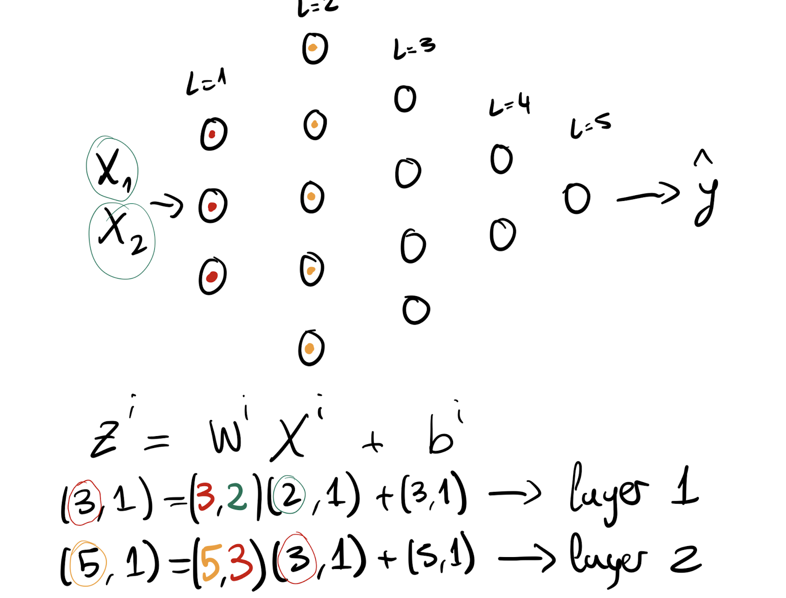

Generalizing:

- $W^i$ will always have a shape $(n^l, n^{(l-1)})$
- $Z^i$ will always have a shape $(n^l,1)$
- $b^i$ will always have a shape $(n^l,1)$
- $X^i$ will always have a shape $(n^{(l-1)},1)$

Otherwise the matrix multiplication will be either wrong or they won't run at all in code.

### 4.3 Parameters vs Hyperparameters

- Parameters: These are the parameters in the model that must be determined using the training data set. These are the fitted parameters $W$ and $b$.

- Hyperparameters: These are adjustable parameters that must be tuned in order to obtain a model with optimal performance: learning rate, number of iterations, the choice of the activation function, number of hidden layers, number of units in each hidden layer...
