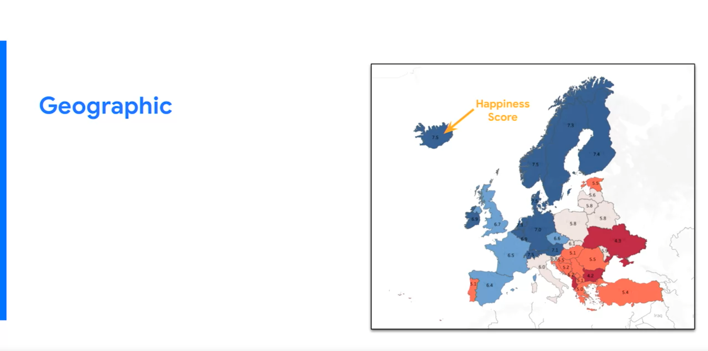
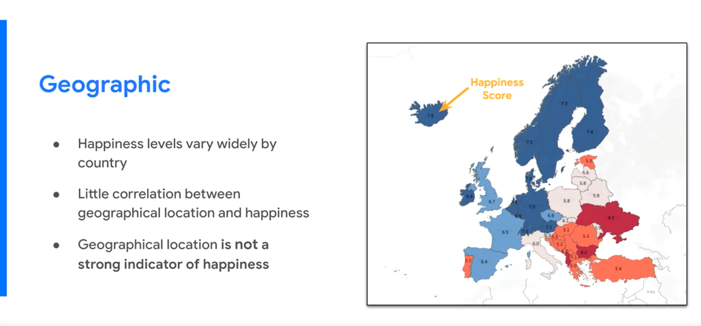
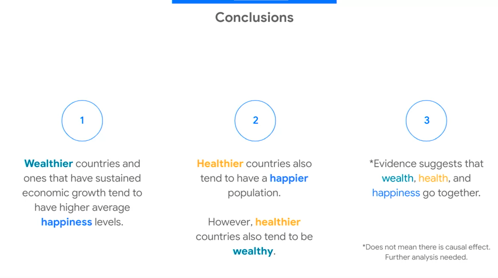
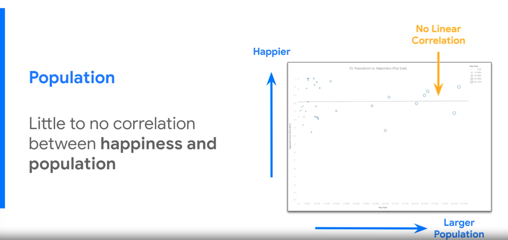

+++
title = "Course Notes - Share Data Through the Art of Visualization"
description = "My personal notes of Google's course."
date = "2021-04-26"
[taxonomies]
tags = ["courses", "ux"]
[extra]
comment = true
+++

My personal notes and presentations tips of Google's course [Share Data Through the Art of Visualization](https://www.coursera.org/learn/visualize-data/)

## 1. Visualizations

Tips for creating and designing powerful visualizations effectively.

### 1.1 Four rule of thumb for better visualizations

1. The Five-second rule: A data visualization should be **clear, effective, and convincing** enough to be absorbed in 5 seconds or less. A visualization must have **enough details to understand, no all the details**.

2. Graphs and charts should use a **diverging color palette** to show contrast between elements.

3. The visualization should align with **audience expectations** and **cultural conventions**. For example, if the majority of your audience associates green with a positive concept and red with a negative one, your visualization should follow this convention.

4. Visualizations should use as **few labels** as it takes to make sense.

### 1.2 Decision Tree for choosing visualizations

This decision tree is useful to choose what kind of data visualizations would be better.

### 1.3 Designing a visualization in 60 minutes

1. **Prep (5 min)**

Create the mental and physical space necessary for an environment of comprehensive thinking. This means allow yourself room to brainstorm how you want your data to appear while considering the amount and type of data that you have.

2. **Talk and listen (15 min)**

Identify the object of your work by getting to the “ask behind the ask” and establishing expectations. Ask questions and really concentrate on feedback from stakeholders regarding your projects to help you hone how to lay out your data.

3. **Sketch and design (20 min)**

Draft your approach to the problem. Define the timing and output of your work to get a clear and concise idea of what you are crafting.

4. **Prototype and improve (20 min)**

Generate a visual solution and gauge its effectiveness at accurately communicating your data. Take your time and repeat the process until a final visual is produced. It is alright if you go through several visuals until you find the perfect fit.

### 1.4 Introducing visualizations in a presentation: The McCandless Method

Use this method to introduce data visualizations during the presentations.

1. Introduce the graphic by name

2. Answer obvious questions before they're asked

One good way to make sure to follow these 2 steps is introducing the slide with the graphic with only the graphic name and the visualization. **No text**. Then, you describe what they are seeing and what the data comes from (answer obvious questions beforehand)

3. State the insight of your graphic (_key takeaways_)

As you discuss the main insights of the graphic, show the key takeaways. **The overall text on the screen only populated as you began to discuss it**. So the audience knows exactly what to be listening to when you talking

4. Call out data to support that insight

For example, the arrow of _"Happiness Score"_ helps directing the attention to the country with the highest score and darker blue color.

5. Tell your audience why it matters

Include conclusions with evidence or recommendations. Make sure that all the information that they are been listening worth something and they got something out of the presentation.

## 2. Presentations

Tips for preparing thoughtful presentation - beyond the visuals.

### 2.1 Preparing a presentation by using Design thinking

The design-thinking framework follows an overall flow of 1) understand, 2) explore, and 3) materialize. Within these larger buckets fall the 6 phases: empathize, define, ideate, prototype, test, and implement.

Any visualization or presentation can follow design thinking:

1. **Empathize** the emotions and needs of the target audience.

2. **Define** the audience’s needs, problems, and insights.

3. **Ideate** by using your findings from the previous phases to begin to create data visualizations.

4. **Prototype** or start “putting it all together” - in this case, into a presentation or dashboard.

5. **Test** that your prototype is effective. You can show your visualizations to team members before the presentation.

6. **Implement** the feedback to improve the final visualization.

### 2.2 Tips to improve presentations

- Think the presentation from the **audience's point of view**. The only thought that's going though their head is _"where should my focus be? where I should be looking?"_

- **Twenty five-words rule**: every slide in a presentation should have **at maximum** 25 words in 5 lines. The audience must focus on what your saying and not reading the slides.

- Use **arrows and call-outs** to direct the attention to the points that you want them to look at in the graphs.

- **Include transition slides or keynotes**. Those are slides that indicates that the previous slide presentation is over and indicating what to expect in the next slide. _"Moving on, the next tackles the effect of..."_

- Always include a conclusion with the **most powerful discoveries** of you analysis.

- **Link the visuals**, instead of copy-pasting them. This way all the changes made in the data and visualization tool are updated and reflected in the presentation.

- Keep things **_"kindergarten simple"_**: keep the concepts that you're presenting as simple and straightforward as possible.

- Make your presentation **fun**. Nobody wants to be in a room were you are talking for a full hour and the only voice they are hearing is your own. Prepare quizzes, videos or ask questions to create interaction.

- Consider **audience questions**: keep your responses short and to the point.

- You can **repeat the question** to involve the whole audience and give yourself time to process the question. Also, take into account that they can always follow-up asking for more deep details so don't elaborate on the topic.

### 2.3 Data storytelling

**Data analysis isn't about graphics and visualizations, it's about telling a story.** Look at data the way a detective examines a crime scene. Try to understand what happened and what evidence needs to be collected. The visualization—it can be a chart, map or single number—will come naturally once the mystery is solved. The focus is the story.

**Data storytelling** means communicating the insights behind a dataset with visuals and a narrative that are customized for each particular audience. Data storytelling is about communicating your insights effectively, giving your data a voice.

### 2.4 Spotlighting technique

A tool or strategy to find the compelling arguments that you want to emphasize in your storytelling.

1. **Write notes on a white board** that contain the data analysis insights.

2. **Identify ideas** or concepts that arise repeatedly.

3. Search for broad, **universal ideas** and messages.

Use it once the first draft of the narrative is over, to make sure that the insights are transmitted clearly and ideas are not repeated.

### 2.5 How to create a story

1. Engage your audience

Know your audience point of view. **How your data project impact them?** What is their stake in the project? What do they hope to get from the data insights I deliver?

Not every peace of information is relevant, part of the job as a data analyst is to eliminate the less important details.

2. Create compelling visuals

A dashboard keeps information presented in a neat and tidy way. The elements on the dashboard need to be **cohesive and balanced**. Cohesive means that you use a consistent theme and you are making a good use of the available space.

Always ask yourself:

_"Does this data point or chart support the point I want people to walk away with?"_

Tell a story in an interesting narrative. A compelling story needs the following attributes:

- **Characters**: why they care? Make characters resemble your audience.
- **Setting**: what's going on? The presentation must describe the current situation.
- **Plot**: what creates tension or needs to be fix? Set the ground for a new solution that solves the tension. Frame it as an opportunity that the company can't pass up.
- **Big reveal**: show the solution to the problems the characters are facing, that makes them more competitive, improving a process, a new system...
- **Aha moment**: why this solution is successful for the company?

### 2.6 About messy presentations

The main problem with the messy presentation is the lack of a logical flow, so **people don’t know where to focus their attention** . The audience has no sense of what they are looking at and why, end up being lost, confused, and unclear about any actions they need to take.

Typical messy presentation includes:

- No story or logical flow.
- No axis and graph titles.
- Too much text.
- Hard to understand.
- Inconsistent format (no theme).
- No recommendation or conclusion at the end.

### 2.7 Anticipate the questions

If you misunderstood your stakeholders' expectations or the project objectives, you won't be able to correctly answer their questions. Think ahead.

**Expectations**: What the stakeholders are suppose to get out of the presentation?

Avoid any jargon, acronyms, past events, or other necessary background information. Don't assume that they know what all the concepts or data sources in the presentations. **Start with zero assumptions**.

**Project objective**: Did you clearly address the initial goal of the project in the presentation?

### 2.8 Tips before important presentations

1. Assemble and prepare your questions.

2. Discuss your presentation with your manager, other analysts, or other friendly contacts in your organization.

3. **Ask a manager or other analysts what sort of questions were normally asked** by your specific audience in the past.

4. Seek comments, feedback, and questions on the deck or the document of your analysis.

5. At least 24 hours ahead of the presentation, try and brainstorm tricky questions or unclear parts you may come across- this helps avoid surprises.

6. It never hurts to practice what you will be presenting, to account for any missing information or simply to calm your nerves.

7. Put supplementary visualizations and content in the appendix to help answer questions.
