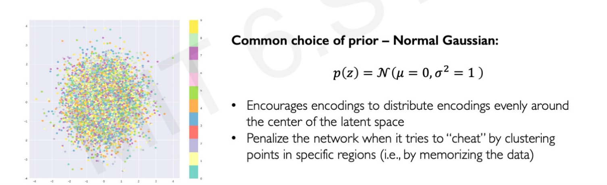
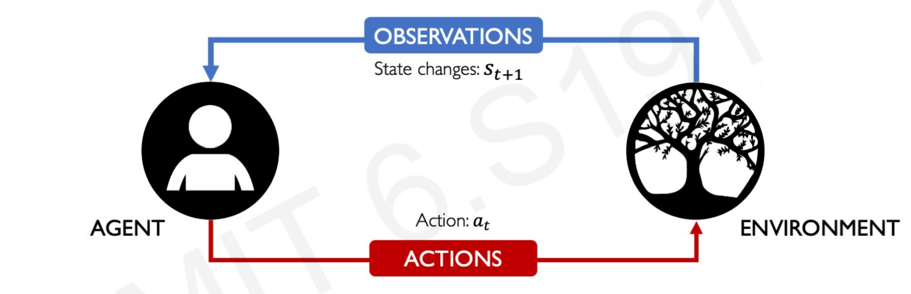
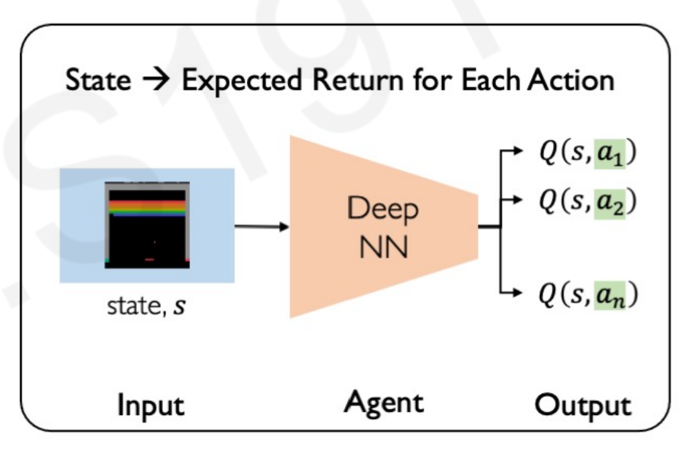
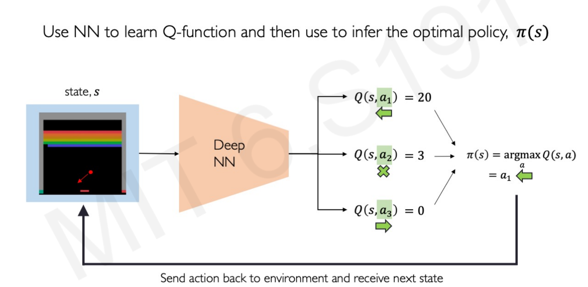
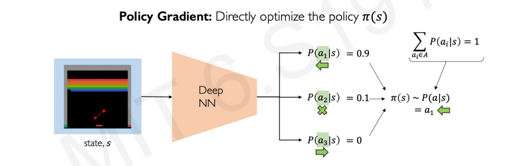

+++
title = "Course Notes - MIT 6.S191, Introduction to Deep Learning"
description = "My personal notes of MIT 6.S19."
date = "2021-06-08"
[taxonomies]
tags = ["courses", "machine learning", "deep learning", "python"]
[extra]
comment = true
+++


My personal notes of the MIT course [MIT 6.S191, Introduction to Deep Learning](http://introtodeeplearning.com/)

NOTE: Diagrams only look good in `light` mode.

## Lecture 1 - Introduction

### 1.1 Perceptron


If we denote $\widehat{y}$ as the output:

$$
\begin{array}{c}
\widehat{y}=g\left(w_{0}+\sum_{i=1}^{m} x_{i} w_{i}\right)
\end{array}
$$

Being $g$ , for example, a Sigmoid, Tangent or ReLU function:

$$
g(z)=\frac{1}{1+e^{-z}} \quad , \quad g(z)=\frac{e^{z}-e^{-z}}{e^{z}+e^{-z}} \quad , \quad g(z)=\max (0, z)
$$

The purpose of activation functions is to introduce non-linearity into the network:


Linear activation functions produce linear decisions no matter the network size while non-linearities allow approximating arbitrarily complex functions.

### 1.2 Neural Networks

Taking the previous perceptron and simplifying the output to be $z$:


We can try with different weights, that would produce different outputs $z_1$ and $z_2$:


Neural Network is made stacking those different outputs. Notice that this is just a stack of dot products of the same features and different weights ($W^{(1)}$).

These outputs in the hidden layer have a different range of values, but there are only 2 possible final outputs: $\widehat{y_1}$ and $\widehat{y_2}$.

**How we classify a label as $\widehat{y_1}$ or $\widehat{y_2}$.?**

In this step the non-linear or transformation function g$ trigger the outcomes to being one or the other.

- If the outcome value is more than the function threshold, the outcome is transformed to 1 (the label of $\widehat{y_1}$).

- If the value is less than the threshold, the outcome is transformed to 0 (the label of $\widehat{y_2}$).


Neural Network application in Tensorflow:

```python
import tensorflow as tf

model = tf.keras.Sequential([
        # Hidden layers with n neurons
        tf.keras.layers.Dense(n),
        # Output layer with 2 neurons
        tf.keras.layers.Dense(2)
])
```

_Dense_ means that the layers are fully connected, all the neuron's weight counts in the dot product calculation.

### 1.3 Forward propagation in Matrix notation (extra explanation)

For example, let's say that we have 3 observations, we know 2 features of them, and we want to construct a Neural Network with 1 hidden layer containing 3 neurons.

- In a first step (1), we calculate manually the dot product of $X$ and $W^{(1)}$:

$$Z = XW^{1}$$

**The shape of $Z$ is always a product of: _(observations, features) x (features, n neurons in the layer)_**.

The columns of the first element have to be equal to the rows of the second element. It is necessary for matrix calculation.

- The second step (2), we take the outputs of the hidden layer, apply the non-linear transformation, and calculate the dot product with respect to the second layer of weights:

$\widehat{y} = g(Z)W^{2}$

Here is an example of how to calculate $\widehat{y}$ using the dot product for a made-up dataset:


The final output is 3 predictions (_real numbers_) for the 3 observations. Imagine that all the notations denoted with $w$ are constants chosen randomly. Then, every matrix product is also constants as the only variable that is an incognita are these weights.

Weight updating is made by the network by backward propagation (later explained).

### 1.4 Deep Neural Networks

To make a Neural Network deep, we just add more layers. The number of layers and the number of neurons of each layer has to be defined beforehand (parameters to optimize) by us, humans. The model is only tunning the weights.

Neural Network application in Tensorflow:

```python
import tensorflow as tf

model = tf.keras.Sequential([
        # Hidden layers with n neurons
        tf.keras.layers.Dense(n),
        # Hidden layers with n neurons
        tf.keras.layers.Dense(n),
        # Output layer with 2 neurons
        tf.keras.layers.Dense(2)
])
```

### 1.5 The loss function

Initiating random values of $W$, will give a prediction. A terrible one, as the model has no idea yet if the prediction is good, or how to measure how good is it.

**The measure of how good is a prediction is will be determined by the _Loss function_**.

The "Loss function" measures how bad is the prediction. The final output predictions compares the predicted values with the actual ones:

$$
\mathcal{L}\left(f\left(x^{(i)} ; \boldsymbol{W}\right), y^{(i)}\right)
$$

The more the difference, the worse the prediction as predicted values are far away from the real ones. We want to minimize the loss function.

On average, for all the $n$ observations:

$$
\boldsymbol{J}(\boldsymbol{W})=\frac{1}{n} \sum_{i=1}^{n} \mathcal{L}\left(f\left(x^{(i)} ; \boldsymbol{W}\right), y^{(i)}\right)
$$

### 1.6 Training the Neural Network: Gradient Descent and Backpropagation

The final goal of every Neural Network is find the weights that achieve the lowest loss:

$$
\boldsymbol{W}^{*}=\underset{\boldsymbol{W}}{\operatorname{argmin}} \frac{1}{n} \sum_{i=1}^{n} \mathcal{L}\left(f\left(x^{(i)} ; \boldsymbol{W}\right), y^{(i)}\right)
$$

$$
\boldsymbol{W}^{*}=\underset{\boldsymbol{W}}{\operatorname{argmin}} J(\boldsymbol{W})
$$

**How the Neural Network finds the optimal ${W}^{*}$?**

By gradient descent. Gradient descent algorithm:

1. Initialize wrights randomly.
2. Compute the gradient.
3. Update the weights according to the direction of the gradient and the learning rate.
4. Loop until convergence 2 and 3.
5. Return optimal weights.

### 1.7 Backpropagation

In the second step, the algorithm computes the gradient by a process called backpropagation. **Backpropagation is just the efficient application of the chain rule** for finding the derivative of the loss function with respect to the neuron weights.


When training a neural net, the goal is to find neuron parameters (weights) that cause the output of the NN to best fit the data, right? The chain rule is the way the NN can "connect" the loss function and outputs with the weight parametrization.

- If the loss function is less than the previous value using the current weights, then the gradient is in a good direction.

- If the loss function is more than the previous, it goes in the opposite direction.

- Repeat until the loss function is zero or cannot make it lower (_convergence_).

When the Neural Network converged, it found a spot in the loss function that increasing or decreasing the weight values makes the loss function increasing.

Note that it might be the case that the optimal weights are not optimal for the entire loss function space because they converged in a local minimum. In practice, finding the global minimum is very difficult as the algorithm is very prompt to get stuck in these local minimums along the way of convergence.


### 1.8 Learning rates

**The learning rate is how much increase the weight in the updating step of the gradient descent.**. If the gradient calculates the direction of the algorithm to find the minimum, the learning rate sets the magnitude of every weight try.

Setting a stable learning rate is key to find the global minimums. It should be large enough that avoid local minimums, but small enough that is not being able to convergence (**Exploding Gradient Problem or Divergence**). Stable learning rates converge smoothly and avoid local minima.

In practice, a usual approach is trying a lot of different learning rates and see what works. A better one is to design an adaptative learning rate that "adapts" to the loss function or landscape. In this second approach, the learning rate is no longer a constant or fixed number but a rate that gets smaller or bigger depending on how large the gradient is, how fast the learning is happening, the size of the particular weights, and so forth.

In Tensorflow, these are called optimizers. They are many learning rate optimizers that make the NN coverage more quickly and generally better such as Adaptive Gradient Algorithm (Adam) or Adadelta.

Optimizers application in Tensorflow:

```python
tf.keras.optimizers.Adam
tf.keras.optimizers.Adadelta
```

### 1.9 Batching and Stochastic gradient descent

When we talked about backpropagation and computing the gradient, I did not mention how computationally expensive this can be. In practice, calculating the chain rule for hundreds of layers using the entire training set every time the algorithm loops is not feasible.

**Instead of looping through the entire training set, we can pick a random sub-sample of the data. This process is also called _Batching_** as it divides the training sets into small batches of data that feed the NN. The gradient computation is passed only through a small batch of data $B$:

$$
\frac{\partial J(W)}{\partial W}=\frac{1}{B} \sum_{k=1}^{B} \frac{\partial J_{k}(W)}{\partial W}
$$

Then the weights are updated accordingly and the process starts again with another sub-sample or batch.

**This process is called _Stochastic gradient descent_, as it replaces the actual gradient (calculated from the entire data set) by an estimate thereof (calculated from a randomly selected subset of the data).**

### 1.10 Regularization

A technique that **constrains the optimization problem** to discourage complex models to avoid overfitting.

1. Dropout

**For every iteration, the Neural Network drops a percentage of the neurons.**

Using Dropout the Neural Network doesn't rely on a pathway or very heavy weighting on certain features and overfitting, making the Neural Network more prompt to generalize to new data.


Dropout regularization in Tensorflow:

```python
tf.keras.layers.Dropout(p=0.5)
```

2. Early stopping

First, we monitor the process of minimizing the loss function of training and testing data at the same time.

When the loss function starts increasing in the test data (more difference between predicted and real outputs), stop the Neural Network.


## Lecture 2 - Recurrent Neural Networks

From a single perceptron, we can extend the number of inputs, neurons and yield multi-dimensional outputs:


But this multi perceptron, or Neural Network, doesn't have a sense of time or element sequence. Every input and output is a specific time step.


This lack of connection between time steps is problematic in predicting problems that involves time or sequences. In a sequence, the inputs are correlated with each other. They are not independent. For example, future sales in a given shop are correlated with previous sales, they are not independent events.

Expressing it in the above graph, the output of $\hat{y}_2$ not only depends on $X_2$, but also on $X_0$ and $X_1$.

### 2.1 The missing piece, the Cell state

To make use of the correlation of the inputs in sequence, the network would need to have a connection that allows to look forward. This connection is called internal memory or **cell state** $h_t$:


**The memory or cell state pass the current information in the step $t$ to the next step $t+1$**.

### 2.2 Recurrent Neural Networks

Recurrent Neural Networks are the result of incorporating the idea of using cell states to pass throw information between time steps. **They can be thought of as multiple copies of the same network, each passing the new cell state value to a successor network**. Every network is a time step of the _global_ neural network.

RNNs have a state $h_t$, that is updated at each time step as a sequence is processed. The recurrent relation applied at each and every time step is defined as:


The function is going to be parametrized by a set of weights that is leaned throughout training the model. **The same function and the very same parameters are applied every step of processing the sequence (every iteration of the model)**.


- $W_{xh}$ denotes the weight matrix optimized for that specific step of the sequence.

- $W_{hh}$ denotes the weight matrix of the memory cell, reused every step for the entire sequence.

- $W_{hy}$ denotes the weight matrix of a combination of both the specific optimization of the weights for that step, and the memory cell matrix.

In practice, you won't see the cell states weighting the outputs of the next step outputs, or multiple networks one after the other. The loop is made inside one single architecture. The RNN algorithm can be simplified as:


### 2.3 Examples of RNN application

Recurrent Neural Networks are usually used in text problems such as sentiment classification, text generation from an image, generation of image title or translation.


This is an example using **many** words **to predict the one** next word in the sentence. Depending on the problem, the number of inputs and outputs change, that modify the NN architecture:


### 2.4 Making Neural Networks understand text: Embedding

Neural Networks do not understand word language, or images, they only understand numbers. They require the words to be parsed as vectors or arrays of numbers:


**How are this vectors made?**

1. The computer/algorithm gets all the words and create a **vocabulary** with them.

2. Then, it creates its own dictionary to understand them, assigning a number to each different word (**indexing**).

3. The numbers form vectors of a fixed size that captures the content of the word (**embedding**).

By using vectors and not single numbers, you can compare how close are vectors to each other. And comparing distance is key because the words that usually go together in a phase must be represented by vectors close to each other. For example, the vector of _dog_ is closer to the vector of _cat_ than to the vector of _sad_.

**Embedding gather words together by similarity using the distance between vectors.**


### 2.5 Model Design Criteria, or why RNN are good

Any recurrent model architecture must the following design criteria:

1. Must handle variable-length sequences (RNN ✔️)


2. Must track long-term dependencies (RNN ✔️)


3. Must maintain information about order (RNN ✔️)


4. Must share parameters across the sequence (RNN ✔️)

In RNNs the same memory cell is reused every step for the entire sequence, as explained previusly.

### 2.6 RNN Illustrated example (from Michael Phi)

Let's say that we want to do a many-to-one prediction in which the inputs are words in this cereal review and the output is a positive or negative sentiment analysis.


First the words are transformed to vectors by embedding.

From:


To:


While processing, it passes the previous hidden state to the next step of the sequence. The hidden state acts as the neural networks memory. It holds information on previous data the network has seen before.


For every of theses steps or layers, the input and previous hidden state are combined to form a vector. It goes through a tanh activation, and the output is the new hidden state $h_t$. The tanh function ensures that the values stay between -1 and 1.


### 2.7 Backpropagation Through Time (BPTT)

The usual NN backpropagation algorithm:

1. Take the derivative (gradient) of the loss with respect to each parameter $W$.
2. Shift parameters to minimize loss.

With a basic Neural Network, the backpropagation errors goes trough a single feedforward network for a single time step.

Recurrent Network backpropagation needs a twist, as it contains multiple steps and a memory cell. In RNNs, **the errors are backpropagating from the overall loss through each time step**:


The key difference is that the gradients for $W$ at each time step are summed. A traditional NN doesn't share parameters across layers. Every input is different and have different weights $W$.

### 2.8 Problems with backpropagation in RNN

Computing the gradient with respect to the initial $h_0$ involves many matrix multiplications between the memory cell $h_t$ and the weights $W_hh$.

#### Exploiting gradients (gradients > 1.0)

In the the process of backpropagation the gradients get multiplied by each other over and over again. If they are larger than 1.0, the end matrix of weights is huge.

As a silly example: 0.5 times 1.5 is 0.75, 0.5 times 1.5^200 is 8.2645996e34. This can give you a perspective of how matrix multiplication can "exploit" by multiplying constantly by 1.X.

These huge gradients can become extremely large as the result of matrix and the loss function cannot be minimized.

The usual solution is change the derivative of the errors before they propagate through the network, so they don't become huge. Basically, you can create a threshold that the gradients cannot surpass. _Create a threshold_ means that you set a value, such as 1.0, that forces the values to be 1.0 at maximum.

#### Avoid exploiting gradients: Gradient thresholds

There are two ways to create these thresholds:

**1. Gradient Norm Scaling**

Gradient norm scaling rescales the matrix so the gradient equals 1.0 if the a gradient exceeds 1.0.

Gradient Norm Scaling in Tensorflow:

```python
  opt = SGD(lr=0.01, clipnorm=1.0)
```

**2. Gradient Value Clipping**

Gradient value clipping simply forces all the values above the threshold to be the threshold, without changing the matrix. If the clip is 0.5, all the gradient values less than -0.5 are set to -0.5 and all the gradients more than 0.5 set to 0.5.

Gradient Norm Scaling in Tensorflow:

```python
  opt = SGD(lr=0.01, clipvalue=0.5)
```

#### Vanishing gradients (gradients < 1)

As gradients can become huge they can also become tiny to the point that it is not possible to effectively train the network.

This is a problem because the errors further back in time are not being propagated. It would cause that the long-term errors are vanished and bias the model only to capture short-term dependencies.

#### Avoid vanishing gradients

The basic recipe to solve vanishing gradients is use a ReLU activation function, chaning to a smart weight initialization and/or use a different RNN architecture.

**1. Change activation function to ReLU.**

Why ReLu?

Because when the cell or instance gets activated (weight 0 or more), by definition the derivative or gradient is 1.0 or more:


**2. Change weight initialization.**

For example to the **Xavier initialization/Glorot initialization**:

Changing the weight activation in Tensorflow:

```python
from keras.models import Sequential
from keras.layers import Dense, Activation

model = Sequential([
    Dense(16, input_shape=(1,5), activation='relu'),
    Dense(32, activation='relu', kernel_initializer='glorot_uniform'),
    Dense(2, activation='softmax')
])
```

**3. Change Network architecture.**

More complex RNNs such as **LSTM or GRU** can control the information that is passing through. Long Short Term Memory networks (**LSTM**) and Gated Recurrent Units (**GRU**) are special kinds of RNN, capable of learning long-term dependencies.


They can keep informed of long-term dependencies **using filters or gates**. In essence, these gates decide how much information to keep of the previous neuron state or values, and how much to drop. This makes the optimization problem or the Neural Network less prompt to vanishing or exploding gradient problems.

### 2.9 Long Short-Term Memory networks (LSTM)

In a simple RNN, the information goes though every step with the input of that time step ($x_t$), the previous step memory cell ($h_{t-1}$) and an output for every step ($y_t$).


The structure of a LSTM is more complex. **LSTM forces the matrix inputs in every step to go through gates**, or internal mechanism to keep long-term information.


**LSTM Gates system**

They 4 types of gates interacting within each step layer:

1. **_Forget gate_**: Remove the irrelevant information.

Information from the previous hidden state and the current input is passed through the sigmoid function. Values come out between 0 and 1.

The closer to 0 means to forget, and the closer to 1 means to keep.


2. **_Store gate_**: Store relevant information.

The same previous $h_{t-1}$ and the current inputs goes into two transformations:

- Sigmoid transformation. It is the same operation as before, but in another gate. Instead of forget and keep, it will decide the information to update or not update.

- Than transformation. It helps to regulate the network by squishing values between -1.0 and 1.0.

The matrix multiplication of the tanh outputs with the sigmoid outputs decides which information is important, and store it in a cell state $\bigotimes$.


3. **_Update gate_**: update the separated cell state.

- The update gate takes the previous cell state vector $c_{t-1}$ and multiply by the forget vector (from the forget gate), that allows to drop non-important information.

- Then, it adds the store vector from the store gate, as this information is important to keep from the current step.


The update gate takes the information to the other 2 gates to decide what to forget and what to keep, updating the cell state.

4. **_Output gate_**: decides what the next hidden state $h_{t+1}$.

- The previous hidden state and the current input into a sigmoid function.
- Then the newly modified cell state pass the tanh function.
- By multiplying the two vectors it decides what information the hidden state should carry.


### 2.10 Gated Recurrent Unit networks (GRU)

GRU’s has fewer tensor operations; therefore, they are a little speedier to train then LSTM’s. There isn’t a clear winner which one is better, try both to determine which one works better for their use case.


## Lecture 3 - Convolutional Neural Network

### 3.1 Computer Vision Introduction

We can train computers to understand the world of images, mapping where things are, what actions are taking place, and making them to predict and anticipate events in the world. For example, in this image, the computer can pick up that people are crossing the street, so the black car must be not moving.


**What computers _see_ ?**

Task that for us are trivial, for a computer is not. To a computer, the images are 2-dimensional arrays of numbers.

Taking the following image, we are able to see that is a Lincoln portrait but the computer sees a 1080x1080x3 vector of numbers.


The classification of an image by a computer is made by picking up clues, or features, from the image. If the particular features of the image are more present in Lincoln images, it will be classified as Lincoln.

The algorithm, to perform this task well, should be able to differentiate between unique features and modifications of the same features. For example, it should classify as "Dog" a photo of dogs taken from different angles or a dog hidden in a tree.


The computer must be invariant of all those variations, as humans recognize the same image changing its viewpoint or scale.

### 3.2 Learning Visual features

**Computers learn hierarchically from the features** in an image. For example, in face recognition the algorithm learn in order:

1. Facial structure.
2. Eyes, ears, nose.
3. Edges, dark spots
4. ...

A fully connected neural network can take as input an image in the shape of a 2D number array, and classify it. What would be the problem of using a Multilayer Perceptron to classify images?

It's not able to capture is no **spatial information**.

If each feature of the image is an individual characteristic, all the connections between the image characteristics are lost. For example, a MLP architecture is not able to pick that the inner array of pixels the ears must be close to the outer array of pixels of the facial structure.

How can we use spatial structure in the input to inform the architecture of the network?

### 3.3 Patching

Spatial 2D pixel arrays are correlated to each other. By using a spatial structure, it would preserve the correlation of the pixels and its spatial architecture.

We can think about a neural network architecture that takes different parts of the images in different layers and connects somehow the images. How would looks like?

In a neural network with spatial structure each neuron takes a small pixel of the entire image and try to extract it's feature information. Only a small region of the image, a **patch**, affects a concrete neuron and not the entire image.


**The next neuron afterwards takes a shifted patch of pixels. The process is repeated for all the neurons until the entire image is taken as input by patches**.

As you can see in the image below , some of the patched pixels took from the first neuron in the left overlap some of the pixels patched in the right neuron.


The overlapping of pixels preserves the spatial component of the image. Every patch is intended to reveal features characteristic of the image.

But...how the algorithm learn the features? How it knows to detect the ears or eyes in a patch? The process is called _local feature extraction_.

### 3.4 Local feature Extraction

The neural network identify the features patches by weighting the pixels.

Take the following image. The idea is that the neural network have to classify the right image as an X or not a X.


While for us humans is simple to see that is an X, the pixel arrays do not match. After all, computers cannot see images, only arrays of numbers that do not match.

By the process of patching, the neural network takes images with different pixel position that share same features:


Multiple patches in the X images are similar, or equal.

**How the model calculates this similarity?**

By **the convolutional operation**. While the name seems scary, it is just multiplying each pixel value element-wise between the filter matrix (_real X patch_) and the patch of the input image, and adding the outputs together.


In other words, comparing the pixels between the _"proper X patch"_ and the input patch that "_might or might not be an X patch_", in an a numerical way.

By going through local patches, the algorithm can identify and extract local features for each patch:


The end matrix from the convolutional operation is called **feature map**, as it mapped the features of the input image.

### 3.5 Convolutional Neural Netowrk operations

CNNs are neural networks that apply the concept of patching, and are able to learn from spatial numerical arrays. **The word _Convolutional_ is a way too say that this neural network architecture handles cross-correlated 2D arrays of numbers.**

Three CNN core operations are:

1. Convolution.
2. Apply a non-linear filter, often ReLU.
3. Pooling: a downsampling operation that allows to scale down the size of each feature map.


**1. Convolution, or Convolutional Operations.**

The operation described in the above section. Each neuron takes **only the input from the patch**, computes the weighted sum, and applies bias that passes through a non-linear function (as usual in NN). Every neuron takes a different shifted patch.


Take into account that there are not only one feature map in the neural network. **A feature map is specific for a feature**. As images have multiple features, multiple feature map or layers are needed.

Think about a human portrait. Taking only the feature _"oval shape of the face"_ the algorithm could confuse a potato as a human face, as is oval as well.

By applying multiple filters, or layers, the CNN learns hierarchically from the features in an image.

**2. ReLU filter.**

After each convolutional operation, it needed to apply a ReLU activation function to the output volume of that layer.

**Why using a ReLU activation function?**

For any given neuron in the hidden layer, there are two possible (fuzzy) cases: either that neuron is relevant, or it isn’t. We need a function that shuts down the non-relevant neurons that do not contain a positive value.

ReLU replaces all the negative values with zero and keeps all the positive values with whatever the value was.

Think it this way: if the output of the convolutional operation is negative it means that the sample image patch doesn't look similar to the real image patch. We don't care how different it looks (how negative is the output), we only want that this neuron is not taken into account to train the model.

ReLU is also computationally cheap in comparison with other non-linear functions. It involves only a comparison between its input and the value 0.

**3. Pooling.**

Pooling is an operation to **reduce the dimensionality** of the inputs while still **preserving spatial invariants**. For example, a MaxPool2D takes a 4x4 patch matrix and convert it into a 2x2 patch by taking only the maximum value of each patch:


### 3.6 Convolutional Neural Netowrka for Image Classification

Using CNNs for image classification can be broken down into 2 parts: learning and classification.

**1. Feature learning.**

The convolutional, ReLU and pooling matrix operations, the model to learn the features from an images. These feature maps get the important features of an image in the shape of weighted 2D arrays.

For example, a CNN architecture can learn from a set of images of cars and then distinguish between _car_ features and _not car_ features using the three key operations, but is still unable to classify images into labels.

**2. Classification part.**

**The second part of the CNN structure is using a second normal MPL to classify the label of the image**. After capturing the features of a car by convolutional operations and pooling, the lower-dimensional feature arrays feed this neural network to perform the classification.


**Why not using a second CNN structure or any other NN complex architecture?**

Because you don't need a neural network that handle sense of space or cross-corrlation for this task. It is a simple classification task. The inputs are not even an image anymore, they are features coded as number vectors. They don't need patching.

**Softmax function**

Given that the classification is into more than one category, the neural network output is filtered with a **softmax non-linear function to get the results in terms of probabilities**. The output of a softmax represents a categorical probability distribution. Following the car classification example, if the input image is a car it could give a 0.85 probability of being a car, 0.05 of being a van, a 0.01 of being a truck, and so forth.

### 3.7 Code example

CNN "vehicle classifier" in Tensorflow:

- **_filters_** refers to the number of feature maps. For the first layer we set 32 feature maps, for the second 64.

- **_kernel_size_** refers to the height and width of the 2D convolution window. 3 means 3x3 pixel window patching.

- **_strides_** refers to how far the pooling window moves for each pooling step. With stride 2, the neurons moves in 2x2 pixels windows.

- **_pool_size_** refers to the window size over which to take the maximum when calculating the pooling operation. With 2, it will take the max value over a 2x2 pooling window.

- **_units_** refers to the number of outputs. 10 lasting outputs representing the 10 classes of vehicles.

```python
import tensorflow as tf

def vehicles_classifier_CNN():
  model = tf.keras.Sequential([

  ########First part: Feature learning ########

  ## CONVOLUTION + RELU
  tf.keras.layer.Conv2D(filters = 32,
                        kernel_size = 3,
                        activation = 'relu'),
  ## POOLING
  tf.keras.layer.MaxPool2D(pool_size = 2, strides = 2),
  ## CONVOLUTION + RELU
  tf.keras.layer.Conv2D(filters = 64,
                        kernel_size = 3,
                        activation = 'relu'),
  ## POOLING
  tf.keras.layer.MaxPool2D(pool_size = 2, strides = 2),

  ######## Second part: Classification ########

  ## FLATTEN
  tf.keras.layer.Flatten(),
  ## FULLY CONNECTED
  tf.keras.layer.Dense(units = 1024, activation = 'relu'),
  ## SOFTMAX
  tf.keras.layer.Dense(units = 10, activation = 'softmax')
  ])

  return model

```

## Lecture 4 - Deep Generative Modeling

Deep Generative Modeling is part of **unsupervised learning: the models receive the data but not the respective labels**. The goal is to take as input the training samples from some distribution and learn a model that represents that distribution.

Another way to define this goal is to **find ways to learn the underlying and hidden latent variables** in the data even when the generative model is only given the representation of the variables.


Deep generative models are very useful to create synthetic samples using the probability density function of the samples provided.

### 4.1 Use examples

- Debiasing image recognition

Let's say that you have a silly algorithm that takes facial expressions and the goal is classifying between _pretty_ or _non pretty_. However, all your faces are either _white-blond-people smiling at the camera_ or portraits of _drug addicts_. This algorithm won't create a boundary between pretty and not, it would define a boundary between white-blond-smiling people and drug users. Generative models can follow the facial distribution of the existing sample to create new samples of portraits with different skin tones, postures and attributes.

- Outlier detection in images

Rare events in tail distributions, such as people crossing the street in red, accidents, or sudden impacts can be created by generative models as samples to train the model of self-driving cars. The benefit is that the car would know what to do in these extreme scenarios even if it hasn't seen it before in the sample.

### 4.2 Autoencoding

Autoencoding means **auto**matically **enconding** data. In Generative Modeling, the _Encoder_ learns to map from the data $x$ into a low-dimensional vector $z$:


**Autoencoding is a form of compression**. A smaller dimensionality of the latent space means that we can compress the data into smaller latent factors that keep the feature representation.

However, the dimensionality of the latent space will also influence the reconstruction quality. The smaller the latent space the poorer and less quality the generated images have, as will force a larger training to bottleneck.

But wait, the input data has no labeled. Therefor, $z$ cannot be a _feature map_ of the attributes of 2s, as this algorithm doesn't know is a 2 in the first place!

**What is this $z$ then?**

**$z$ is vector of latent variables**. It represent the features of the image in a lower dimensional vector space, in this case the features of a 2.

The model uses the features created in this latent space $z$ to construct a new observations $\hat{x}$ following the features of the original $x$. It "decodes" the original images to create new images.

**How the algorithm knows that the atributes in $z$ are right?**

The model learns by comparing the difference between the new synthetic image and the original image in terms of pixels.


Therefore, can be trained to minimize the Mean Squared Error between the sample inputs $x$ and ouput synthetic samples $\hat{x}$.

### 4.3 Variational Autoencoders (VAEs)

In the previous image, the latent space $z$ acts as a "normal" layer in a Neural Network. Is deterministic in the sense that it would yield the same latent variable space $z$ every time we use the same image as input.

In contrast, **VAEs impose a variational or stochastic** twist to the architecture to generate smoother and different representations of the images:


For each variable, the VAE learns a mean and a variance associated with that latent variable. Instead of using the vector latent variables $z$ straight, the model uses the vector of means and a vector of variances to define the probability distributions for each of the latent variables.

The goal of this twist is to generate slightly different new images from the samples, not to imitate perfectly them perfectly.

### 4.4 VAE Operations

VAEs optimization process can be dividing into: **encoding and decoding**.


1. **Encoding**.

The first part of the process is called _encoding_, as it encode or define the latent space $z$ given $x$ observations.

Learning the structure of the input images by deconstruction, comparing the differences between the distribution of features input images and new images (log-likelihood). Optimizing the $q_{\phi}$ weights.

2. **Decoding**.

The second part of the process is called _decoding_, as it decodes or extract the features of the latent space $z$ to make new observations $\hat{x}$.

### 4.5 The VAE regularization

The training phase will change as a result of these two different tasks. The loss function cannot be only calculated as the difference in similarity between input and output images, as they must be different by definition. This is the stochastic _twist_ necessary to create new images, not just copies.

The optimization function must include a new term, the **VAE loss:**

**<center>VAE Loss function = (reconstruction loss) + (regularization term)</center>**

As in any other neural network, the regularization term avoids overfitting. In this neural network architecture overfitting would mean replicating the same exact images of $x$ into $\hat{x}$. We don't want the same images, we want different images that follows the latent varaibles of the original sample.


By adding this new parameter $D$ to the loss function, the Neural Network will try to reduce not only the errors extracting the latent variables (reconstruction loss) but also avoid overfitting the model so it doesn't create identical copies of the input images (regularization term).

Let's analyze this regularization term analytically: $D\left(q_{\phi}(\mathrm{z} \mid x) \| p(z)\right)$

$D$ is a function of:

- $q_{\phi}(z \mid x)$: the encoding. Imposes to the new synthetic images $\hat{x}$ to follow a inferred latent distribution of the latent variables $z$.

- $p(z)$: the decoding. Imposes to the new synthetic images $\hat{x}$ to follow a prior **fixed prior** distribution of $z$

- Finally, the two vertical lines between the elements of the function is a reciprocal math operator. Effectively, it means that $D$ is function of the difference between the two elements, the **inferrerd** and the **fixed prior** distribution.

In other words, $D$ is a parameter that represents the divergence of what the encoder is trying to infer and a prior distribution of $z$.

The **inferred** distribution of $z$ is easy to understand, as it is just the latent variables of the images created by using the mean and standard deviation of each input.

However...**What is a fixed prior distribution? How it calculates the $p(z)$ ?**

### 4.6 Priors on the latent distribution

The usual prior distribution choice is the **normal Gaussian distribution** (means equal 0 and standard deviations equals 1). In practical terms, this prior makes the model cut the features that are way out of a normal distribution, such as outliers or edge cases in the data.

The new samples generated $\hat{x}$ follows the inferred distribution but also this fixed prior. The loss funtion optimize the inferred latent distribution and also penalize extreme cases outside the normal distribution (_weird or non-common elements in the images_)



We said that the regularization term _D_ is a function of the difference between the inferred latent distribution and a Gaussian prior distribution. This difference is called **KL-divergence**(Kullback-Leibler) or **relative entropy**.

$$
D\left(q_{\phi}(\mathrm{z} \mid x) \| p(z)\right) =-\frac{1}{2} \sum_{j=0}^{k-1}\left(\sigma_{j}+\mu_{j}^{2}-1-\log \sigma_{j}\right)
$$

While the form of the function looks _unfriendly_, it is just a measure of how one probability distribution is different from a second reference probability distribution.

### 4.7 Why VAE regularization is important?

The VAE regularization creates:

1. **Continuity**. Data points that are similar in the latent space should result in similar content after the decoding.
2. **Completeness**. New samples out of the latent space should resemble meaningful content after decoding.

Without regularization (a loss function that just tries to minimize the encoding loss), the model could group images that are similar in real life in different clusters because of the small variations. We want input images with close latent features to have very similar distributions that the model can use to create new ones.


The normal prior force the latent learned distribution to overlap. For example, if we want to create faces with VAEs the fixed distribution forces images of faces to place the eyes, mouth, and ears within the same regions.


### 4.8 VAE Backpropagation: Re-parametrization

Backpropagation in Neural Networks requires deterministic nodes and layers (constant weights). Weights need to remain constant to calculate the chain rule to optimize the loss by gradient descent.

But remember that **VAs impose a variational or stochastic** twist in the forward propagation to generate new images and therefore you cannot backpropagate a sampling layer.


Well, you actually can. The hidden latent space $z$ variation is not stochastic itself, it includes a random constant $\varepsilon$. Therefore, $z$ can be _reparametrized_, as $\varepsilon$ is just a constant that follows a normal distribution.


Notice that $z$ goes from being a stochastic node (left) to being a deterministic one (rigth). Again, this is because $z$ can be derived taking $\varepsilon$ as a random constant that follows a normal distribution. The function loss can be minimized since the chain rule can be applied to optimize the weigths of the encoding loss $q_{\phi}$.

### 4.9 Generative Adversarial Networks (GANs)

GANs is another architecture to generate new data following the same distribution of the input data. The _Adversarial_ part comes because in **this architecture two neural networks contesting with each other in a zero-sum game where one network gain is the other network loss**.

1. **Generator Network**

This network is trained to get random noise data and **produce new (fake) samples that represent the noise distribution** as much as possible. The random noise can be created sample out of a Gaussian distribution.

There are no encoding loss, the new features extracted comes from noise. Therefore, the distribution that the model is trying to learn comes from a random sampling, not real images.

Here in the next image, the Generator Network $G$ learns from a normal Gaussian distribution $z$ and creates new samples $X_{fake}$ that follows this distribution.


2. **Discriminator Network**

This network takes the fake features from the Generator Network and real features from real images data. With both inputs, **the Discriminator task is to identify the fake features from the real ones**.


_G_ tries to synthesize fake instances that fool _D_, and _D_ tries to identify these from real ones.

The two networks interact with each other, **the better the Generator Network gets the hardest is for the Discriminator to tell apart** fake from real features.

### 4.10 GANs Loss

As they have different goals, the Generator and Discriminator network have different loss functions that combines into a _total_ GAN loss function.

1. Discriminator Network Loss

$$
\arg \max_{D} \mathbb{E}_{\mathbf{z}, \mathbf{x}}[\log D(G(\mathbf{z}))+\log (1-D(\mathbf{x}))]
$$

It maximizes the probability of the fake data to be identified as fake: $\log D(G(\mathbf{z}))$, and the real data being identified as real: $\log (1-D(\mathbf{x})$.

2. Generator Netowork Loss

$$
\arg \min_{G} \mathbb{E}_{\mathbf{z}, \mathbf{x}}[\log D(G(\mathbf{z}))+\log (1-D(\mathbf{x}))]
$$

It minimizes the probability of the Discriminator Network _D_ to identify fake data as fake: $\log D(G(\mathbf{z})$, and the real data being identified as real: $\log (1-D(\mathbf{x}))$.

We can combine both loss functions as the GANs Loss function:

$$
\arg \min_{G} \max_{D} \mathbb{E}_{\mathbf{z}, \mathbf{x}}[\log D(G(\mathbf{z}))+\log (1-D(\mathbf{x}))]
$$

## Lecture 6 - Reinforced Learning

In Reinforced Learning the data is not a matrix of features and set of targets (supervised learning), neither a matrix of features without targets that an algorithm has to cluster (unsupervised learning). The input data is a state-action pairs.

The algorithm **learns from the consequences of some action in a certain state**. If the action contributes to a reward function, then is encourage and if it doesn't the action is avoided. The **goal** of the algorithm is to maximize the total reward of the agent over time.


The **key concepts** to understand the mechanics of Reinforced Learning are:

- **Actions**: behaviors that the system takes when it sees those states.
- **Agent**: It takes decisions in the environment.
- **Environment**: Where the agent takes action.
- **Action space A**: the set of possible actions an agent can make in the environment.


- **Observations**: who the environment reacts to the agent's actions.
- **State**: a situation which the agent perceives.



- **Reward**: feedback that measures the success or failure of the agent's action.

The **Total Reward** is a function of the sum of rewards through time:

$$
R_{t}=\sum_{i=t}^{\infty} r_{i}=r_{t}+r_{t+1} \ldots+r_{t+n}+\cdots
$$

However, the time of the reward is an important element in the choice of action of the agent. Is not the same $20 today that $20 in 10 years.

The **Discounted Total Reward** is calculated as the sum of rewards through time, times a discount factor between 0 and 1:

$$
R_{t}=\sum_{i=t}^{\infty} \gamma^{i} r_{i}=\gamma^{t} r_{t}+\gamma^{t+1} r_{t+1} \ldots+\gamma^{t+n} r_{t+n}+\cdots
$$

This reward function is also called the _Q-function_.

### 6.1 The Q-function

The Q-function **captures the expected total future reward** $R$ an agent in the state $s$ can receive by executing a certain action $a$:

$$
Q\left(s_{t}, a_{t}\right)=\mathbb{E}\left[R_{t} \mid s_{t}, a_{t}\right]
$$

When the agent has to decide on an environment, the agent considers the possible Q-functions to compare rewards. The higher the Q-function the better, as the reward is higher. We will call all the possible alternatives _policies_, denoted by ($\pi$), that the algorithm compares.

The optimal policy is inferred by the best action $a$. In formal terms, this represents the **strategy** for the agent. Choosing the optimal policy that maximizes the total discounted future reward:

$$
\pi^{*}(s)=\underset{a}{\operatorname{argmax}} Q(s, a)
$$

Therefore, the agent chooses actions $a$ that maximize the Q-function.

### 6.2 Deep Q Networks (DQN)

Imagine the following Deep Neural Network in which the state is an Atari videogame and the agent has the actions of moving right or left to destroy the bricks (reward). The goal of the game is to destroy all the bricks using the least possible moves.


The **first solution** that comes to mind is making a Neural Network that iterates over **all the possible state-action pairs** and takes the one that maximizes the expected reward returns.


However, even for this simple environment **the amount of actions $a$ would be enormous**. It would need to calculate the rewards over the time of the entire game, every time it chooses right or left. Every time, for every move $t$, calculating the optimal action. This method to find a strategy is highly inefficient and computationally very expensive.

**A more efficient way to input only the state and let the Neural Network give all the possible set of Q-functions for each action**. Using this method, the Neural Network does not have to compare over Q-functions, it returns all of them for every possible action.



Notice that we don't feed the state, only actions, so the possibilities do not grow exponentially.

The main issue that comes here is how to train this Neural Network. If the Network does not compare between the Q-functions, how it knows which one is better so the model can be trained?

We can introduce a benchmark that the algorithm compares with. A perfect score that the algorithm has to reach by comparing Q-functions. In other words, **Creating a ground-truth Q-target**. Therefore, the distance with this perfect Q-target is our loss function (MSE) to train the Neural Network:

$$
\mathcal{L}=\mathbb{E}[\| \overbrace{\left(r+\gamma \max_{a \prime} Q\left(s^{\prime}, a^{\prime}\right)\right.}^{\text {target }})-\overbrace{\left.Q(s, a) \|^{2}\right]}^{\text {predicted }}
$$

The Network predicts state-action pairs $Q(s,a_{n})$ that closes the Q-target as much as possible. The better match with the target function, the smaller is the loss and the better is the policy.

Going back to the **Atari example**:



For a given state $s_t$ the ball is coming towards the slider. The Neural Network creates 3 Q-functions: one for the slider going left, one for the slider staying, and one for the slider going right.

The action $a_1$ (slider to the left) has a better payoff reward, so the optimal policy $\pi$ or strategy for this state $s_t$ is going left.

Then it stats over for the state $s_{t+1}$.

### 6.3 Downsides of Q-Learning

- Complexity

**The models can only use scenarios where the action space is discrete and small**. That is why Q-learning is so popular in video games because is a controlled environment with a limited set of actions. As an example of a continuous and infinite space, consider a driving car with the possibility to go towards any direction (infinite angles of directions).

- Flexibility

The optimal policy is **deterministically computed from the Q-function** by maximizing the reward. It cannot compute the reward of any distribution of data outside de range of possible environment scenarios. It cannot learn stochastic policies that might get better rewards.

### 6.4 Policy Learning

Until now, we were taking the state as fixed and looking for the best set of actions that maximizes the rewards. The algorithm learns using the possible actions. Instead of optimizing for actions, we can optimize for policies.

The difference is subtle but important. To illustrate we go back to the **Atari example**:



The Neural Network does not compare actions, it compares the probability of the actions being the correct and sample from that. In this Atari example, going left has a 90% probability of reaching the optimal policy. Therefore, the algorithm choose $a_1$ (slider left) 90% of the time, $a_2$ (center) 10% of the time and $a_3$ (right) 0% of the time. The probabilities sum to 1. This is called **Policy gradient**, as it directly optimizes the policy without calculating the rewards.

**What advantages has Policy Learning over Q-Learning?**

With policy learning, the models can handle continuous spaces. We can calculate not only the left or right (discrete choice) but the speed of the slider (continuous choice). For example, the slider can go 1 meter, 2 meters, or 20 meters to the left. Each continuous set of actions has attached a probability of being the best policy.

In the following image, the highest probability action is going to the -1 meters/second in a continuous probability space with many other rates:


From this probability, the optimal policy derived is going -0.8 meters/second, taking into account the variance.

This opens the possibility of computing in environments in which the actions are continuous like autonomous vehicles.

### 6.5 Policy Learning Gradients

The loss function is calculated by multiplying 2 terms: the probability of an action given the state, and the reward attached to that action. These elements are captured by the negative log-likelihood of the policy ($-log...$) and the total discounted returns ($R_t$)

$$
\mathcal{L}= -log P(a_t|a_s)R_t
$$

The algorithm wants to minimize this loss function as much as possible. Therefore, the larger the probability of the policy and the reward, the more negative is the loss function.

Also, it amplifies the actions with high reward but low probability, and low reward but a high probability of happening.

The gradient descent or weight updating of the neural network works like in the vanilla neural network gradient descent: computes the gradient and updates the weights according to the direction of the gradient. As we said, the gradient descent is made with respect to the policy, not the actions:

$$
w' = w - \nabla\mathcal{L}
$$

$$
w' = w + \nabla \underbrace{\log P(a_t|a_s)R_t}_\text{Policy gradient}
$$

Notice that by using the **negative** log-likelihood instead of positive, it turns the weight updating to positive. Hence, the network weighs more the set of actions with a combination of high probability/high reward.

## Lecture 7 - Deep Learning Limitations and New Frontiers

The rise and hype of Deep Learning led to the general public to see Machine Learning, Deep Learning, and the whole AI field like some kind of **alchemy**. Any problem in which we have data can be solved by AI. The reality is that only very specific problems can be solved by AI, and feeding poor data in a random network architecture will produce no value at all.

**What Deep Learning is good at?**

Deep Neural Networks are extremely good at finding a pattern **in the existing data**. A recent paper by Google Brain/Deepmind researchers[^1] shows that a neural network can be 100% accurate fed **by random label images**:


A model is as good as the data you feed it. If you have trained a model with a banana image and a tree image labeled as "dog", every time that the model sees **those exact images** it will classify them as the label you have used. The problem comes when it sees other bananas or tree images. The accuracy could be 100% in the training set and close-to-random accuracy in the test set:


Random labeling led to random accuracy in the test data. The model overfitted the specific images to the specific label and has **no generalization power** to predict new unseen data. **Without generalization, any neural network is worthless.** A Neural Network can approximate any seen distribution, but how do we know what and how it is going to predict in unseen data?


### 7.1 Limitations: Uncertainty

Part of the new frontiers in AI tries to solve **the problem of uncertainty**. Or how to make models that infer the right choice when it faces data that it has not being trained to interact with. For example, this is especially important in the field of autonomous vehicles, in which a change in the construction of a road can lead to terrible results:


Autonomous cars should be able to identify this **uncertainty** or unseen state of the road and not crash the car, even if the car is being trained to go in that direction.

Let's take the classical toy model of **classifying an image of a dog vs cat**. The model takes only inputs of cat and dog images and returns the probability of being a cat vs a dog. What happens if we ask the model to predict an image of a dog and a cat together? What happens if we ask the model to predict the probability of a cat/dog feeding the image of a horse?

By definition, **the model gives just the probability of dog and cat**. It cannot output the probability of random data or the confidence in that prediction.


We need an uncertainty metric to assess the noise inherent to the data (_aleatoric uncertainty_) and to **assess the network's confidence** in its predictions (_epistemic uncertainty_).

### 7.2 Frontiers: Evidential Neural Networks

New research[^2] using _adversarial attacks_ tries to introduce perturbations into the data so the networks it is **not only optimized by modifying the weights but also optimized by modifying the input images**. Given an input, the network is trained to predict the parameters of what they called an evidential distribution.

The network can model a higher-order probability distribution over the individual likelihood parameters. Taking the cat/dog model example, this means that a network trained with photos of cats and dogs and fed with a horse image can output
cat probability of 0 and a dog probability of 0.


Evidential regression simultaneously learns a continuous target along with aleatoric
uncertainty from the data and epistemic uncertainty from the model.

### 7.3 Frontiers: Automated Machine Learning

Standard deep neural networks are optimized **for a single task**. It often requires expert knowledge to build an architecture for any task. What if we could build a learning algorithm or system that **learns which model** to use to solve a given problem?

Automated Machine Learning (AutoML) is a growing field of AI[^3] that uses auto-detection of network architectures, so it relies less on human choice and expertise as it learns the model architectures directly on the dataset of interest.

The **concept** of this method is simple to understand. It is a system **has a _controller network_ and a _child network_**. The controller samples an initial architecture and the child uses that architecture in a dataset. For every architecture sample, the child network gets an accuracy value that is used to update the controller.


The better the architecture and parameters proposed by the controller is, the better the results of the child network, and the more the controller knows is getting good architecture proposals.

This last step is key. **How the controller learns?**

The controller is a Recurrent Neural Network, with _N_ layers corresponding to different architectures and parameters to choose from. One layer represents a combination of model/parameters to try.


1. The controller samples these different networks with a parametrization.
2. The controller feed variations to the child network.
3. The child produces an accuracy _R_ that is used to train the weights of the controller.
4. Once it has the best parameter, the one with better accuracy in the child network, that layer is optimized and jumps to the next one.
5. Repeat until all the layers (parameters) converge.

While AutoML can be seen as a shortcut, **this system can produce state-of-the-art results**[^3] in image recognition, getting better results and being more efficient than human-created network architectures:


_NASNet_ stands for _Neural Architecture Search Network_

[^1]: C. Zhang et al. (2016) - Understanding deep learning requires rethinking generalization: https://arxiv.org/abs/1611.03530

[^2]: A Amini et al. (2019) - Deep Evidential Regression: https://arxiv.org/abs/1910.02600

[^3]: B. Zoph (2017) - Learning Transferable Architectures for Scalable Image Recognition: https://arxiv.org/abs/1707.07012
