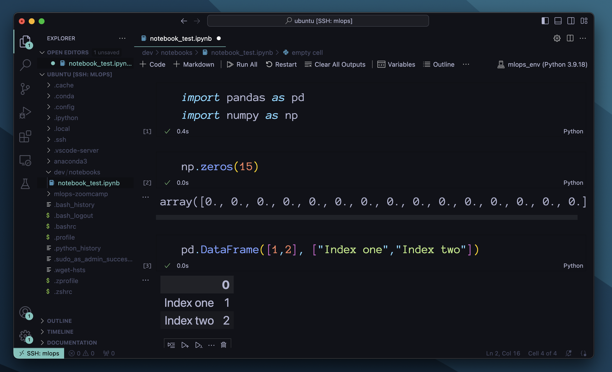
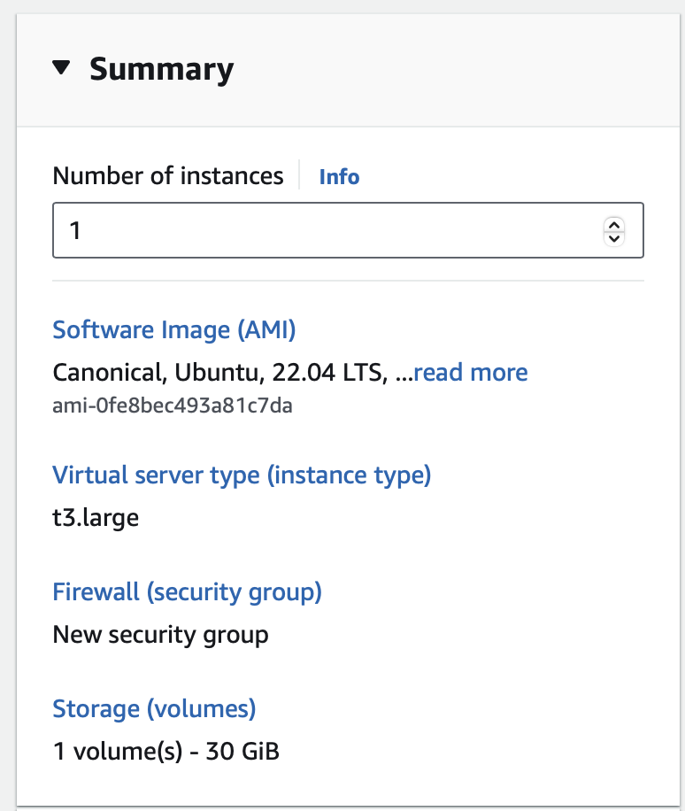
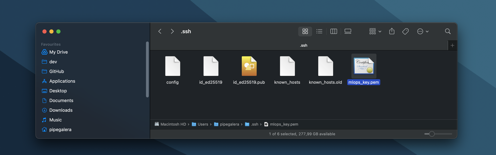
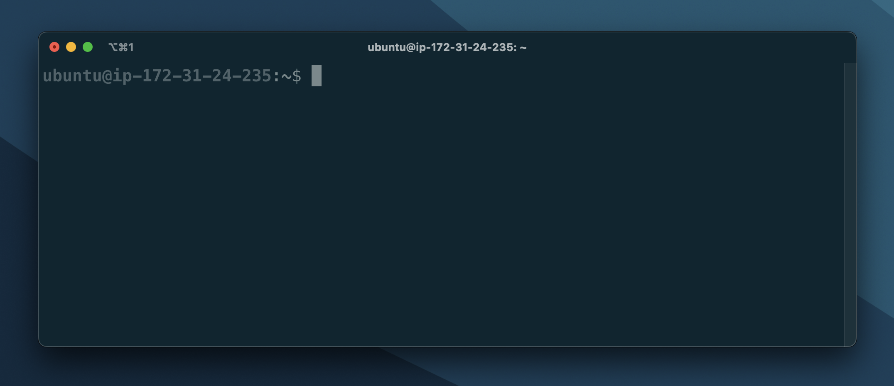
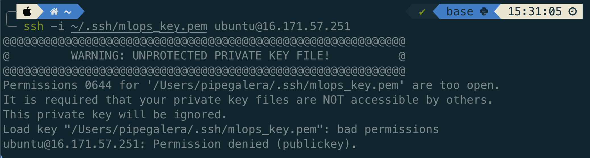
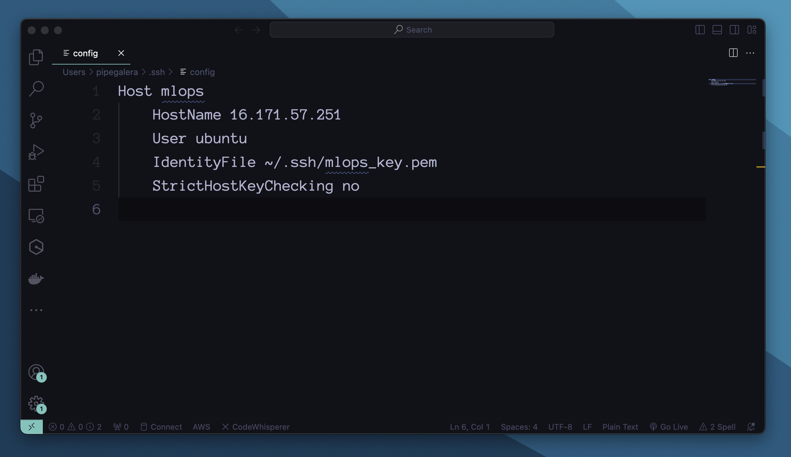
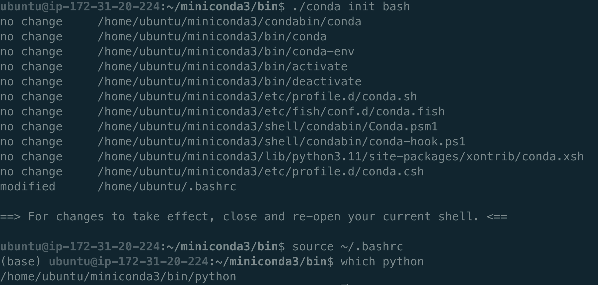
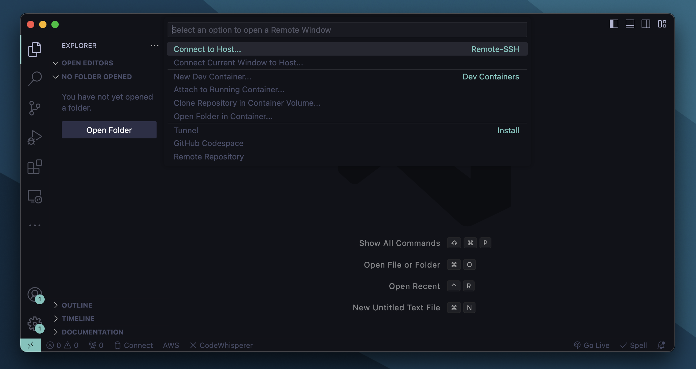
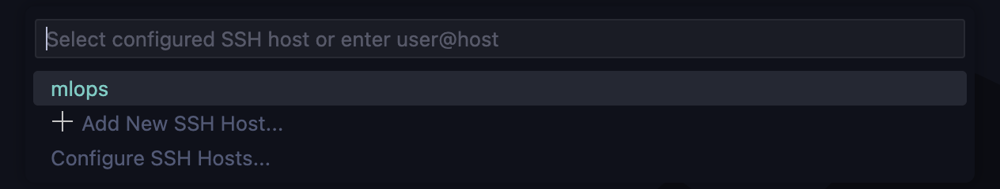

+++
title = "How to set up a AWS EC2 Instance in VSCode"
#description = "How to create a ubuntu server in AWS and connect to to it via VSCode."
date = "2024-01-05"
[taxonomies]
tags = ["aws", "cloud", "ssh", "ide"]
[extra]
comment = true
+++


I will explain how to connect to a remote machine to VSCode. The remote machine will be a ubuntu server in a AWS instance that, in my case, will be used to run lightweight ml models.



## 1. Create an AWS instance

First, just google AWS, create an account, and you will see the option to create an instance in the main page.

Free accounts have a free tier. Selecting everything with the "Free tier eligible" _should_ be free, but please take care what you launch anyway and do not select a 98 Ram machine with a Tesla V100 GPU and whatnot unless you know what you doing.

Here I will set up a cheap machine (like $0.1/hour):



- OS: Ubuntu Server 22.4 64-bit (x86)
- Image: t3.large or t3.xlarge (8/16 Gb of RAM)
- Key pair: New key -> place the pem file in the directory under your ~/.ssh/ folder (I called mine _mlops_key_):

  

- Network settings: Allow SSH traffic from “Anywhere”. As long as you configure the key pair you should be okay.
- Storage: 30 Gb

If the SSH key file was placed correctly, you can access the machine via ssh using the Public PIv4 address you can find in your instance summary website:

```bash
ssh -i ~/.ssh/mlops_key.pem ubuntu@{Instance public IPv4 address}
```



P.S. I did have a problem the first time I tried to connect with "permissions being too open":



That can be solved by running `chmod 600 ~/.ssh/mlops_key.pem` [(Source)](https://stackoverflow.com/questions/9270734/ssh-permissions-are-too-open)

We would like to avoid typing the IP of the virtual OS every time we connect to the instance and simply connect typing _"ssh mlops"_, for example.

To create this shortcut, modify the config file under ssh or your local machine:

```bash
Host mlops
  HostName {Instance public IPv4 address}
  User ubuntu
  IdentityFile ~/.ssh/mlops_key.pem
  StrictHostKeyChecking no
```

E.g.:



## 2. Install stuff in the ubuntu OS

- Docker

```bash
# Update apt
sudo apt update
# Install docker and docker-compose
sudo apt install docker.io docker-compose
# To us docker without using sudo continuously
sudo usermod -aG docker $USER
```

- Miniconda

```bash
# Download miniconda
wget https://repo.anaconda.com/miniconda/Miniconda3-latest-Linux-x86_64.sh
# Run the installer
bash Miniconda3-latest-Linux-x86_64.sh -b
# Add Anaconda to the system path
cd miniconda3/bin
./conda init bash
```

After this, “which python” should point out to the anaconda version:



## 3. Configure VSCode

Open VSCode locally and install the following:

- Install Remote-SSH: https://code.visualstudio.com/docs/remote/ssh-tutorial

- Install Jupyter: https://marketplace.visualstudio.com/items?itemName=ms-toolsai.jupyter

Open Command Palette(`Cmd+Shift+P`) and search "Connect host" and it will pop up:



It will automatically read the Host from the .ssh/config file:



And that's it, you have VSCode connected to remote ubuntu machine.

Clicking open folder will load a tree view. From there you can easily organize files, drag&drop files from your local computer to the folders in the remote machine, or create new files. Like you would locally.


**Please remember to stop the instance in AWS to avoid getting charged while not using it.**
