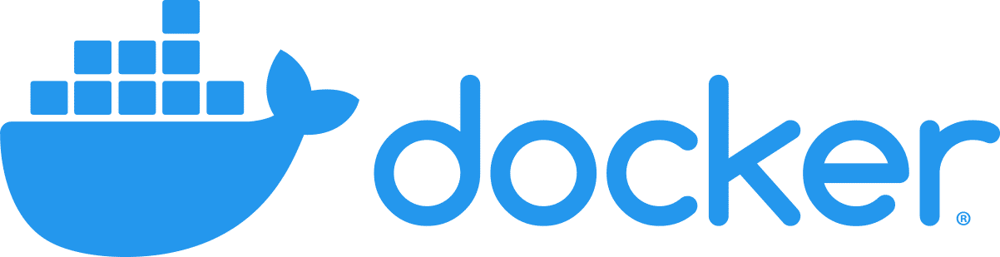
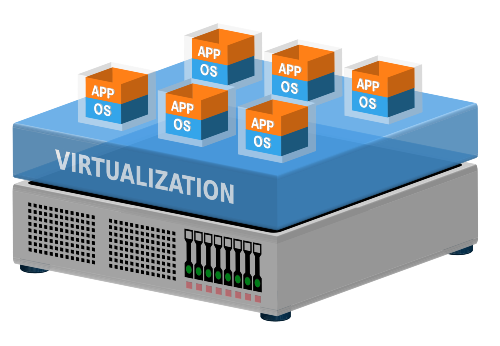
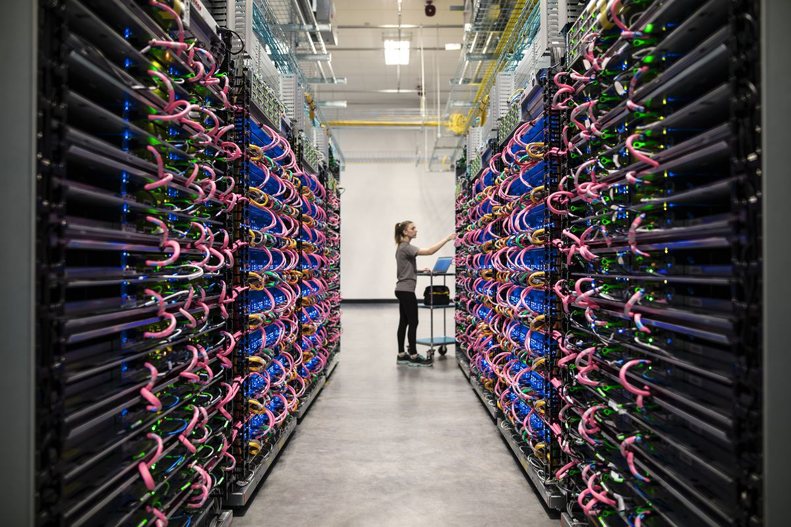
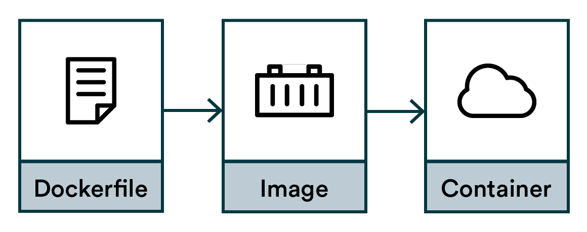
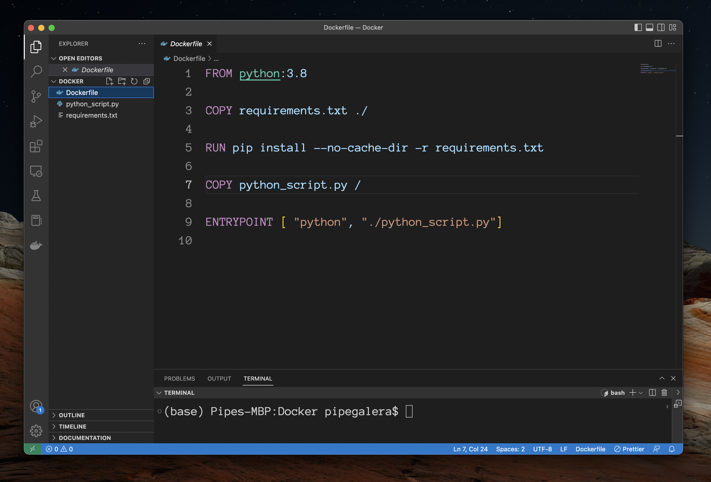
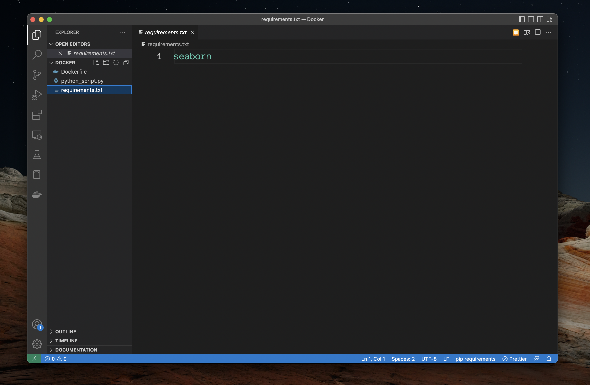
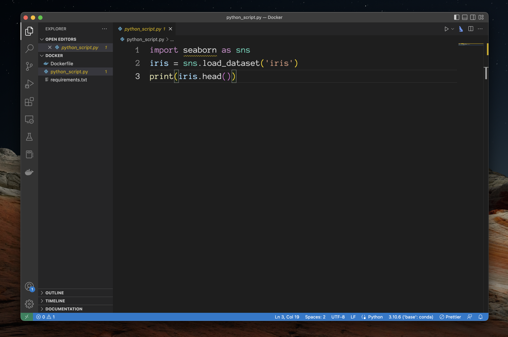
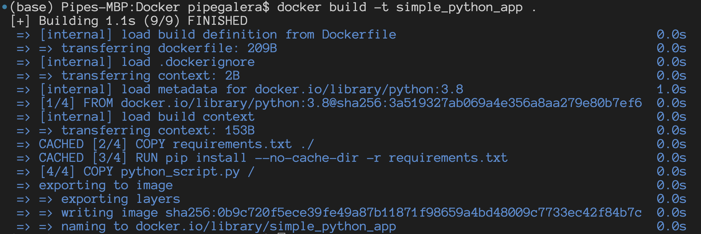
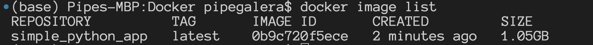
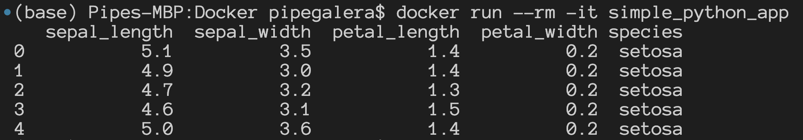

+++
title = "Dockerizing a Python application"
description = "Make your code deployable."
date = "2023-01-09"
[taxonomies]
tags = ["docker", "python"]
[extra]
comment = true
+++

In very simple terms, Docker makes sure than an API, a Dashboard in Streamlit/Shiny, or a scheduled script can be reproducible.

It is a way to package your code - making it able to run it other hardware and systems.

## Servers and Virtual machines

The goal of Docker is deploy code that you have had written somewhere else. This "somewhere else" is usually a server. In short, a server its a computer running in other place. Its always on running a Windows/Linux machine, automatically managed by the provider and usually have more resources than your local computer (e.g. 128 RAM/GPU Nvidia T4s) or the ability to scale if the workload requires it.

Instead of having 1 server running 1 operating system, computers can emulate more than one machine. Imagine a computer having multiple partitions of Linux, Windows, with different version, programs, and capacities. A server can have hundreds of versions or "virtual machines".

Imagine the "cloud" as different gigantic rooms somewhere around the world, with server racks with thousands of computers, running even more hundred of thousands virtual machines. The famous cloud providers (Google Cloud, AWS or Azure VMs) are simply renting you a small space in this gigantic room to store and run your code and software.

Now that we tour from computer, to server, to virtual machines, to cloud providers... How this relates to Docker?

## Basic Docker

The Docker program makes sure that you can run your code/app/dashboard in a virtual machine in the cloud, without need of your local configurations, with everyone having access to the same configuration.

It compartmentalize your code and requirements in chucks. These "chunks" or containers keep everything its needed for the code to be run.

The basic structure of Docker is:

1. **Docker containers**: these independent chunks with everything needed to run your code. From the OS, to packages, to the Dashboard or app. Everything is there, organized, and ready to be run.
2. **Docker images**: a container is run based on images layered on top of each other. One image is the OS (e.g. Windows), another Python, another the packages (e.g. Streamlit, sklearn).
3. **Docker files**: A blueprint for the images. The files that specify how the images must be layered and build. For example, you want the OS to be built before the image of Python, and Python to be built before installing sklearn.

In summary, you use dockerfiles to build images, that are the parts or the final container that can be deployed.

## Practial example dockerizing a Python script

Dockerizing a script allows to deploy it. Docker handles the packing, deploying, and running of applications.

This is an example on how to dockerize a basic python script that show the first 5 rows of the iris dataset. The output is basic, but it can be easily a Dashboard, a statistical analysis that needs to be replicable for auditing, or a trained pickle output of a model + API. The important here is not what to deploy but how to do it.

First, make sure that you have installed correctly installed Docker for your machine following the [Docker documentation](https://docs.docker.com/desktop/install/) .

The instructions of the container must be written in the dockerfile. Here we build a basic container by writing the following instructions or Dockerfile:

Below I'll explain the meaning of the different commands.

- Every new space in between commands (`FROM`, `COPY`, `RUN`...) is an instruction to create a new image on top of the starting image of python 3.8.
- In `FROM python:3.8` we say to Docker to build an staring image with python 3.8.

This is one of the pre-installed images that Docker has. There are more pre-installed images with everything you might need, from slim operating systems to full-packed data science environments. For us, we only need a basic python 3.8 environment image.

In `COPY requirements.txt ./` we tell Docker to copy the requirements. This requirements are the list of packages that we need for the script. In this case only `seaborn`:

- We install them running `RUN pip install --no-cache-dir -r requirements.txt`.
- `COPY python_script.py /` copy the script the code that we want to run into the docker container. The script is just displaying the first 5 rows of the iris dataset:

- The last line of the Dockerfile, `ENTRYPOINT` is the final image layered that say to Docker what to do when someone access this Docker image: run python, and the python script.

Done! We have al the instructions in our `Dockfile` to be able to build `python_script.py` into a container.

## Local deployment

Let's build a docker and call or tag it `simple_python_app` by a command line:

`docker build -t simple_python_app .`

It should create the docker quite fast and without errors if Docker is installed correctly in your machine.

Checking if the image is created can be done by running: `docker image list`

Once we know is there, we can run the Docker image by `docker run`:

Et voilà, the docker run the code, compartmentalized.

## Uses

Why should I care or how can I use this in DS?

- **Bundling a DS app into production** (e.g. Streamlit/Shiny Dashboard). The script, requirements and dockerfile can be send to the engineering team in your organization and can it be hosted in the company server.
- **Scale**. Let's say that your code is a gigantic neural network that your local computers cannot handle. You can train the NN in a virtual machine with an expensive GPU, instead of having to buy one.
- **Parallelize**. You can build an API that receives a lot of requests (an predictive ML system for example) so you can create many many many containers with the same image, and users can access different containers.
