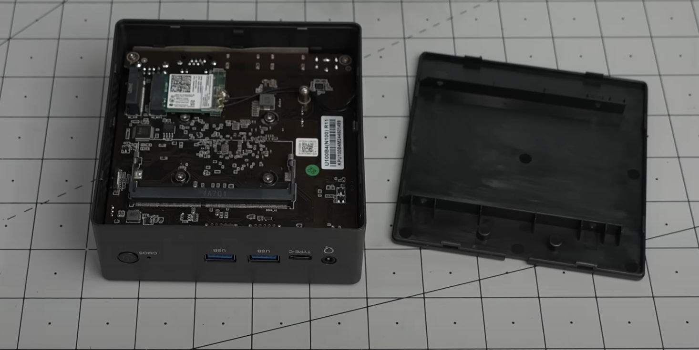
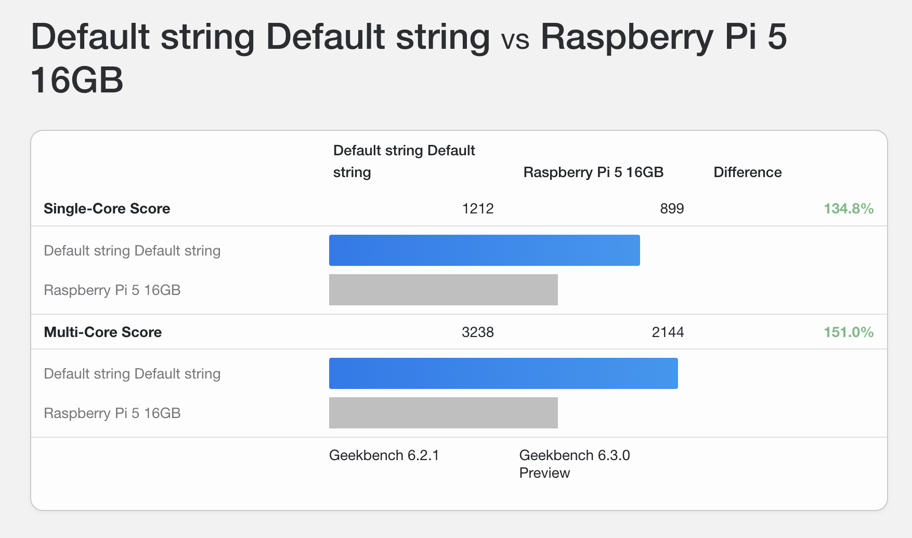

+++
title = "My minimalistic homeserver: Setup (1/N)"
description = "My simple and opinionated guide setup for my minimalistic homeserver."
date = "2025-05-31"
updated = "2025-06-08"
[taxonomies]
tags = ["self-hosting", "servers", "docker"]
+++


My simple and opinionated guide setup for my minimalistic homeserver.



It took me a couple of months of "journey", but I learned a lot of infrastructure, Linux, network security and was a hell of fun.

I self-host applications that replaced my monthly subscriptions of Google Drive, Google Photos, Apple iCloud, Obsidian, Netflix and Disney. And I don't rent my stuff, I own it.

These series of posts describe my "minimalistic" and uncomplicated setup.




It needs:

- [Ubuntu 24 Desktop](https://ubuntu.com/download/desktop)
- [Docker](https://www.docker.com/)
- [Tailscale](https://tailscale.com/)

With this software you are secured, protected, and you can install everything cleanly.
Optionally, you also will need an account in Cloudflare.com if you want to host a website or an app deployed to the public internet:

- [Cloudflare](https://www.cloudflare.com/).

That's it.






I optimized the setup for simplicity.

The choice of using Linux Desktop version is intentional. It allows interaction with the server without ssh. You could get the job done with any other Linux distro.

Also, feel free to  Podman instead of Docker, any other wireguard instead of Tailscale, or nginx proxy instead of cloudfare - but it wouldn't be as simple.
I won't mention the words: proxmox, kubernetes, NixOS, reverse proxing, port routing, gateway router config...

What I called a "minimalistic" configuration doesn't require you to be a part-time system admin. However, you still need to be comfortable writing commands on a terminal.



## 1. The server: *TexHoo QN10*




Reuse any old laptop or pc as a server if you have one. Buying new: the key is to look for  Intel N series CPU + DDR5 ram + NVME storage.



I came across [this fantastic post form a reddit user](https://diycraic.com/2024/12/27/intel-n100-mini-pc-32gb-ram-as-a-home-server/) in which he recommends called *TexHoo QN10 Mini PC*.

This is a great server pc because:

- It has an Intel CPU N100 that consumes very little energy yet powerful
- It has DDR5 ram slots (DDR4 is a main performance bottleneck for tiny computers)
- It has an standard NVME storage X3 faster than m.2 SATA 2280 that tons of mini PCs use

I can confirm that the build quality is good and everything works as it should after running it 24/7 for a couple of months.

### 1.1 Cost

- Mini PC barebones: €138  (Aliexpress.com)
- Crucial DDR5 24GB ram module: €55 (Amazon.de)
- Crucial 4 TB NVME: €272 (Amazon.de)

Total cost: ~€465 (EU-DK).

Tell the Aliexpress seller to "please include a 2.5 sata cable" (like [this one](https://www.aliexpress.com/item/1005007348439542.html)), so you can install also SSD drives.

### 1.2 Performance

[Here](https://browser.geekbench.com/v6/cpu/compare/11218167?baseline=9919608)
 is the comparison with an equally expensive (in Europe) Raspberry Pi 5 - 16 Gb:



You get more bang per buck with a mini pc than a Raspberry Pi.

To be fair, I think a Raspberry Pi 5 could do everything I will describe in my homeserver posts - so it can be also an option if you love the very small factor form of the Pi and you are willing to sacrifice performance.

The mini pc is been serving media at 4k for multiple devices at the same time, has +20 docker containers running and it never crashed in 5 months using it. 99% of the time it doesn't produces any audible noise, and I can only hear it the 1% of time that is under intense load.


## 2. The OS: Ubuntu 24 Desktop



Don't get very picky with the distro, it will only be used as "backend".



You don't need to install the linux "server version" of any distro to make it a server, and I don't recommend it for a basic homeserver.

**The desktop interface takes 3% of my N100 CPU usage when in use, and 1% in idle** - and you can always remove the desktop UX later if you don't use it.

I choose Ubuntu Desktop 24 because it has great reviews in the community, feels very polished, and the security updates are well supported by Canonical (parent company).

[Follow the official instructions](https://ubuntu.com/tutorials/install-ubuntu-desktop#1-overview) to install it - they are illustrated and easy to follow.

After installing the OS, remember to update and upgrade (e.g. `sudo apt update && upgrade`).

## 3.  Docker

The first program to install will be Docker, that will compartmentalize neatly all our applications.

### 3.1 Installation



Do not install Docker using `sudo apt install docker.io`. Ubuntu repository has Docker 20.10.24, and this version don't include **docker compose** plugin.




[Follow the official instructions from the Docker website](https://docs.docker.com/engine/install/). For Ubuntu:


```bash
# Add Docker's official GPG key:
sudo apt-get update
sudo apt-get install ca-certificates curl
sudo install -m 0755 -d /etc/apt/keyrings
sudo curl -fsSL https://download.docker.com/linux/ubuntu/gpg -o /etc/apt/keyrings/docker.asc
sudo chmod a+r /etc/apt/keyrings/docker.asc

# Add the repository to Apt sources:
echo \
  "deb [arch=$(dpkg --print-architecture) signed-by=/etc/apt/keyrings/docker.asc] https://download.docker.com/linux/ubuntu \
  $(. /etc/os-release && echo "${UBUNTU_CODENAME:-$VERSION_CODENAME}") stable" | \
  sudo tee /etc/apt/sources.list.d/docker.list > /dev/null

sudo apt-get update

# Install docker and plugins
sudo apt-get install docker-ce docker-ce-cli containerd.io docker-buildx-plugin docker-compose-plugin

# Check installation
sudo docker run hello-world
```

It should show:

```
Hello from Docker!
This message shows that your installation appears to be working correcly.
```

### 3.2 Admin privileges

After that [create a su user for docker](https://docs.docker.com/engine/install/linux-postinstall/), so you don't have to write `sudo` constantly using docker:

```bash
sudo groupadd docker
sudo usermod -aG docker $USER
newgrp docker
docker run hello-world
```

To test, run: `docker run hello-world`

It should show the same as before, but this time you didn't have to use `sudo`.

### 3.3 Docker parent folder

Create a docker folder from your server parent directory:

```bash
mkdir -p docker
```

This will simply create a folder (e.g. `/home/pipegalera/docker`). All the applications will be installed here so the applications don't spread across folders in your machine.
