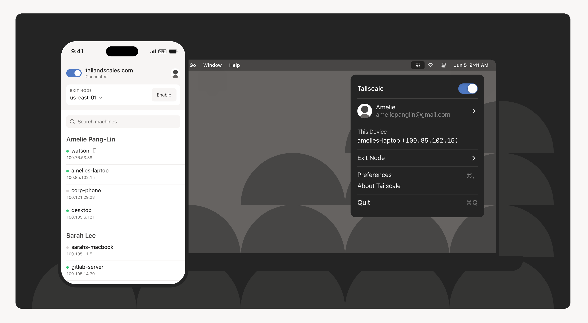
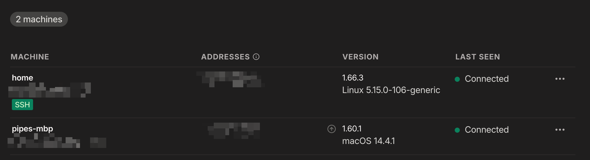
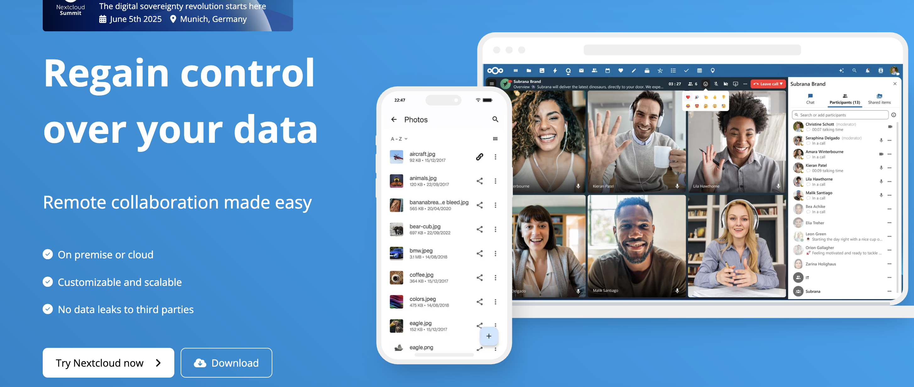
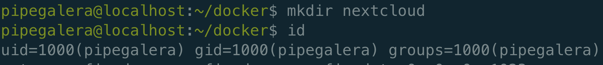
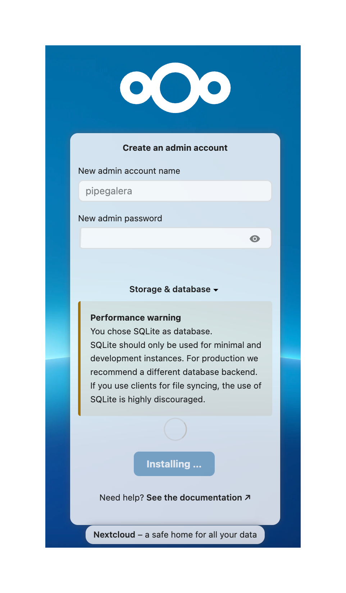
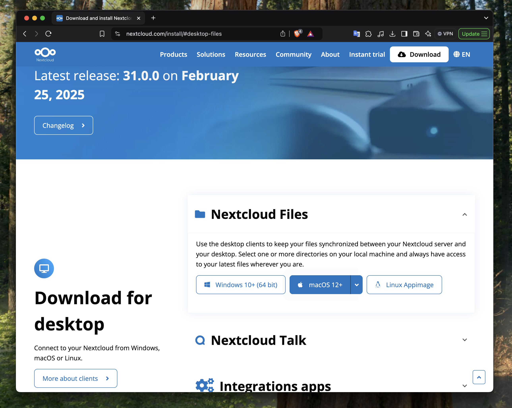
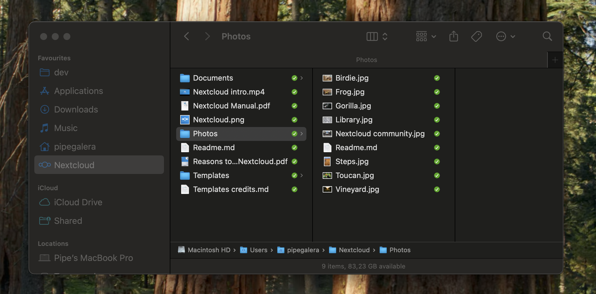

+++
title = "My minimalistic homeserver: Internal Applications (2/N)"
description = "Installing Nextcloud, Immich and Glance."
date = "2025-05-31"
[taxonomies]
tags = ["self-hosting", "servers", "docker"]
+++

This post describes how to install your first batch of internal apps. *Internal* in the sense that they are not public, only allowed devices will be able to reach them.



For media apps (e.g. Jellyfin, Sonarr), please jump to the next post. 



Internal services/apps:

- [NextCloud](https://nextcloud.com/): the self-hosted Dropbox
- [Immmich](https://immich.app/): the self-hosted Google Photos
- [Glance](https://github.com/glanceapp/glance): sleek dashboard to monitor all the applications

All the applications here use Tailscale for tunneling between devices. For example, to connect Immich to your phone you need to install Tailscale in the phone. Immich, as all the other applications, will work seamlessly in all the devices you have Tailscale installed.

## 1. The connector: Tailscale



**Why I need Tailscale?** 

To access your server files (e.g Nextcloud) outside of your network (e.g. from a cafe) without exposing the server to the public internet. 

Tailscale will allow to connect your server to other devices to the same secure network (called “tailnet”). It has a very generous free tier of up to 100 devices. 

All the devices in this network pool will be able to connect between each other through the tailnet.
### 1.1  Install Tailscale in the client

In your client (e.g. your laptop) go to `https://tailscale.com/download` and follow the instructions.

### 1.2 Install Tailscale in the server

Run in the server: `curl -fsSL https://tailscale.com/install.sh | sh`

After the installation is completed, run `sudo tailscale up` and it will give you a website to visit in your client (e.g. https//login.tailscale.com/a/1204ecba01999). Login into that website, and it should say `Success.` in the server terminal.

Into your Tailscale profile (https://login.tailscale.com/admin/machines) it should appear both machines (your *tailnet*):



Please notice that if you google "what is my public ip", it will show your real public IP. Tailscale uses their own IPs to connect and communicate devices. **This is not a free VPN to mask your devices, this is a VPN *network* to connect them securely. 

### 1.3 Connect between devices

From here on you can ssh from your laptop using your server user/server ip (e.g. `ssh pg@100.119.158.33`) or name of the server (e.g. `ssh pg@home` ), even then when you are outside from your home network.

Notice that if you deactivate Tailscale in your client then it is not sync with the tailnet and therefore you cannot access the server (e.g. try switch the toggle off in your laptop). This is the correct behavior: never expose the server out of that secured network pool.



You can assign names to the devices and use this alias instead of the IP (e.g. `ssh pg@homeserver`)



To install any of the following applications, you can either use the Desktop straight in the server or ssh into the server from the client, it doesn't matter.
## 2. Self-hosted Dropbox: NextCloud



I have to admin that calling Nextcloud a "self-hosted version of Dropbox" is a discredit to Nextcloud. I enjoy much more using Nextcloud that I've ever done with Dropbox - it works flawlessly. 

### 2.1 Installation

Make a `nextcloud` folder under `docker` and cd on it: `mkdir nextcloud && nextcloud`

After, create the file `docker-compose.yml` under your newly created folder `your_user/docker/nextcloud` with the following:

```docker-compose.yml
---
services:
  nextcloud:
    image: lscr.io/linuxserver/nextcloud:latest
    container_name: nextcloud
    environment:
      - PUID=1000
      - PGID=1000
      - TZ=Europe/Copenhagen
    volumes:
      - /home/your_user/docker/nextcloud/config:/config
      - /home/your_user/docker/nextcloud/data:/data
    ports:
      - 4040:443
    restart: unless-stopped
```


This Nextcloud image is safe and comes from [https://www.linuxserver.io/](https://www.linuxserver.io/).

Change:

- `your_user` for whatever su user you have
- `TZ` timezone for yours (e.g. `America/New_York`)
- `4040` to any other number if that port is used. Never change the container internal port (right number) , only the external (left number). 
-  `1000` for your user id




Run `id` in the terminal:




Normally it is 1000 by default. But if not, you should modify the docker-compose.yml `PUID` and `PGID` 



Finally, run the Nextcloud docker running: 

```bash
docker compose up -d
```

Once finish installation Nextcloud should be visible locally.

### 2.2 Setup

Visit server Tailscale IP/name + Nextcloud port (e.g. `https://100.123.90.81:4040/` or `https://homeserver:4040/`) and set up a user. As db, imo sqlite is a great db for homeservers.



From the client side (e.g. your phone or laptop), Nextcloud works like Dropbox. Download the app at their website: [https://nextcloud.com/install/](https://nextcloud.com/install/) and install it.



After installing the app, it will ask for the server ip (e.g. `https://homeserver:4040/`) and for permission to sync the server data. 



It can take up to 5 min to recognize the IP if you just installed Nextcloud.





Please notice that the app has many more functionalities that you can explore: office, calendar, notes, videocalls. I personally only use Notes app in my Android phone and Nextcloud in all my devices. 



Obsidian, the popular notetaking app, can use any folder as "vault" to start. 

Simply use a Nextcloud folder (e.g. `Notes`) and all the notes will be synced across all the devices with Nextcloud.


<iframe src="https://www.youtube-nocookie.com/embed/e3uQ2rtKkFA" frameborder="0" allow="accelerometer; autoplay; clipboard-write; encrypted-media; gyroscope; picture-in-picture" allowfullscreen="1"></iframe>





## 3. Self-hosted Google Photos: Immich


### 3.1 Installation 

I followed [the official documentation](https://immich.app/docs/install/docker-compose/) :

Make a `immich` folder under `docker` and cd on it

```bash
mkdir immich && cd immich
```

Download the latest docker-compose

```bash
wget -O docker-compose.yml https://github.com/immich-app/immich/releases/latest/download/docker-compose.yml
wget -O .env https://github.com/immich-app/immich/releases/latest/download/example.env
```

Before running this docker compose, please change the `.env` file (e.g. `nano .env`) that you just download with your own timezone, db passwords and username. The same as with Nextcloud.

Run the immich docker: `docker compose up -d` and once finish installation Immich should be visible locally.

### 3.2 Setup

Same as with Nextloud. Visit server Tailscale IP + Immich port: `http://homeserver:2283/` and set up a user.

From your smartphone or tablet, download the app in the apple/play store and similary you can use the Tailscale IP + Immich port to log in.

There is no desktop app but you can always visit `http://homeserver:2283/`. 



You can **only** use the Immich app to delete photos both local and server side. Any other app will only delete your local copy.



## 4. A Dashboard for your server: Glance

Glance is a great dashboard that provides a visual overview of your whole server and offers all kind of widgets to personalize.


I strongly recommend it to control the temps, load, and application status of your server. [Here is the public repository of the project](https://github.com/glanceapp/glance)

### 4.1 Installation 

Download the latest docker-compose

```bash
mkdir glance && cd glance && curl -sL https://github.com/glanceapp/docker-compose-template/archive/refs/heads/main.tar.gz | tar -xzf - --strip-components 2
```

Note that besides downloading the `docker-compose.yml` file, the command also downloads a  template dashboard to start with. 

Run the Glance docker image: `docker compose up -d` and  you should be able to see it at port 8080.

The whole dashboard is configurable via a single yaml file in `docker/glance/config/home.yml`. In the official config docs [here](https://github.com/glanceapp/glance/blob/main/docs/configuration.md) you have plenty of widgets easy to configure and make it your own.




These are 3 examples of very useful applications, but they are endless self-hosted applications that can replace subscription model software.

Just google: *"self-hosted version of X software"*. Look for the docker compose installation. As you can see, it is very easy and clean.

Some other self hosted software that I like for internal use:

- [Paperless](https://docs.paperless-ngx.com/) to digitalize paper documents
- [Obsidian](https://obsidian.md/) for notetaking (via Nextcloud)
- [Home Assistant](https://www.home-assistant.io/installation/alternative/#docker-compose) for managing smart bulbs and other home devices
- [Recipya](https://github.com/reaper47/recipya/) for cooking recepies
- [Kestra](https://kestra.io/) to orchestrate and automate data pipelines (data engineering)


