+++
title = "My minimalistic homeserver: *Arr Media Suite (3/N)"
description = "Installing *Arr Media Suite and securing internet privacy."
date = "2025-06-07"
updated = "2025-06-13"
[taxonomies]
tags = ["self-hosting", "servers", "docker"]
+++



This post is for educational purposes only.

The applications and software shown in this post are free and open source with a wide variety of features and use cases. **How you use these tools is to be dictated by your local laws and personal discretion.** This post will not show how to find, obtain, or download non-open source materials.



This is my simple configuration for my media application for Movies and TVShows. 

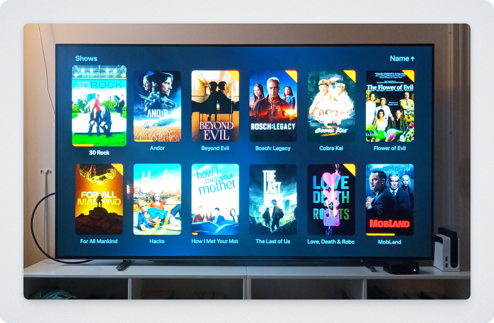

I am able to run 4k at 60fps with ease in multiple devices at the same time from my network with a mini N100 pc.

I do not expose publicly any of these applications, and I connect between my devices locally using Tailscale free tier (see [here](https://pipegalera.com/posts/minimalistic-homeserver-2/#1-the-connector-tailscale) instructions on how to install Tailscale.)

Remember to replace my home folder `/home/pipegalera/` for your own or whatever parent folder you want to use.

### 1. Installation




It is very easy to f*ck up the routing paths between the different apps. I recommend not to skim the sections. 



My setup follows [TRaSH folder structure](https://trash-guides.info/File-and-Folder-Structure/) to avoid having duplicating media files and wasting storage. `Sonarr` and `Radarr` will "read" the files from `qbittorrent` (*Hardlink*), instead of creating a copy of it.   

I will use a single `docker-compose.yml` file to install:

- [Radarr](https://radarr.video/) - a movie collection manager
- [Sonarr](https://sonarr.tv/) - a tv shows collection manager
- [Prowlarr](https://prowlarr.com/) -  an indexer manager
- [qBittorrent](https://www.qbittorrent.org/) - a torrent sharing client
- [Jellyfin](https://jellyfin.org/) - an organization media application
- [Jellyseerr](https://docs.jellyseerr.dev/) - a discovery application

### 1.1 Create directory folders

I will setup a single folder `data` for the media with the subfolders `movies` and `tv`. 

```
# Set one folder for data and other for the app config
sudo mkdir /home/pipegalera/data/{torrents,media}/{movies,tv}
sudo mkdir /home/pipegalera/docker/arr
```

```
# Set ownership
sudo chown -R 1000:1000 /home/pipegalera/data
sudo chown -R 1000:1000 /home/pipegalera/docker/arr
```

### 1.2 Docker compose file

After creating the files and setting the ownership (important!), create the `docker-compose.yml` file and install the apps via docker:

```
cd /home/pipegalera/docker/arr
touch docker-compose.yml
```

Write into `docker-compose.yml` the arr applications: 

```docker-compose.yml
services:
    qbittorrent:
        container_name: qbittorrent
        image: ghcr.io/hotio/qbittorrent
        ports:
            - "6080:6080"
        environment:
            - PUID=1000
            - PGID=1000
            - UMASK=002
            - TZ=Etc/UTC
            - WEBUI_PORTS=6080/tcp,6080/udp
        volumes:
            - /home/pipegalera/docker/arr/qbittorrent/config:/config
            - /home/pipegalera/data/torrents:/data/torrents
        restart: unless-stopped

    sonarr:
        container_name: sonarr
        image: ghcr.io/hotio/sonarr
        ports:
            - "8989:8989"
        environment:
            - PUID=1000
            - PGID=1000
            - UMASK=002
            - TZ=Etc/UTC
        volumes:
            - /home/pipegalera/docker/arr/sonarr/config:/config
            - /home/pipegalera/data:/data
        restart: unless-stopped
        
    radarr:
        container_name: radarr
        image: ghcr.io/hotio/radarr
        ports:
            - "7878:7878"
        environment:
            - PUID=1000
            - PGID=1000
            - UMASK=002
            - TZ=Etc/UTC
        volumes:
            - /home/pipegalera/docker/arr/radarr/config:/config
            - /home/pipegalera/data:/data
        restart: unless-stopped
        
    prowlarr:
        container_name: prowlarr
        image: ghcr.io/hotio/prowlarr
        ports:
            - "9696:9696"
        environment:
            - PUID=1000
            - PGID=1000
            - UMASK=002
            - TZ=Etc/UTC
        volumes:
            - /home/pipegalera/docker/arr/prowlarr/config:/config
        restart: unless-stopped
        
    jellyfin:
        container_name: jellyfin
        image: ghcr.io/hotio/jellyfin
        ports:
            - "8096:8096"
        environment:
            - PUID=1000
            - PGID=1000
            - UMASK=002
            - TZ=Etc/UTC
        volumes:
            - /home/pipegalera/docker/arr/jellyfin/config:/config
            - /home/pipegalera/data:/data
        restart: unless-stopped
        
    jellyseerr:
        container_name: jellyseerr
        image: ghcr.io/hotio/jellyseerr
        ports:
            - "5055:5055"
        environment:
            - PUID=1000
            - PGID=1000
            - UMASK=002
            - TZ=Etc/UTC
        volumes:
            - /home/pipegalera/docker/arr/jellyseerr/config:/config
        restart: unless-stopped
```

Make sure you are in the correct parent folder (e.g. `/home/pipegalera/docker/arr`) and run `docker compose up -d` 

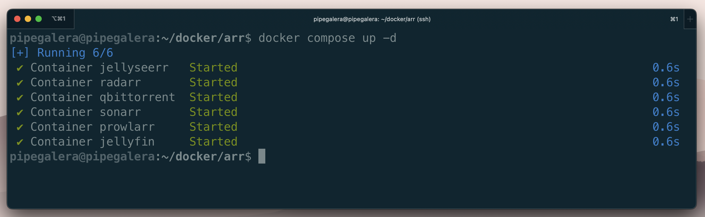




- Running only selected apps: `docker compose up -d jellyfin radarr`
- Taking them down: `docker compose down jellyfin`
- Check the logs for info or errors: `docker logs radarr`
- Check the images status: `docker compose ps`




Here I will follow what I consider a logical order to setting up the applications: 

1. `Prowlarr` to look for media
2. `qBittorrent` to download media
3. `Radarr` and `Sonarr` to organize the files
4. `Jellyfin` to reproduce them
5. `Jellyseerr` to discover new stuff


### 2. The Indexer: Prowlarr

1. Go to: http://homeserver:9696/
2. Set up user:

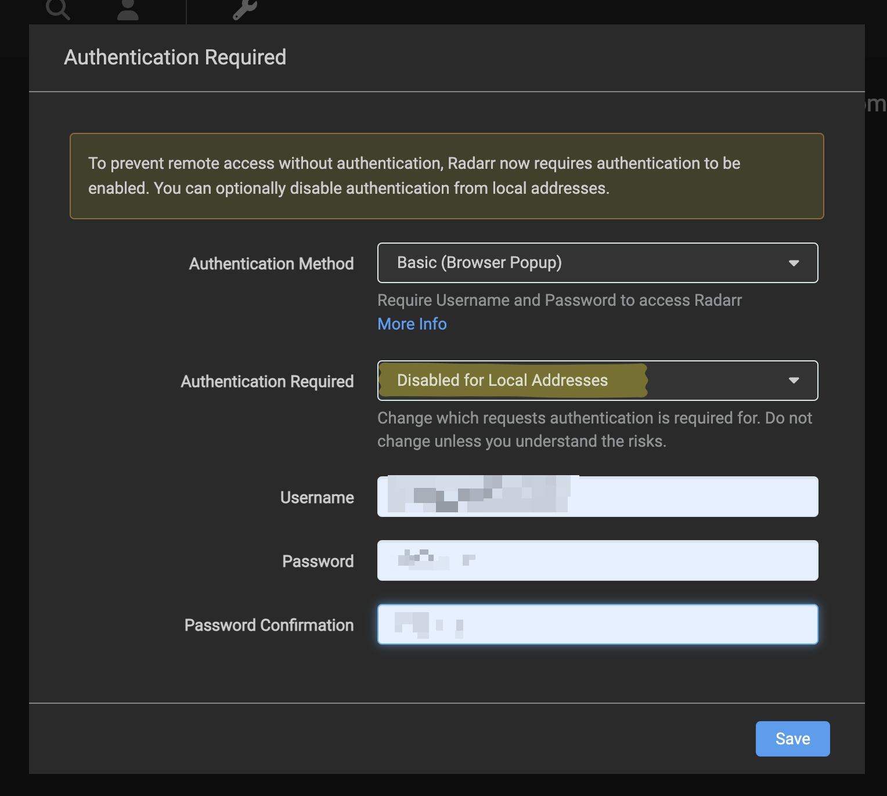

"Disable for Local Addresses" allow local logic without admin/password since we will only use the local network via Tailscale. 

3. Add indexers: 

I won't recommend any illegal site. There is an interactive search bar with the most popular ones and what kind of service can provide.

4. Grab API key from `Radarr` to connect with Prowlarr

- Go to: http://homeserver:7878/
- Set up user (same as with `Prowlarr`)
- Go to: `General -> API key -> copy this`
- Go back to `Prowlarr` and set up `Radarr` connection at: `Settings -> App -> Add -> Radarr`

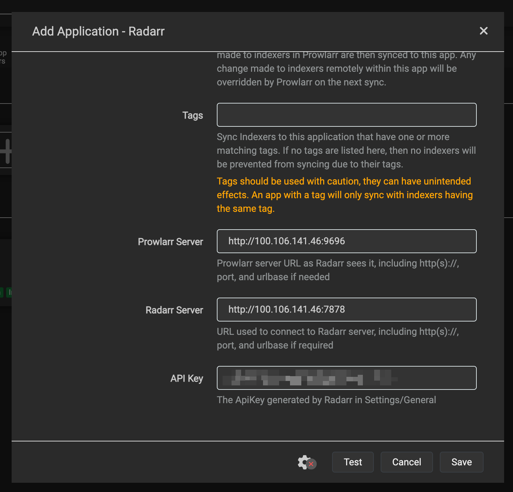



For Tailscale users: you cannot use the machine name here - use the Tailscale IP. 




5. Grab API key from `Sonarr` to connect with Prowlarr

Same steps:

- Go to: http://homeserver:8989/
- Set up user (same as `Prowlarr`)
- Go to: `General -> API key -> copy this`
- Go back to `Prowlarr` and set up `Sonarr` connection at: `Settings -> App -> Add -> Sonarr`

`Prowlarr` should show now the 2 apps: 

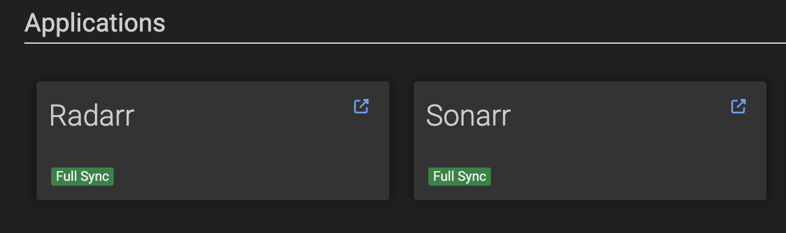

## 3. The Torrent Client: qBittorrent

The first time it runs, qBittorrent provides a temporary password. You can see the credentials by running:  `docker logs qbittorrent` .

It should print something like: 

```
******** Information ********
To control qBittorrent, access the WebUI at: http://localhost:6080
The WebUI administrator username is: admin
The WebUI administrator password was not set. A temporary password is provided for this session: vpRYnzDbq
You should set your own password in program preferences.
Connection to localhost (::1) 6080 port [tcp/*] succeeded!
```

Once you are inside the app.

- Change the password: 

```
Tools -> Options -> WebUI -> Authentication -> change password -> Save
```

- Limit the kind of files that are allowed to be downloaded for security:

```
Tools -> Options -> Downloads -> Exclude file names:

*.arj
*.lnk
*.zipx
*sample.mkv
*sample.avi
*sample.mp4
*.py
*.vbs
*.html
*.php
*.torrent
*.exe
*.bat
*.cmd
*.com
*.cpl
*.dll
*.js
*.jse
*.msi
*.msp
*.pif
*.scr
*.vbs
*.vbe
*.wsf
*.wsh
*.hta
*.reg
*.inf
*.ps1
*.ps2
*.psm1
*.psd1
*.sh
*.apk
*.app
*.ipa
*.iso
*.jar
*.bin
*.tmp
*.vb
*.vxd
*.ocx
*.drv
*.sys
*.scf
*.ade
*.adp
*.bas
*.chm
*.crt
*.hlp
*.ins
*.isp
*.key
*.mda
*.mdb
*.mdt
*.mdw
*.mdz
*.potm
*.potx
*.ppam
*.ppsx
*.pptm
*.sldm
*.sldx
*.xlam
*.xlsb
*.xlsm
*.xltm
*.nsh
*.mht
*.mhtml
```

- The default path should be the one we created for `qBittorrent`:

```
Tools -> Options -> Downloads -> Default Save path:

/data/torrents

```

## 4. Movie manager: Radarr 

We will configure `Radarr` now.

-  Media Management settings

```
Settings -> Media Management -> Root Folders
```

And set the path for the movies that we created previously: `/data/media/movies`

- Download Client settings

```
Settings -> Download Clients -> Download Client (plus sign) -> qbittorrent
```

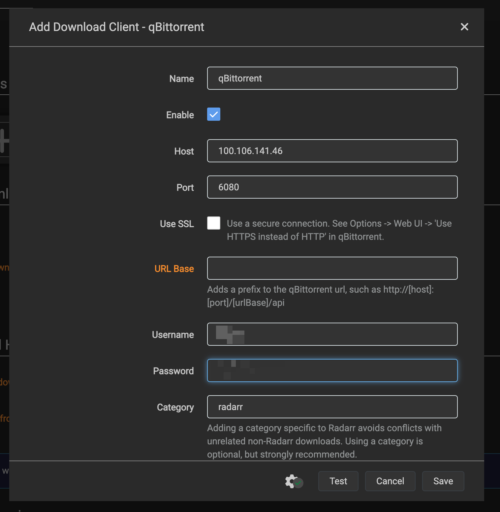



Please note that my screenshot has my own `server ip` and  `port`. Change them to yours. 



## 4.  TV Shows manager: Sonarr 

We will configure `Sonarr` now. It is the exact same process.

-  Media Management settings

```
Settings -> Media Management -> Root Folders
```

And set the path for the tv shows that we created previously: `/data/media/tv`

- Download Client settings

```
Settings -> Download Clients -> Download Client (plus sign) -> qbittorrent
```


## 5. After installation checks

- `Prowlerr`: Use the `Search` button up top of `Radarr` to check if you find any movies.

-  Folder structure: Make sure the Root Folder of that movie is `/data/media/movies/...` and for tvshows `/data/media/tv`

- `qBittorrent`: Check that the movie was added and it's downloading (if it has seeders).

- Download (copyright free) content and [check if hardlinks are working](https://trash-guides.info/File-and-Folder-Structure/Check-if-hardlinks-are-working/).


## 6. Multimedia Player: Jellyfin 

`Jellyfin` is very easy to install. Go to the docker images url (e.g. `http://<Server Tailscale IP>:8096/)` and follow the instructions. 



You should use the media folder only. The files are *hardlinked* to the torrent files and their formatting is "cleaned" by `Radarr/Sonarr` - do not use the path `data/torrents`



- All the defaults are okay for my usecases.
- Create one library to the tvshows pointing to folder `/data/media/tv`
- Create one library to the movies pointing to folder `/data/media/tv`
- Scan library

Libraries should look like:

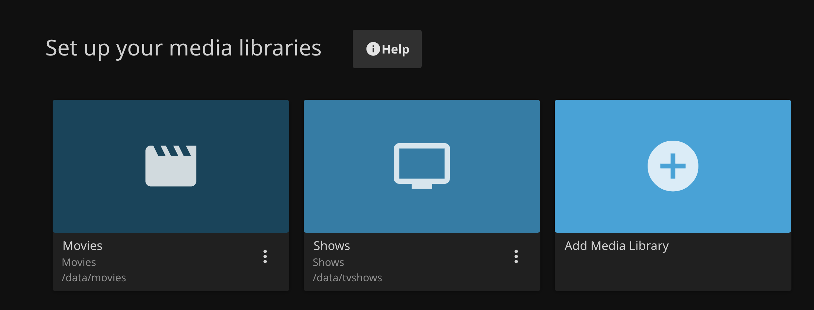


## 7. Discovery tool: Jellyseerr

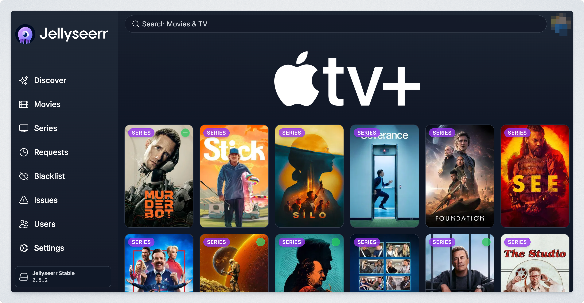

`Jellyseerr` is an application to discover new TV shows and movies. One of my favourite feature is that you can filter for network (e.g. `Apple tv+`) and request any content from there. 

To install it, go to `http://<Server Tailscale IP>:5025/` and follow the instructions.

This application is connected to you `Jellyfin` account, so you will have to use your `Jellyfin` info and  credentials. 

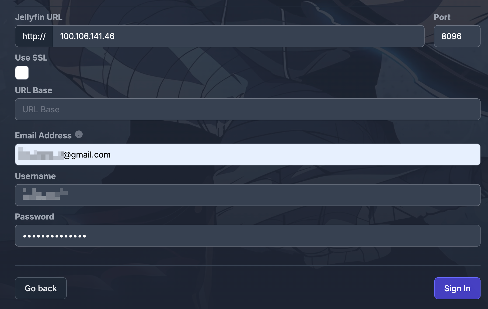

## 8. Setting a VPN with Mullvad and  Tailscale

 I strongly recommend using a VPN if you want to protect your privacy.  [Tailscale colab with Mullvad to provide a VPN mask for your IP for $5 month](https://tailscale.com/mullvad) . 

### 8.1 From the server

Once you got the Mullvad paid extension, you can see the list of VPN locations running:

```
tailscale exit-node list
```

Every location has a ip and name. You can use them running:

```
tailscale set --exit-node=<IP> --exit-node-allow-lan-access=true
```

After waiting 5 minutes you can use `curl ipinfo.io` to check where you public IP is:


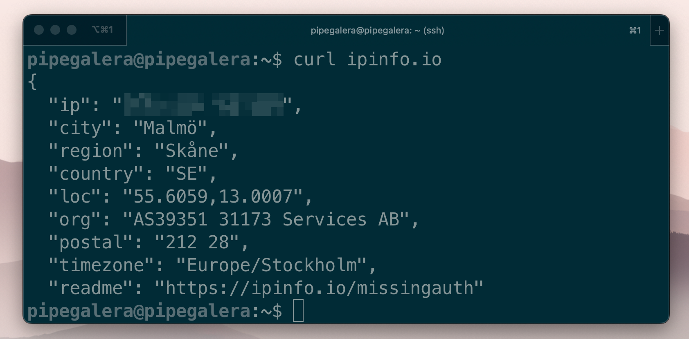

### 8.2 From clients and devices

You can use the VPN in up to 5 devices, and set your devices in different locations. 

From MacOS Tailscale app is very easy to change IP locations:

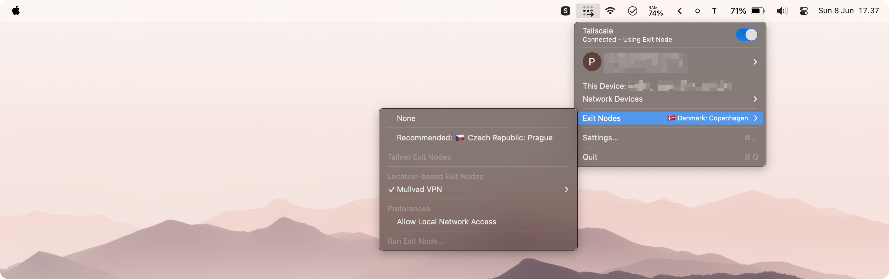

Since the server and devices connect internally via Tailscale IPs, it doesn't affect their connection if they use different exit nodes or VPN locations.

I really like [Mullvad](https://mullvad.net/en) VPN. They have all the "green flags"  from people that care about internet privacy: from setting your user as a random token (they don't host your email), or allowing people to pay using cash in an envelope, or non predatory/vendor-lock VPN prices.
