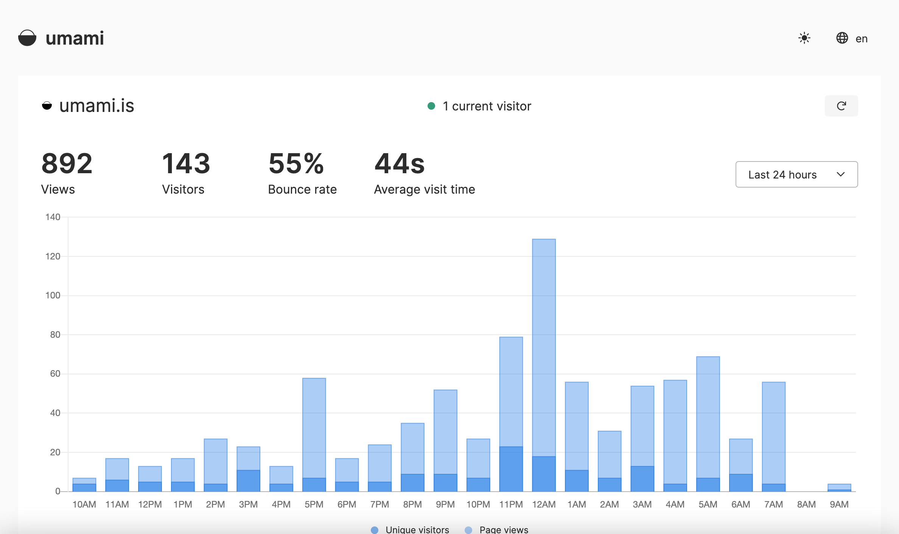
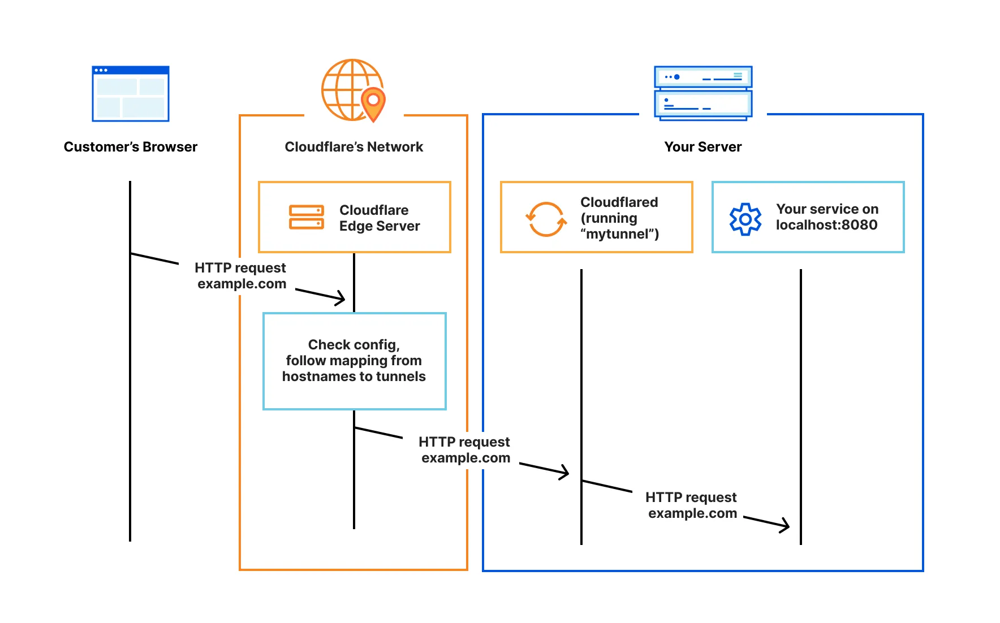
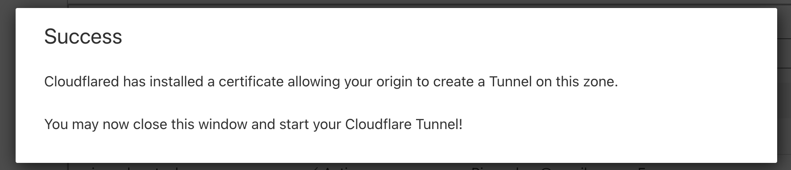
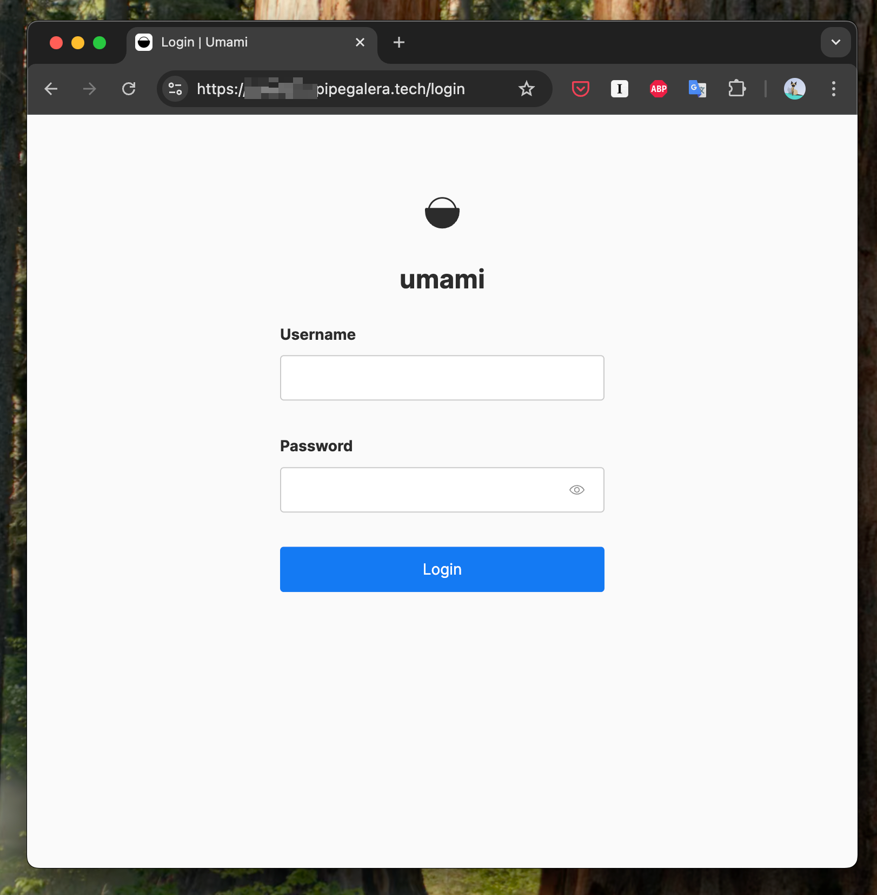

+++
title = "My minimalistic homeserver:  Public Applications (4/N)"
description = "Exposing Umami service to the public internet."
date = "2025-06-08"
updated="2025-06-12"
[taxonomies]
tags = ["self-hosting", "servers", "docker"]
+++



This guide works with any other service or application.



Here I will make accessible my local service `umami` (`http://localhost:3000`) publicly as `umami.pipegalera.tech`.




Umami is an [analytics platform](https://umami.is/), similar to Google Analytics, that can be self-hosted. 

I will user [Cloudflare tunnels](https://developers.cloudflare.com/cloudflare-one/connections/connect-networks/), instead of the usual combo of [Nginx reverse proxy](https://docs.nginx.com/nginx/admin-guide/web-server/reverse-proxy/), getting a static IP and opening the ports of the home router. 

Cloudflare allow to create “tunnels” for an outbound connections so you can make public a website or service hosted in your homelab securely. 



If you want to completely manage your network security, go for [Nginx](https://nginx.org/). I prefer Cloudflare to handle my network security and not get paranoid with DoS, DDoS or bruteforce IP attacks. 



 - A public domain (www.example.com). 
 - A Cloudflare account (free tier). 




## 1. Share a service via Cloudfare

### 1.1. Connect your domain to Cloudflare

Go to [www.cloudflare.com](www.cloudflare.com) , log in and click `+ Add domain` under `Account Home`. 

Just follow the instructions, they are easy: write your domain, it will give you a DNS record (e.g. `kim.ns.cloudflare.com `) and it will tell you to  go to your domain provider (e.g. Namecheap) and put it there under `Custom Domain`.


### 1.2. Install cloudflared on your Linux homelab machine

Login via ssh into the server and run: 

```
wget https://github.com/cloudflare/cloudflared/releases/latest/download/cloudflared-linux-amd64.deb
sudo dpkg -i cloudflared-linux-amd64.deb
rm cloudflared-linux-amd64.deb
```

Depending on your OS, the version (e.g. `linux-arm64` instead of `linux-amd64` ) might change. See  the [official docs](https://developers.cloudflare.com/cloudflare-one/connections/connect-networks/downloads/)

You also need to install cloudflared service:

```
sudo cloudflared service install
```


### 1.3. Authenticate with Cloudflare

```
cloudflared tunnel login
```

This opens a browser. Choose your domain and press “authenticate”.



The authentication  will create a cert in `~/.cloudflared/cert.pem`

### 1.4. Create a Cloudflare Tunnel

Create a tunnel, I called mine `homelab-tunnel`:

```
cloudflared tunnel create homelab-tunnel
```

The terminal should print something like:

```
Tunnel credentials written to /home/pipegalera/.cloudflared/107cf67df-624a-4eb2-bf35-70eec35d9eec.json. cloudflared chose this file based on where your origin certificate was found. Keep this file secret. To revoke these credentials, delete the tunnel.

Created tunnel homelab-tunnel with id 107cf67df-624a-4eb2-bf35-70eec35d9eec.json
```

You will need this id to map the service to the tunnel. 

You can always find the ID again by running: `cloudflared tunnel list`

### 1.5. Cloudflare config.yml file

Create Cloudflare `config.yml` file:

```
sudo mkdir -p /etc/cloudflared
sudo nano /etc/cloudflared/config.yml
```

And insert: 

```
tunnel: 107cf67df-624a-4eb2-bf35-70eec35d9eec
credentials-file: /home/pipegalera/.cloudflared/107cf67df-624a-4eb2-bf35-70eec35d9eec.json

ingress:
  - hostname: umami.pipegalera.tech
    service: http://localhost:3000
  - service: http_status:404
```

Please replace the tunnel id, home path, the port, subdomain with your own. 

### 1.6. Configure tunnel routing

One the `config.yml` file is created, you can now route the service to the domain:

```
cloudflared tunnel route dns homelab-tunnel umami.pipegalera.tech
```

### 1.7. Start the Service

Re-execute the systemd, reload the config files, start cloudflared and enable it to make sure it activate the tunnel after the homelab reboots. 

```
sudo systemctl daemon-reexec
sudo systemctl daemon-reload
sudo systemctl start cloudflared
sudo systemctl enable cloudflared 

```

Check status:

```
sudo systemctl status cloudflared
```

If everything goes well, in 15 minutes to 1 hour the subdomain should be up publicly.






- Stop it: `sudo systemctl stop cloudflared`

- Disable permanently: `sudo systemctl disable cloudflared` 

- Delete the tunnel: `cloudflared tunnel delete homelab-tunnel`

- Remove credentials: `sudo rm ~/.cloudflared/107cf67df-624a-4eb2-bf35-70eec35d9eec.json`

- Edit config: `sudo nano /etc/cloudflared/config.yml` 



## 2. How to add more services to the tunnel

Let’s say that we have a second local service under `http://localhost:4000` that we want to expose to `my_new_service.pipegalera.tech`.

- Enter the  `config.yml` file: `sudo nano /etc/cloudflared/config.yml`
- Edit the `config.yml` file with the new service: 

```config.yml
tunnel: 107cf67df-624a-4eb2-bf35-70eec35d9eec
credentials-file: /home/pipegalera/.cloudflared/107cf67df-624a-4eb2-bf35-70eec35d9eec.json

ingress:
  - hostname: umami.pipegalera.tech
    service: http://localhost:3000
  - hostname: my_new_service.pipegalera.tech
    service: http://localhost:4000
  - service: http_status:404
```



You can replace "localhost" for your IP or Tailscale machine name.




- Route the new service: 

```
cloudflared tunnel route dns homelab-tunnel my_new_service.pipegalera.tech
```

- Reset cloudflared: `sudo systemctl restart cloudflared`
