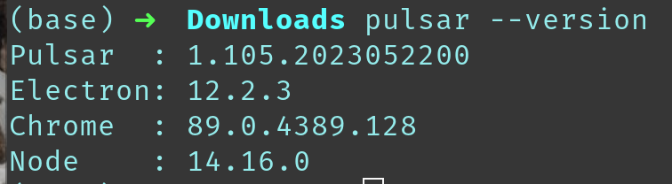
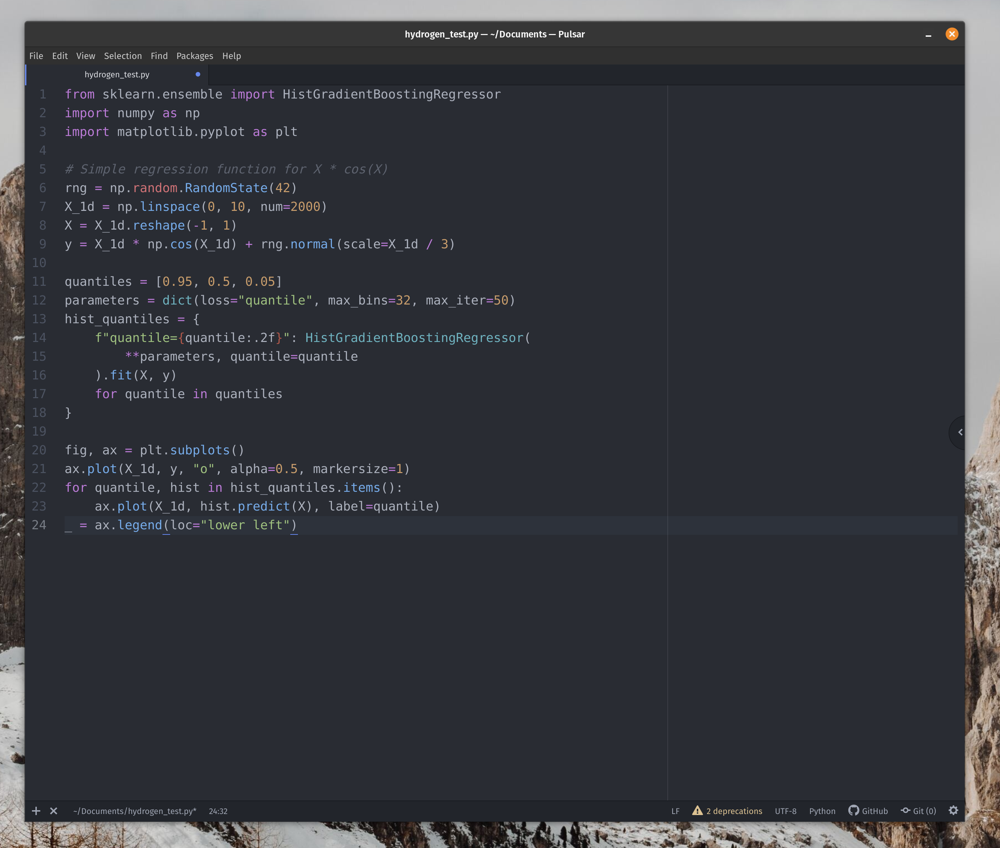
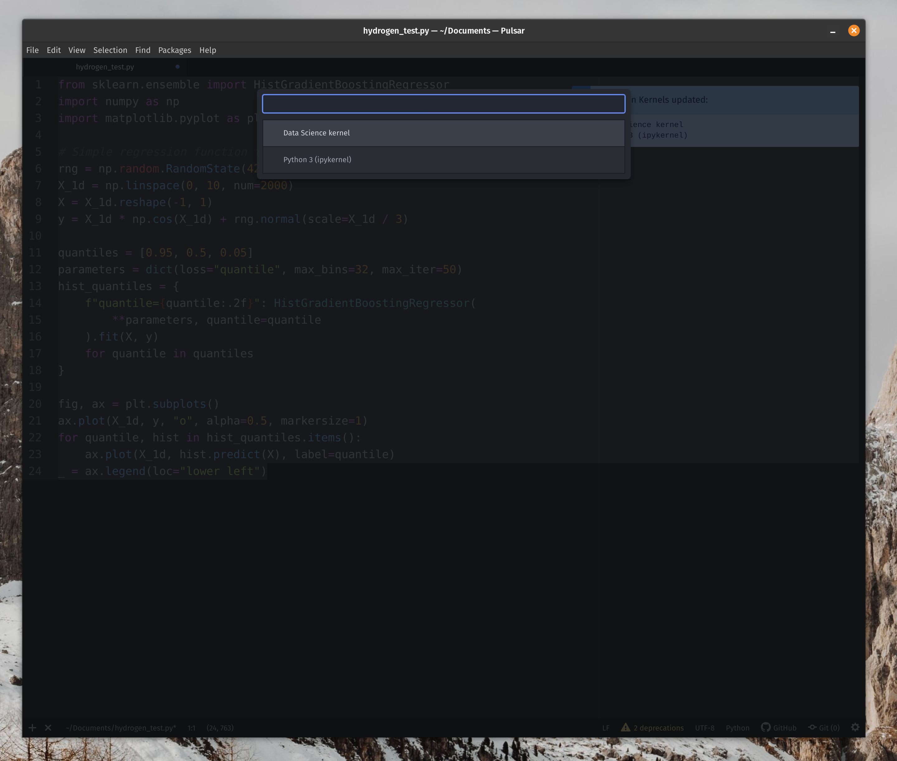
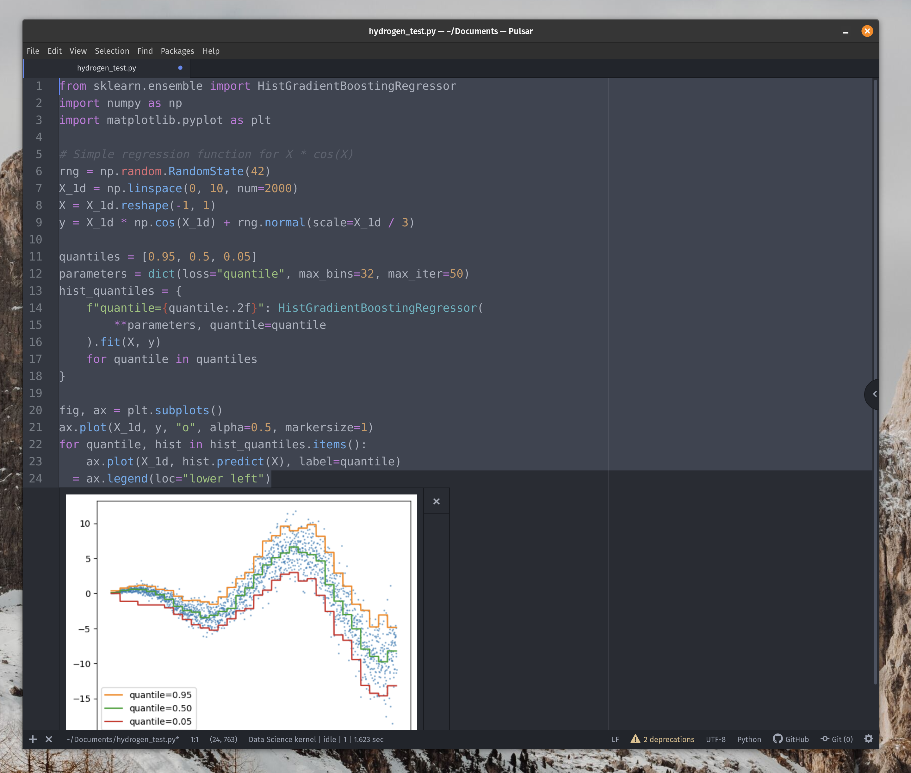

+++
title = "How to set up Hydrogen in Pulsar IDE"
description = "Setting up Hydrogen in Atom's spiritual successor."
date = "2023-08-02"
[taxonomies]
tags = ["ide", "python", "ipython"]
[extra]
comment = true
+++

## I missed Atom 💔 (**tl;dr** skip to next section.)

I switched my IDE to VSCode from Atom around 5 years ago for my usual data science related work. However, year after year I kept missing the Hydrogen IDE package for one reason or another. If you don't know what I'm talking about, in essence Hydrogen is jupyter notebook' cells embedded in python files:


This was a game changer for me using Python for data science during my first years. As free GPU platforms based on notebooks were getting more traction (e.g. Google Colab, Kaggle, Amazon SageMaker, Databricks) I ended up rotating to VSCode and Jupyter notebooks. They really _hooked me_ with free Tesla V100s GPUs.

Flash forward 2022 and after much testing with other tools, I wanted to come back to the good-old Atom+Hydrogen combo. Easy change I expected... oh well. Atom was closing doors and finally [shut down](https://github.blog/2022-06-08-sunsetting-atom).

Luckily, the open-source community is amazing, and started to develop an Atom fork called Pulsar.


In all the honesty, at the early stages of Pulsar (Late 2022) the IDE was very buggy and unusable. Hydrogen wasn't working either in my machine. Trying to find solutions was difficult as they weren't precisely popping up in Stackoverflow or their Github repo. The project was basically brand new.

The developers kept improving Pulsar, fixing bugs, and the Atom community jumped on solving issues. By the time I'm writing this post (Q2 2023), I happily say that I moved completely to Pulsar as my IDE 🎉.

Everything that I use simply work as it used to in Atom. Setting up Hydrogen was more tricky than expected, but I made it work and the instructions are below.

## How to set up Hydrogen in Pulsar

The following instructions have been tested in Linux (Pop OS Distro) and macOS (Ventura 13.4).

### 1. Install Pulsar

Simply follow the [official instructions](https://pulsar-edit.dev/download.html) for your particular OS system. For Windows/macos simply download the executable installer. For Linux, I downloaded the image (_pulsar_1.105.2023053023_amd64.deb_) and run:

```bash
sudo apt install ./pulsar_1.105.2023052200_amd64.deb
```

Make sure it's installed by running `pulsar --version`. Something like the following should show:



### 2. Install Hydrogen and Hydrogen plugin

**⚠️ Do not install Hydrogen from the package manager within the Pulsar app.**

Open any terminal and install Hydrogen by running:

```bash
pulsar -p install https://github.com/nteract/hydrogen -t v2.16.5
```

[Source](https://github.com/pulsar-edit/package-backend/blob/main/docs/reference/Admin_Actions.md#hydrogen)

Install also 2 plugins for Hydrogen:

1. **Hydrogen Launcher**: enable opening terminals and Jupyter consoles connected to Hydrogen.

```bash
pulsar -p install hydrogen-launcher
```

2. **Hydrogen-python**: provides various Python-specific features.

```bash
pulsar -p install hydrogen-python
```

### 3. Correct the Electron version

Pulsar has moved to a newer version of Electron than what Atom was on, so those native modules (e.g. Hydrogen) needed to be rebuilt for the new version. Change directory to the Hydrogen folder (tip: the step before prints the Hydrogen folder path), and rebuild electron:

```bash
cd /home/pipegalera/.pulsar/packages/Hydrogen
npx electron-rebuild -v 12.2.3
```

[Source](https://www.reddit.com/r/pulsaredit/comments/119tby8/hydrogen_package_fails_to_activate_any_tips/)

### 4. Create a virtual environment and test

Creating a virtual environment is a good test to make sure Hydrogen is working correctly. We would like Hydrogen to load the packages from the specific environment - not from python base env.

We'll create a virtual environment and then run an example. Feel free to use your virtual environment manager of your choice, I personally use [miniconda](https://docs.conda.io/en/latest/miniconda.html) or [mamba](https://mamba.readthedocs.io/en/latest/user_guide/mamba.html).

In Linux, miniconda can be easily installed by running the below:

```bash
wget https://repo.anaconda.com/miniconda/Miniconda3-py37_4.11.0-Linux-x86_64.sh
bash Miniconda3-py37_4.11.0-Linux-x86_64.sh
```

If you are reading this from Windows or macOS I would recommend that simply download the miniconda or anaconda installer [from the official page](https://conda.io/projects/conda/en/latest/user-guide/install/index.html).

Once you have it installed, we will create a basic data science environment with jupyter, ipykernel, scikit-learn, and matplotlib:

```bash
# Needed packages for Hydrogen to work
conda create -n ds python=3.9
conda activate ds
conda install -y ipykernel jupyter
python -m ipykernel install --user --name ds --display-name "Data Science kernel"

# Basic packages for testing purposes
pip install -U scikit-learn
conda install -y matplotlib
```

[Source](https://nteract.io/kernels)

Done! We have all the pieces to run Hydrogen by now.

To test that Hydrogren is working, create an empty _test.py_ file and copy&paste a [random example code from sklearn](https://scikit-learn.org/stable/auto_examples/release_highlights/plot_release_highlights_1_1_0.html#sphx-glr-auto-examples-release-highlights-plot-release-highlights-1-1-0-py):



Now, select the code that you want to run and press `Shift+Enter`. Hydrogen will launch and it will give you the option to select the kernel/environment to load. In this case _"Data Science kernel"_, the one we just have created:



The code should run and print the results:



And that's it. I might change IDE again to VSCode when Copilot takes over the world, but for now Pulsar+Hydrogen is my favorite data science IDE 😊
