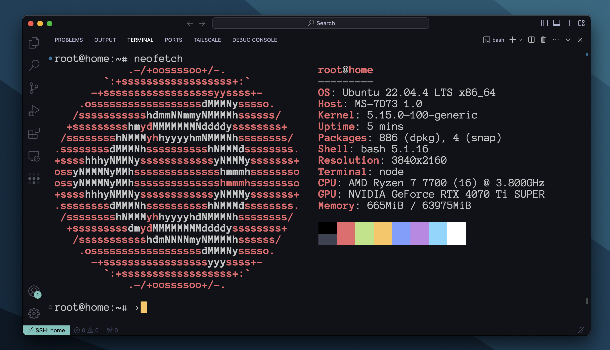
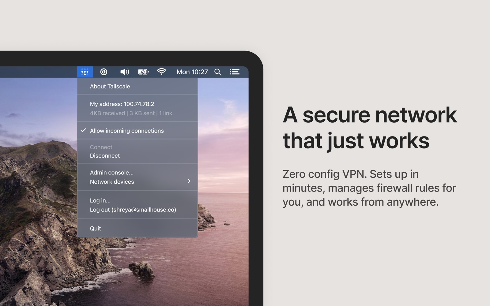
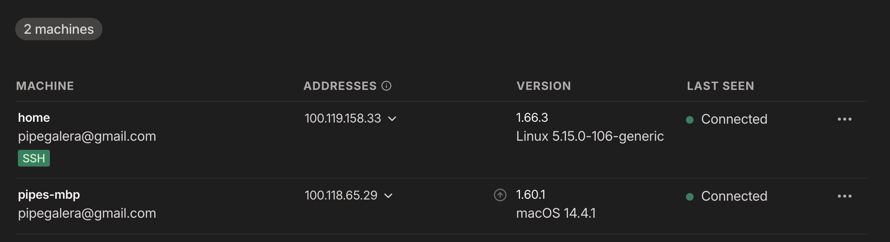
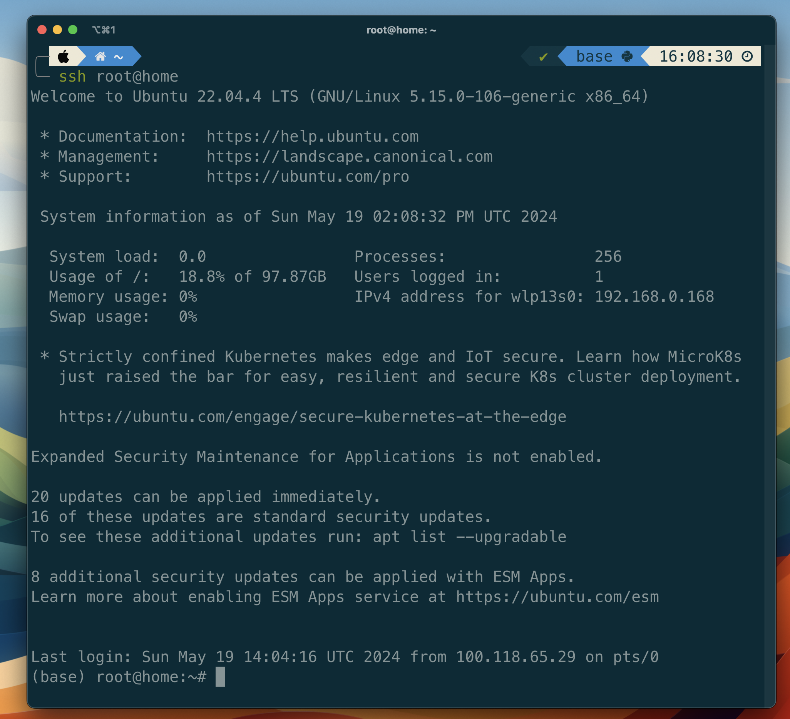
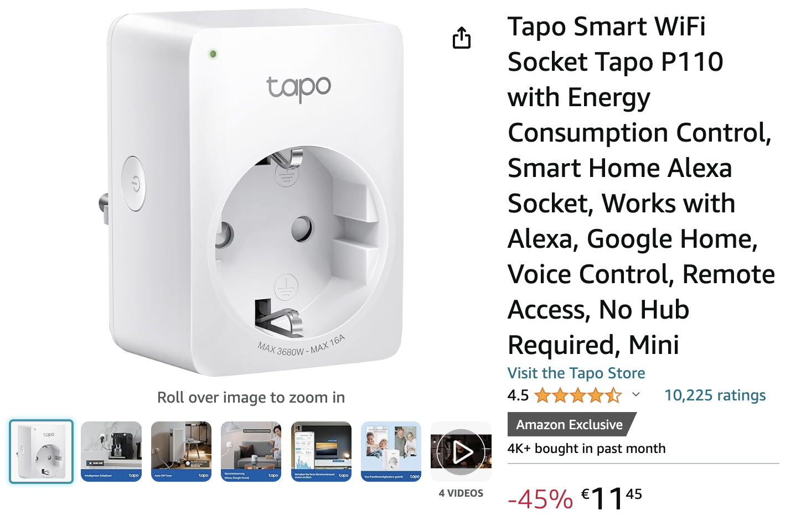

+++
title = "Using my desktop GPU remotely via Tailscale"
#description = "No port routing, no gateway router config, no fail2ban, not even touching ssh config!"
date = "2024-03-17"
[taxonomies]
tags = ["cloud", "ide", "ssh"]
[extra]
comment = true
+++


In this post I’ll explain how I connect to my gaming pc via SSH with my laptop completely remotely (and securely).


_My MacBook Pro connected from the public library wifi to my home pc._

No need for port routing, gateway router config, fail2ban...not even touching ssh/config!

## 1. Case problem

Some months ago I wrote [a post](https://pipegalera.com/posts/aws-instance-vscode/) about connecting VSCode to an AWS instance. I was using AWS instances this way to train small ml models for panel data. You can also train models in your laptop, but it takes much longer without a good GPU.

The problem is that it can become expensive running instances with GPUs fairly quick. It sucked that every model or little experiment I run cost money.

Then it hit me... Why am I paying for a GPU when I do have a powerful GPU in my gaming pc?

It must be a way to connect my laptop to my home pc and use it as a server.

And yes it is, and it’s fairly easy.

I have to admit It took me 2 weeks to discover “the easy way” described in this post. Following the steps below should take ~2 hours to get everything up and running.

The only thing you need is a laptop (client), a home pc (server) and a $10 smart plug (e.g. _TP-Link Tapo Smart WLAN Socket_).

## 2. Installing Ubuntu Server

This covers installation and server configuration.

### Bios options

I needed to go to my MOBO bios settings (click `Del` when the pc is turning on) and change 2 options before installing Ubuntu, otherwise the installation crashed:

1. `Security -> Secure Boot -> Disable`
2. `Advanced -> Settings -> Integrated graphics configuration -> Disable`

After that, reboot.

### Download the latest Ubuntu Server LTS from [their website](https://ubuntu.com/download/server)

Burn it into a usb stick with [etcher balena](https://etcher.balena.io/) or [rufus](https://rufus.ie/en/).

### Settings during installation

Boot the pc from the USB stick and install Ubuntu Server in in a second hard drive or a partition. It doesn’t matter much, but I recommend using a second drive if you have an spare one around.

Settings:

```bash
- [X] Search for third-party drivers
- [ ] Set up this disk as an LVM group
- [X] Install OpenSSH server
```

After the installation is done, remove the usb stick and boot into the Ubuntu server.

You might need to change the boot priorities in the bios if the initial reboot goes into Windows or whatever OS you have alongside Ubuntu Server.

### Set some basic initial package installation and connect to the WiFi

To install the dependencies the server must be connected to the internet via ethernet cable.

The first thing I did is increasing the font of the terminal, so I didn’t have to squish my eyes every time I look at the screen:

```bash
sudo nano /etc/default/console-setup
--->  FONTFACE="Terminus"
--->  FONTSIZE="16x32"
sudo update-initramfs -u
```

Reboot by typing `reboot`.

After rebooting, I updated the system and prepared the network options.

```bash
sudo apt-get update
systemctl disable systemd-networkd-wait-online.service
systemctl mask systemd-networkd-wait-online.service
sudo systemctl mask sleep.target suspend.target hibernate.target hybrid-sleep.target
sudo apt install network-manager
```

The above commands:

- Update the system.
- Avoid the system waiting 2 minutes every booth for the ethernet connection (server will be connected via WiFi).
- Avoid the system to go to sleep/suspend/hibernate causing ssh to time out.
- Install a network manager to connect via WiFi.

Once the network manager is installed I followed network-manager basic guide to connect to the WiFi: https://ubuntu.com/core/docs/networkmanager/configure-wifi-connections

Done with the basic configuration.

### Install the other packages you need

This depends on the use of the server, for me it’s usually:

- The proprietary NVIDIA GPU drivers

Check the latest driver available at [this NVIDIA website](https://www.nvidia.com/en-us/drivers/unix/)

```bash
sudo add-apt-repository ppa:graphics-drivers/ppa
sudo ubuntu-drivers install nvidia:550
```

- Miniconda

```bash
wget https://repo.anaconda.com/miniconda/Miniconda3-latest-Linux-x86_64.sh
bash Miniconda3-latest-Linux-x86_64.sh -b
cd miniconda3/bin
./conda init bash
```

- A few utility packages

```bash
sudo apt install neofetch
sudo update-pciids
sudo apt install net-tools
```

### Optional. For dual boot with Windows in the same hard drive

I use the pc for gaming in Windows 11, not only as a server. So I needed a way to select Windows if I wanted to play games when the pc boots.

1. Make sure Ubuntu Server is the first option to boot in the bios.
2. Activate the GRUB menu in the Ubuntu Server and setting it to 10 seconds.

```bash
sudo nano /etc/default/grub
--->  GRUB_TIMEOUT=10
--->  GRUB_TIMEOUT_STYLE=menu
sudo update-grub
```

This way it will boot on the menu and it’ll give 10 secs to select Ubuntu Server or Windows 11.

## 3. Connecting your laptop to your server with Tailscale



### Setting up a Tailscale SSH

1. Install Tailscale in the client (e.g.laptop):

https://tailscale.com/download

2. Install Tailscale in the server (Ubuntu Server):

```bash
curl -fsSL https://tailscale.com/install.sh | sh
```

Run `sudo tailscale up` and it will give you a website to visit in your client (e.g. _https//login.tailscale.com/a/1204ecba01999_). After login in to the website, it should say "Success." in the server terminal.

Run `sudo tailscale set --shh` to set the ssh profile.

3. Into your Tailscale profile (https://login.tailscale.com/admin/machines) it should appear both machines, and the tag `SSH` under your server info



Try typing `ssh root@{the server name}` from the terminal and check that the client connects:



After setting up Tailscale I could securely log in into my home pc from other networks.

### Set up VSCode for SSH

Once the connection is created, to set up VSCode:

1. Install the [Tailscale VSCode extension](https://marketplace.visualstudio.com/items?itemName=Tailscale.vscode-tailscale).
2. Click on the side panel Tailscale icon. Your server will appear, right click on it -> `Add to SSH config file`.
3. [Install Remote-SSH](https://code.visualstudio.com/docs/remote/ssh-tutorial).
4. Open Command Palette(`Cmd+Shift+P`) and search “Connect host” and the server name will pop up to connect.

## 4. Automatic turn on remotely with a smart plug



This is the cherry on top of the cake.

I can always turn off the pc server remotely by typing `poweroff` in the terminal . But **how do I turn the server on if the home pc is not powered on?**

We'll use a trick with a smart plug and a bios functionality for that.

Most bios have a _Wake on power_ mode that basically turn on the computer once they receive electric power from. On my MSI mobo bios, the option is: `Advanced -> APM Configuration -> "Restore AC Power Loss" -> Enable`.

With this setting, the pc will turn on every time it receives electric current.

By using a smart plug I can control the electric current that goes to the plug from the phone app - So I can power on the computer from the phone.

Example use:

- Remotely, I go to the smart plug app and activate the plug (0 to 1 electricity). The computer turn on and I can access via SSH.
- I turn it off using `poweroff` since I don’t need it.
- I got an idea and need the server GPU again. I go to app, turn off the plug and on again and the computer turns on.

It’s more difficult to explain than to do. It honestly takes one or two taps on the phone and the server pc is turned on.

## 5. Final thoughts and benefits vs cloud computing

It was surprisingly easy setting up the server once I discovered Tailscale. This solution for running “small” models remotely is:

- **Way cheaper than cloud**.

The cost of electricity is negligible since new NVIDIA GPUs are very efficient and the server can be turn on and off on command. Smart plugs cost <$10 and can be reused for other smart-home stuff.

This obviously only applies if you have a home pc to use as a server, but it doesn't need a fancy GPU - reusing any GPU will cost less than paying for a GPU to a third party.

- **Headache free**.

I had little nightmares about forgetting to turn off the instance and waking up the next day with a hole in my wallet.

I can let run a couple of experiments freely while doing other things without having a constant thought of having to go back to close the AWS.

- **Dead simple**.

I open the smart plug app on the phone to turn on the server and open VSCode on my laptop. 30 seconds and I'm in.

That’s it.

No need to go to AWS to open an instance, not changing the SSH config to the instance dynamic ip, no Terraform, no products I do not need.

- **Increased productivity**.

I can make stupid experiments, weird test and tinkering in general with models - which translates into more coding hours.

Zero remorse. No more _"if run this model for 20 hours and it doesn’t converge it will be a waste of money"_ mindset.

Since I set up the server I’m constantly trying new stuff and writing more code.

---

I hope you enjoyed the reading and give home servers a try. It was very fun to learn about internet networking and very practical to learn how to access my GPU everywhere.

Have a good day!
